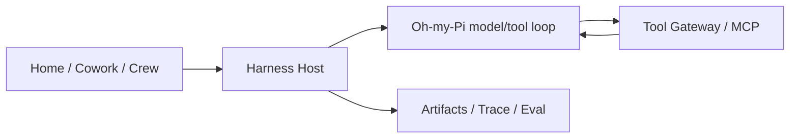

# Anna


**An AI companion for personal tasks, business workflows, and project collaboration.**

Anna is a personal open-source project exploring how an AI agent can carry work from a conversation through to a reviewable result. The local-first desktop app brings tasks, connected business systems, and collaboration together in **Home, Cowork, and Crew**.

The aim is to keep the work understandable: what Anna is doing, which tools she can use, what needs your decision, and where the result came from.

**Developer Preview** · macOS arm64 · [MIT License](LICENSE) · [CI](https://github.com/Foxtailsss-Andy/Anna-Agent/actions)

[中文](README.zh-CN.md) · [Explore Anna](#what-you-can-explore) · [Quick start](#quick-start) · [Current status](#current-status) · [Codex pet](#meet-anna-your-codex-companion) · [Development diary](https://github.com/Foxtailsss-Andy/Anna-Agent/wiki/Anna-Development-Diary)

> **September 5, 2026 · The next Anna update is coming soon**
>
> With the release of [GPT-6 Astra](https://developers.openai.com/api/docs/models/gpt-6-astra), we're working with Astra in Codex to investigate and fix underlying issues in Anna, with a focus on architecture and runtime reliability. This work is in progress; we'll share the changes and validation results with the next update. Thank you for following this personal project and sharing your feedback.

## What you can explore

| Workspace | When to use it | What you can do |
| --- | --- | --- |
| **Home** | Work through a personal task or create a reusable resource. | Bring files into a conversation, follow the task plan, inspect tool activity, and review documents or Prompt artifacts. Skill and Python Tool creation are also part of the interface. |
| **Cowork** | Work with information from a connected business system. | View business dashboards, ask the Hiker assistant about available data, and access existing reimbursement workflows. Connector permissions determine the available operations. |
| **Crew** | Coordinate a project with people and specialist Workers. | Organize tasks and dependencies on a project graph, add context in channels, assign work, and review or return versioned artifacts for rework. |

Home includes execution controls, history, files, and Trace inspection. Crew keeps project context, task discussions, artifacts, and review decisions connected, so a result can be followed back to the work that produced it.

## Product walkthrough


*Create, Cowork, and Crew in one loop. The walkthrough illustrates the interface; the Hiker dashboard uses synthetic data. Live model and connector validation is documented separately below.*

<details>
<summary>Inside a Crew artifact review</summary>


A deliverable, its source task, the project channel, and the review decision stay connected in one workspace.

</details>

## Meet Anna, your Codex companion

Anna's iris flower, ivory blouse, and purple skirt now come as a little desktop companion. Bring her into Codex to keep you company while you work.

<p align="center">
  
  
</p>

<p align="center">
  <a href="https://github.com/Foxtailsss-Andy/Anna-Agent/releases/download/anna-pet-v1.0.0/anna-codex-pet-v1.0.0.zip"><strong>Download Anna for Codex</strong></a> · <a href="pets/README.md">Installation guide</a> · <a href="pets/anna-iris">Pet files</a>
</p>

*A still capture and animation from the shared pet artwork. Includes 9 animation states and 16 look directions; requires desktop support for custom v2 pets.*

## Current status

Anna is in active development. The current source is intended for developers and contributors exploring the project.

| Area | Status |
| --- | --- |
| **Current `main`** | Home, Cowork, and Crew use a shared Node Harness Host with the Oh-my-Pi model/tool loop. Architecture and reliability improvements are ongoing. |
| **Recorded live validation** | Home document generation, Prompt creation, Stop, and next-turn context; Crew Worker delivery, review/rework, and contextual Anna; Hiker dashboard reads and an Agent capability query. See the [August 31–September 1 validation record](docs/superpowers/handoff/2026-08-31-harness-product-parity.md) for scope and remaining gates. |
| **External business operations** | The Hiker service used for that validation exposed read tools. Authorized write and read-back acceptance remain blocked on the service exposing the required capability. |
| **Desktop distribution** | Validation currently targets macOS arm64. The local application build is unsigned and unnotarized; Windows/Linux release acceptance remains open. |
| **Application releases** | [`v0.2.0` Developer Preview](https://github.com/Foxtailsss-Andy/Anna-Agent/releases/tag/v0.2.0) predates the current Harness execution path. The Codex pet has its own asset release. |

Production readiness, exhaustive recovery coverage, and benchmark results remain outside the current release claims. CI checks, interface demos, and live external-service runs provide different evidence; the [current acceptance goals](docs/product/anna-harness-product-parity-goal-2026-08-31.md) track those boundaries.

## Quick start

Requirements: **macOS arm64**, **Node.js ≥22.19.0**, **Python 3.12**, and **uv**.

```bash
git clone https://github.com/Foxtailsss-Andy/Anna-Agent.git
cd Anna-Agent
npm ci
uv sync --locked --extra dev
ANNA_OMP_BUN_ARCHIVE_URL=https://github.com/oven-sh/bun/releases/download/bun-v1.3.14/bun-darwin-aarch64.zip npm run harness:omp:prepare
npm run desktop:run
```

To run Agent tasks, configure your model provider locally; business features also require their connector configuration. The current documented model setup uses DeepSeek through an OpenAI-compatible transport.

Follow [DEVELOPMENT.md](DEVELOPMENT.md) for configuration paths, state isolation, and troubleshooting. Keep model credentials, connector secrets, and runtime state outside the Agent-readable task workspace. External model providers and connectors receive the requests you configure; local-first describes where the desktop app and its state run.

## How work moves through Anna

Anna's shared execution layer is the **Harness**. It manages task context, permissions, durable events, and execution outcomes across the three workspaces.



- **Context and Memory:** the Host loads authorized task and channel context; confirmed Memory is distinct from a proposed memory candidate.
- **Tools and permissions:** the Tool Gateway applies schema, scope, approval, and effect-recording rules. External actions depend on the connected service and granted permissions.
- **Execution history:** canonical events link model calls, tool results, and terminal states to artifacts and Trace/Eval records.
- **Business integration:** Python retains identity, business data, state machines, and connectors. Agent execution belongs to the Node Host and Oh-my-Pi.

See the [architecture terminology](CONTEXT.md) and [current implementation scope](docs/product/anna-harness-product-parity-goal-2026-08-31.md) for the contracts behind this design.

## Build with us

Useful contributions start with a concrete task: what you tried, what you expected, and what actually happened. Reproducible failures, interaction feedback, connector improvements, and documentation fixes are welcome.

- [Report an issue](https://github.com/Foxtailsss-Andy/Anna-Agent/issues) with reproduction steps and sanitized evidence.
- Read [CONTRIBUTING.md](CONTRIBUTING.md) and choose a scoped item from the [community backlog](docs/product/anna-harness-first-community-backlog-2026-08-31.md).
- Follow the [development diary](https://github.com/Foxtailsss-Andy/Anna-Agent/wiki/Anna-Development-Diary) for the decisions, setbacks, and lessons behind Anna.

<details>
<summary>Repository verification commands</summary>

```bash
npm run typecheck
npm test -- --reporter=dot
npm run frontend:product-smoke
./.venv/bin/python -m pytest -q
npm run build
npm run release:verify
npm run evidence:verify:all
```

For desktop packaging checks:

```bash
npm run desktop:package
npm run desktop:smoke-asar
```

Live provider and business-system validation require separate configuration and evidence. See [DEVELOPMENT.md](DEVELOPMENT.md).

</details>

Please keep credentials, local state, runtime logs, provider responses, and real business data out of public contributions. Follow [SECURITY.md](SECURITY.md) to report vulnerabilities.

## Credits and license

Anna grew from a personal exploration of AI agents and Harness design. Pi Agent and Oh-my-Pi have been important technical references. Thank you to the open-source community and everyone sharing feedback along the way.

**Hiker** is an external ERP collaboration by [kc8zshnt6n-gif](https://github.com/kc8zshnt6n-gif). Its platform, server, deployment, and business data are not included here, and Hiker is not currently open source. Anna's license covers the Anna-side connector and UI integration, and does not extend to Hiker.

[Foxtailsss-Andy/Anna-Agent](https://github.com/Foxtailsss-Andy/Anna-Agent) is the canonical public repository. Anna is released under the [MIT License](LICENSE); third-party dependency notices are listed in [NOTICE.md](NOTICE.md).
