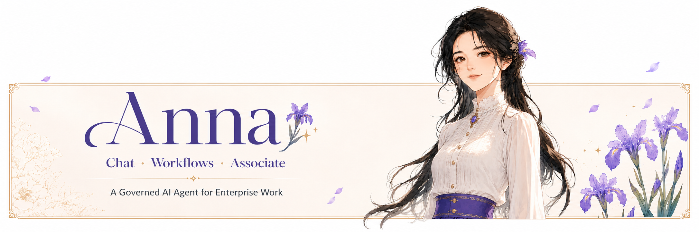
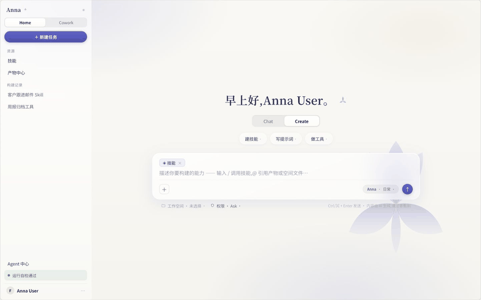
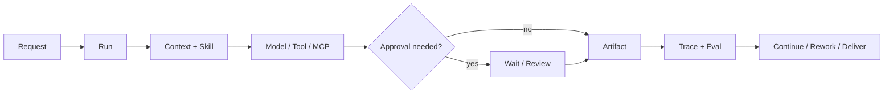
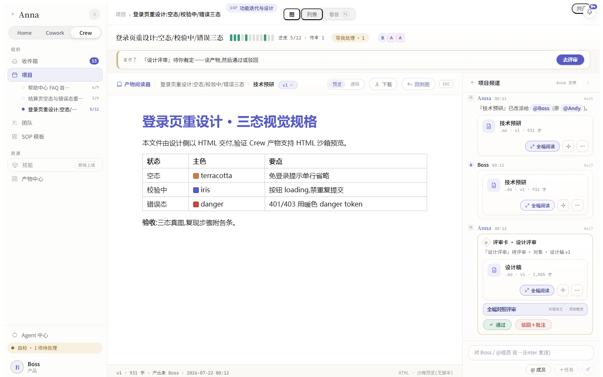

# Anna



Anna is a governed, local-first desktop AI agent for enterprise work. It combines direct conversation, channel collaboration, business workflows, specialist Associates, and MCP-connected systems in one working loop so a task can pause, resume, be reviewed, and continue without losing its state.

- **Chat with a working agent.** Give Anna a goal, add context, interject, continue, and inspect the Run behind the conversation.
- **Coordinate through channels.** Humans, Anna, and specialist Agents share task context, artifacts, decisions, review gates, and durable history.
- **Run governed workflows.** Goals become Runs with explicit state, permissions, approvals, artifacts, and next actions.
- **Connect business systems through MCP.** Read operational data, inspect business records, and invoke governed actions in external systems.
- **Review how work happened.** Trace and Eval connect model calls, tools, approvals, retries, and terminal results.

The product uses an iris-inspired visual system and a dedicated Anna character identity to keep Chat, Workflows, and Associate experiences coherent. The visual language reinforces the product's completeness while governed execution remains the core.

**Current release: [`v0.2.0` Developer Preview](https://github.com/Foxtailsss-Andy/Anna-Agent/releases/tag/v0.2.0)** | macOS source preview | MIT License | [CI](https://github.com/Foxtailsss-Andy/Anna-Agent/actions)

[中文](README.zh-CN.md) | [Product walkthrough](#product-walkthrough) | [Quick start](#quick-start) | [What you can explore](#what-you-can-explore) | [Architecture](#how-work-moves-through-anna)

## Product walkthrough



*One loop across three surfaces: the Create page before a task starts, the complete Cowork Hiker customer-and-contract dashboard, and the Crew workflow canvas. The Hiker view uses synthetic fixture data and contains no real service response, credentials, or business data.*

## Quick start

Requirements:

- Node.js `>=22.19.0`
- Python `>=3.12,<3.14`
- macOS, the desktop platform validated for this Developer Preview

```bash
npm ci
python3.12 -m venv .venv
. .venv/bin/activate
python -m pip install -e '.[dev]'
npm run desktop:run
```

Anna starts without provider credentials and reports an explicit `not_configured` state. Configure an OpenAI-compatible provider or MCP connector from the local runtime settings when you want to exercise real model or business-system calls.

To opt into the local Harness v2 sidecar:

```bash
ANNA_HARNESS_V2_BRIDGE_ENABLED=1 npm run desktop:run
```

The sidecar switch is a development and validation boundary. It does not imply that every business domain has completed migration to Harness v2.

## What you can explore

| Surface | What it demonstrates |
| --- | --- |
| **Chat** | Streaming background Runs, stop/continue/interject, history, workspace context, and explicit provider failure states. |
| **Channels** | Human-Agent coordination around tasks, mentions, artifacts, active Runs, decisions, and review history. |
| **Create** | Reviewable Skill, Prompt, and Python Tool drafts with workspace context, permission modes, validation, and confirmation. |
| **Cowork** | Reimbursement, Hiker ERP access, approval, audit, and external MCP connectors kept at a controlled boundary. |
| **Associate** | Specialist Agents that analyze business context, propose actions, and advance work under the same governance model. |
| **Crew** | SOP-driven projects, task graphs, assignment, channels, artifacts, review gates, rework, notifications, and delivery. |
| **MCP systems** | Structured access to external business data and operations, with write actions kept behind permission, approval, idempotency, and audit. |
| **Harness v2** | Durable events, channel isolation, Tool Gateway controls, memory policy, Trace/Eval evidence, scheduling, and recovery foundations. |

These surfaces can be explored with deterministic fixtures. Real provider and enterprise-system results require explicit local configuration.

## Channels and connected business systems

Channels are Anna's collaboration layer. A channel keeps people, Anna, and specialist Agents aligned around the same tasks, active Runs, artifacts, mentions, review decisions, and project history. A message can add context, steer an active execution, request a person or Agent, or return the team to the exact task and artifact under discussion.

MCP is Anna's external-system boundary. Anna can use MCP connectors to retrieve operational data, inspect records, and invoke business operations in ERP or other enterprise systems. Read access stays scoped; external writes retain permission checks, human approval, idempotency, read-back verification, and audit evidence when the connected workflow supports them.

## How work moves through Anna

Enterprise work usually crosses several steps: clarify the goal, load context, call a system, produce an artifact, wait for approval, rework, and deliver. Anna keeps those steps inside one inspectable lifecycle:



The shared runtime is organized around three durable foundations:

- **Identity:** workspace, user, channel, and permission scope;
- **Judgment:** an explicit decision to continue, wait, request information, or finish;
- **Memory:** a controlled distinction between task context, candidate memory, and confirmed business memory.

When configuration is missing or a connector is unavailable, the state remains visible and recoverable. Anna does not convert an unavailable dependency into a successful result.

## Crew: projects, artifacts, and human gates

Crew turns multi-person work from a message stream into an observable project graph:

- decompose work with SOP templates and dependencies;
- assign, start, submit, review, approve, and return tasks for rework;
- connect channel messages and artifact cards to concrete nodes;
- inspect project progress and waiting gates from the canvas;
- read and download Markdown or HTML deliverables inside the workflow.



*The artifact reader keeps the deliverable, source task, project channel, and approval decision in one review surface.*

## Harness: the execution and governance layer

Harness v2 focuses on recoverability and evidence quality:

| Capability | Contract |
| --- | --- |
| **Durable Run / Event Store** | Persist canonical state and events instead of relying on one live process. |
| **Channel-scoped isolation** | Keep workspace and channel boundaries explicit. |
| **Tool Gateway** | Apply schema, permission, approval, idempotency, and audit controls. |
| **Memory policy** | Separate proposed memory, confirmed memory, and disabled writes. |
| **Trace / Eval** | Link context, model calls, tools, approvals, retries, and terminal evidence. |
| **Scheduler / fencing** | Establish controlled proactive runs, ownership, recovery, and duplicate-execution protection. |

Harness v2 is currently exposed through an opt-in bridge. The Create vertical slice has a local implementation; domain-level migration for Cowork, Crew, and Hub remains follow-up work.

## Why Anna

| Need | Anna's approach |
| --- | --- |
| **Continue beyond one answer** | A Run retains state, events, artifacts, and the next action. |
| **Keep automation controlled** | External writes retain permission, approval, and audit. |
| **Recover from interruption** | Waiting, missing configuration, retries, and failure remain explicit states. |
| **Review how a result was produced** | Trace/Eval evidence connects the execution path to the final artifact. |
| **Keep local control** | Runtime data stays local by default; external providers and connectors are opt-in. |
| **Extend into business domains** | Connectors, Skills, and Run Profiles add domain behavior around a shared runtime contract. |

## Verification

Run the core repository gates:

```bash
npm run typecheck
npm test -- --reporter=dot
npm run frontend:smoke
./.venv/bin/python -m pytest -q
npm run build
npm run release:verify
npm run evidence:verify:all
```

For the desktop packaging smoke:

```bash
npm run desktop:package
npm run desktop:smoke-asar
```

CI runs the core gates without a private provider, MCP endpoint, local runtime state, or signing identity. The packaged smoke intentionally reports model and MCP capabilities as `not_configured` when credentials are absent.

## Developer Preview boundary

This release is useful for:

- understanding Anna's desktop Agent Runtime and Harness direction;
- connecting one OpenAI-compatible provider locally;
- exploring Chat/Create, Cowork, and Crew workflows;
- exercising deterministic Run, Tool, Artifact, Trace, and approval contracts;
- iterating from real traces and failure cases.

This release does not claim:

- production readiness or a hosted cloud runtime;
- complete Legacy-to-Harness-v2 migration across all domains;
- production Review-to-Validated-Patch approval;
- guaranteed external WebSearch or MCP availability;
- signed and notarized macOS installers;
- Windows installer or cross-platform release acceptance.

## External project boundary

**Hiker** is a complete ERP system for small teams, with integrated finance, supply-chain, and marketing capabilities. Anna connects to Hiker through MCP to retrieve ERP data, inspect business context, and invoke governed business operations across the ERP services that Hiker exposes.

Hiker is an external collaborative project authored by [kc8zshnt6n-gif](https://github.com/kc8zshnt6n-gif). The Hiker platform, server source, deployment, and business data are not included in this repository, and Hiker is not currently open source. Anna's MIT License applies only to the Anna-side MCP connector, UI integration, and other files committed here; it does not extend to Hiker.

## Repository and maintenance

The GitHub repository was created on April 2, 2026 for a retired book project and was repurposed for Anna on August 24, 2026. Anna's software release history begins with the `0.2.0` Developer Preview; the repository creation date is not the software release date.

[Foxtailsss-Andy/Anna-Agent](https://github.com/Foxtailsss-Andy/Anna-Agent) is the canonical public repository. The publication milestone, naming boundary, and future GitHub-centered workflow are recorded in [Anna Agent GitHub Milestone - 2026-08-24](docs/product/anna-agent-github-milestone-2026-08-24.md).

For deeper project and release detail, see:

- [Developer Preview Wayfinder](docs/product/anna-github-developer-preview-wayfinder-2026-08-23.md)
- [Developer Preview Spec](docs/product/anna-github-developer-preview-spec-2026-08-23.md)
- [Release tickets](docs/superpowers/plans/2026-08-23-github-developer-preview/00-tickets.md)

Read [CONTRIBUTING.md](CONTRIBUTING.md) before opening a pull request and [SECURITY.md](SECURITY.md) before reporting a vulnerability. Do not commit `.anna/`, databases, runtime logs, provider responses, API keys, generated packages, or real enterprise data.

Anna is released under the [MIT License](LICENSE). Third-party dependency notices are described in [NOTICE.md](NOTICE.md).
