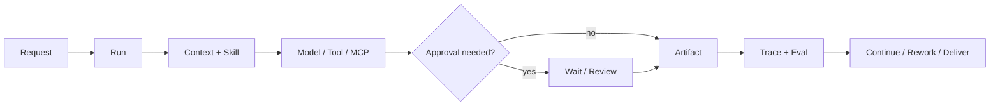

# Anna


> **September 5, 2026 · The next Anna update is coming soon**
>
> With the release of [GPT-6 Astra](https://developers.openai.com/api/docs/models/gpt-6-astra), we're working with Astra in Codex to investigate and fix underlying issues in Anna, with a focus on architecture and runtime reliability. This work is in progress; we'll share the changes and validation results with the next update. Thank you for following this personal project and sharing your feedback.

Anna is a governed, local-first desktop AI agent organized around **Home, Cowork, and Crew**. This branch preserves the existing product while moving Agent execution into one Node Harness Host and the actual Oh-my-Pi loop.

- **Home:** personal conversations, task execution, and creation of Skills, prompts, and Python-tool artifacts in the original shared work surface.
- **Cowork:** business dashboards, Hiker MCP assistance, and existing reimbursement workflows.
- **Crew:** project graphs, channels, contextual Anna, specialist Workers, artifacts, review, and confirmed project Memory.

The migration replaces Agent execution authority, while retaining business state machines, interfaces, and data. Python may serve identity, business storage, and connectors without model credentials or a legacy Agent loop. Integration and live acceptance are tracked separately; a passing unit test does not establish product readiness.

**Current branch: [Harness Product-Parity Goal](docs/product/anna-harness-product-parity-goal-2026-08-31.md)** | macOS arm64 | MIT License | [CI](https://github.com/Foxtailsss-Andy/Anna-Agent/actions)

Earlier release: [`v0.2.0` Developer Preview](https://github.com/Foxtailsss-Andy/Anna-Agent/releases/tag/v0.2.0), before the default Harness cutover.

[中文](README.zh-CN.md) | [Development diary](https://github.com/Foxtailsss-Andy/Anna-Agent/wiki/Anna-Development-Diary) | [Product walkthrough](#product-walkthrough) | [Quick start](#quick-start) | [What you can explore](#what-you-can-explore) | [Architecture](#how-work-moves-through-anna)

## Meet Anna, your Codex companion

Anna's iris flower, ivory blouse, and purple skirt now come as a little desktop companion. Bring her into Codex to keep you company while you work.

<p align="center">
  
  
</p>

<p align="center">
  <a href="https://github.com/Foxtailsss-Andy/Anna-Agent/releases/download/anna-pet-v1.0.0/anna-codex-pet-v1.0.0.zip"><strong>Download Anna for Codex</strong></a> · <a href="pets/README.md">Installation guide</a> · <a href="pets/anna-iris">Pet files</a>
</p>

*A still capture and animation from the shared pet artwork. Includes 9 animation states and 16 look directions; requires desktop support for custom v2 pets.*

## Product walkthrough

The walkthrough records the existing product design retained by the migration. It is not evidence of a live Harness or Hiker run.


*One loop across three surfaces: the Create page before a task starts, the complete Cowork Hiker customer-and-contract dashboard, and the Crew workflow canvas. The Hiker view uses synthetic fixture data and contains no real service response, credentials, or business data.*

## Quick start

Requirements:

- Node.js `>=22.19.0`
- Python 3.12 and `uv` for the managed business adapter
- macOS arm64, the current desktop validation target

```bash
npm ci
uv sync --locked --extra dev
ANNA_OMP_BUN_ARCHIVE_URL=https://github.com/oven-sh/bun/releases/download/bun-v1.3.14/bun-darwin-aarch64.zip npm run harness:omp:prepare
npm run desktop:run
```

Configure the provider and business connectors locally. Model credentials belong to the Node Host; the Python business adapter receives only its business configuration. Keep configuration and application state outside any Agent-readable workdir.

Prepare the fixed Bun/OMP runtime once per fresh checkout. A worker source change requires a newly bound runtime. The launcher must not fall back to the old Python or Pi Agent loop. See [DEVELOPMENT.md](DEVELOPMENT.md) for configuration, state isolation, and validation.

## What you can explore

| Surface | What it demonstrates |
| --- | --- |
| **Home** | Chat/Create, shared LoopCard, workdirs, files/canvas, history, execution controls, and Trace. |
| **Cowork** | Deterministic Hiker dashboards, an Agent assistant, and existing business approval workflows. |
| **Crew** | Graph x Channel x Memory, assignment, Worker execution, artifact versions, review, and Showcase. |
| **Harness** | OMP model/tool iteration with Host-owned context, permissions, Memory, canonical events, and Eval. |

This update brings the preserved product onto the new execution path:

- **Home:** Chat/Create tasks can run through verified OMP with the configured DeepSeek model, using native Todo, scoped tools, Stop, Trace, durable next-turn context, and reviewable artifacts.
- **Cowork:** Hiker dashboards and the Agent assistant share the Harness path. The current connected service supports scoped reads; writes still depend on server capability and approval.
- **Crew:** Contextual Anna and specialist Workers can use project and channel context to draft tasks, produce artifacts, and enter the existing review and rework flow.
- **Harness:** The Node Host and OMP own model/tool iteration, Memory loading, canonical events, and Eval. Python remains a model-less business and connector adapter.

Each surface is subject to the current Goal's live acceptance gates. Deterministic tests and demonstration fixtures are not evidence of a live provider or external business operation.

## Channels and business systems

These workflows are part of the product-preservation contract.

Channels are Anna's collaboration layer. A channel keeps people, Anna, and specialist Agents aligned around the same tasks, active Runs, artifacts, mentions, review decisions, and project history. A message can add context, steer an active execution, request a person or Agent, or return the team to the exact task and artifact under discussion.

MCP is Anna's external-system boundary. Anna can use MCP connectors to retrieve operational data, inspect records, and invoke business operations in ERP or other enterprise systems. Read access stays scoped; external writes retain permission checks, human approval, idempotency, read-back verification, and audit evidence when the connected workflow supports them.

## How work moves through Anna

The Agent path is `Home / Cowork / Crew -> product adapter -> Node Harness Host -> actual OMP -> Host model transport / ToolGateway -> Contract Eval -> terminal event`. Business CRUD and connector operations retain their existing domain services. Agent history, Memory loading, and model/tool authority belong to the Harness.

The product workflow retains explicit approval and review boundaries:



The shared runtime is organized around three durable foundations:

- **Identity:** workspace, user, channel, and permission scope;
- **Judgment:** an explicit decision to continue, wait, request information, or finish;
- **Memory:** a controlled distinction between task context, candidate memory, and confirmed business memory.

When configuration is missing or a connector is unavailable, the state remains visible and recoverable. Anna does not convert an unavailable dependency into a successful result.

## Crew

Crew turns multi-person work from a message stream into an observable project graph:

- decompose work with SOP templates and dependencies;
- assign, start, submit, review, approve, and return tasks for rework;
- connect channel messages and artifact cards to concrete nodes;
- inspect project progress and waiting gates from the canvas;
- read and download Markdown or HTML deliverables inside the workflow.


*The artifact reader keeps the deliverable, source task, project channel, and approval decision in one review surface.*

## Harness: the execution and governance layer

Harness v2 focuses on recoverability and evidence quality:

| Capability | Contract |
| --- | --- |
| **Durable Run / Event Store** | Persist canonical state and events instead of relying on one live process. |
| **Channel-scoped isolation** | Keep workspace and channel boundaries explicit. |
| **Tool Gateway** | Apply schema, permission, approval, idempotency, and audit controls. |
| **Memory policy** | Separate proposed memory, confirmed memory, and disabled writes. |
| **Trace / Eval** | Link context, model calls, tools, approvals, retries, and terminal evidence. |
| **Scheduler / fencing** | Establish controlled proactive runs, ownership, recovery, and duplicate-execution protection. |

The current migration covers the existing Home, Cowork, and Crew Agent paths, including less visible drafting and matching calls. The separate Preview panel is not the product entry. Old Python Agent execution must not act as a fallback.

## Longer-term design

| Need | Anna's approach |
| --- | --- |
| **Continue beyond one answer** | A Run retains state, events, artifacts, and the next action. |
| **Keep automation controlled** | External writes retain permission, approval, and audit. |
| **Recover from interruption** | Waiting, missing configuration, retries, and failure remain explicit states. |
| **Review how a result was produced** | Trace/Eval evidence connects the execution path to the final artifact. |
| **Keep local control** | Runtime data stays local by default; external providers and connectors are opt-in. |
| **Extend into business domains** | Connectors, Skills, and Run Profiles add domain behavior around a shared runtime contract. |

## Verification

Run the core repository gates:

```bash
npm run typecheck
npm test -- --reporter=dot
npm run frontend:smoke
./.venv/bin/python -m pytest -q
npm run build
npm run release:verify
npm run evidence:verify:all
```

For the desktop packaging smoke:

```bash
npm run desktop:package
npm run desktop:smoke-asar
```

CI runs deterministic gates without a private provider, local runtime state, or signing identity. Python tests cover the retained business services and the disabled legacy-execution boundary. Real provider and Hiker evidence is recorded separately and is never inferred from fixture tests.

## Developer Preview boundary

This release is useful for:

- preserving the original Home, Cowork, and Crew workflows while migrating their Agent execution;
- connecting one OpenAI-compatible provider locally;
- validating scoped tools, execution controls, persistent history, and contextual collaboration;
- contributing scoped improvements from the community backlog;
- iterating from real traces and failure cases.

This release does not claim:

- production readiness or a hosted cloud runtime;
- an externally enabled Hiker write capability when the connected server exposes only reads;
- unrestricted coding tools, exhaustive recovery coverage, or SWE-bench results;
- production Review-to-Validated-Patch approval;
- guaranteed external WebSearch or MCP availability;
- signed and notarized macOS installers;
- Windows/Linux support or cross-platform release acceptance.

## External project boundary

**Hiker** is an external ERP project for small teams. Anna preserves its Hiker dashboard and MCP integration. Actual read/write capability depends on the connected server and granted permissions; a read-only server cannot satisfy write acceptance.

Hiker is an external collaborative project authored by [kc8zshnt6n-gif](https://github.com/kc8zshnt6n-gif). The Hiker platform, server source, deployment, and business data are not included in this repository, and Hiker is not currently open source. Anna's MIT License applies only to the Anna-side MCP connector, UI integration, and other files committed here; it does not extend to Hiker.

## Repository and maintenance

This GitHub repository was created on April 2, 2026 to plan the Anna project. As Harness technology continued to evolve, advanced paradigms such as Pi Agent provided substantial technical reference and inspiration for the project, ultimately shaping Anna. We are grateful to the GitHub community.

[Foxtailsss-Andy/Anna-Agent](https://github.com/Foxtailsss-Andy/Anna-Agent) is the canonical public repository. The publication milestone, naming boundary, and future GitHub-centered workflow are recorded in [Anna Agent GitHub Milestone - 2026-08-24](docs/product/anna-agent-github-milestone-2026-08-24.md).

For deeper project and release detail, see:

- [Current product-parity Goal and release gates](docs/product/anna-harness-product-parity-goal-2026-08-31.md)
- [Community backlog and capability boundaries](docs/product/anna-harness-first-community-backlog-2026-08-31.md)
- [Harness-first SPEC and acceptance gates - 2026-08-30](docs/product/anna-harness-first-spec-2026-08-30.md)
- [Harness-first update: delivered scope, verification and open work](docs/product/anna-harness-first-update-2026-08-30.md)
- [Harness-first SDD plan and migration status](docs/superpowers/plans/2026-08-30-harness-first/00-plan.md)
- [Developer Preview Wayfinder](docs/product/anna-github-developer-preview-wayfinder-2026-08-23.md)
- [Developer Preview Spec](docs/product/anna-github-developer-preview-spec-2026-08-23.md)
- [Release tickets](docs/superpowers/plans/2026-08-23-github-developer-preview/00-tickets.md)

Read [CONTRIBUTING.md](CONTRIBUTING.md) before opening a pull request and [SECURITY.md](SECURITY.md) before reporting a vulnerability. Do not commit `.anna/`, databases, runtime logs, provider responses, API keys, generated packages, or real enterprise data.

Anna is released under the [MIT License](LICENSE). Third-party dependency notices are described in [NOTICE.md](NOTICE.md).
