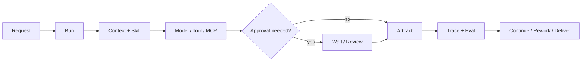

# Anna


Anna is a governed, local-first desktop AI agent. This branch delivers the **Harness-first Developer Preview**: the normal desktop entry runs one Node Harness Host and the actual Oh-my-Pi loop, with no automatic Python or Pi fallback.

- **Run a task.** Configure a provider, submit a goal, inspect real run events and the final answer, or stop execution.
- **Read within a workspace.** Admitted read-only tools pass through the Host ToolGateway; native shell and write tools are not exposed.
- **Keep the history.** The Host owns Run, Profile, Context/Memory, Skill, SQLite events, and Contract Eval.

This is a deliberately narrow release. Crew, Create, Cowork, Hub, and Hiker/MCP business operations remain outside the default Preview. Their prior source and data are retained; their migration is tracked in the [community backlog](docs/product/anna-harness-first-community-backlog-2026-08-31.md).

**Current branch: [Harness-first Preview Goal](docs/product/anna-harness-first-preview-goal-2026-08-31.md)** | macOS arm64 | MIT License | [CI](https://github.com/Foxtailsss-Andy/Anna-Agent/actions)

Earlier release: [`v0.2.0` Developer Preview](https://github.com/Foxtailsss-Andy/Anna-Agent/releases/tag/v0.2.0), before the default Harness cutover.

[中文](README.zh-CN.md) | [Development diary](https://github.com/Foxtailsss-Andy/Anna-Agent/wiki/Anna-Development-Diary) | [Product walkthrough](#product-walkthrough) | [Quick start](#quick-start) | [What you can explore](#what-you-can-explore) | [Architecture](#how-work-moves-through-anna)

## Product walkthrough

The following is a historical product prototype, not the set of enabled Harness-first Preview surfaces.


*One loop across three surfaces: the Create page before a task starts, the complete Cowork Hiker customer-and-contract dashboard, and the Crew workflow canvas. The Hiker view uses synthetic fixture data and contains no real service response, credentials, or business data.*

## Quick start

Requirements:

- Node.js `>=22.19.0`
- macOS arm64, the platform targeted by this Preview

```bash
npm ci
ANNA_OMP_BUN_ARCHIVE_URL=https://github.com/oven-sh/bun/releases/download/bun-v1.3.14/bun-darwin-aarch64.zip npm run harness:omp:prepare
npm run desktop:run
```

Anna opens Settings without provider credentials. Set an OpenAI-compatible model endpoint, model name, API key, and an existing workspace to run real tasks. Python is not needed for the default Preview runtime.

Prepare the fixed Bun/OMP runtime once per fresh checkout. Preparation refuses to overwrite a bound runtime. The normal launcher uses the single Preview Host; the old sidecar flag is not a migration switch for this release. See [DEVELOPMENT.md](DEVELOPMENT.md) for state isolation, rollback, and retained legacy tests.

## What you can explore

| Surface | What it demonstrates |
| --- | --- |
| **Tasks** | Actual OMP execution, canonical lifecycle/tool/final-answer events, stop, and explicit provider failure states. |
| **Settings** | Local model/endpoint/key/workspace configuration; no key returned by the API. |
| **History** | Completed Runs and canonical events from the same SQLite state after reopening. |
| **Harness** | Host-owned Profile/Skill/Memory preparation, read-only ToolGateway, and Eval before terminal state. |

Event streaming reports real lifecycle and final-message events; this version does not promise token-by-token text streaming. Deterministic tests are not evidence of a live provider call.

## Earlier product work: channels and business systems

The following collaboration and business workflows remain disabled in the default Preview while migration continues.

Channels are Anna's collaboration layer. A channel keeps people, Anna, and specialist Agents aligned around the same tasks, active Runs, artifacts, mentions, review decisions, and project history. A message can add context, steer an active execution, request a person or Agent, or return the team to the exact task and artifact under discussion.

MCP is Anna's external-system boundary. Anna can use MCP connectors to retrieve operational data, inspect records, and invoke business operations in ERP or other enterprise systems. Read access stays scoped; external writes retain permission checks, human approval, idempotency, read-back verification, and audit evidence when the connected workflow supports them.

## How work moves through Anna

The Preview path is `Desktop -> Node Harness Host -> actual OMP -> Host model transport / ToolGateway -> Contract Eval -> terminal event`. Its completed history comes from the same event store. Memory and tools load under Harness authority.

The longer-term enterprise workflow below includes approvals and business surfaces that are not enabled in this Preview:



The shared runtime is organized around three durable foundations:

- **Identity:** workspace, user, channel, and permission scope;
- **Judgment:** an explicit decision to continue, wait, request information, or finish;
- **Memory:** a controlled distinction between task context, candidate memory, and confirmed business memory.

When configuration is missing or a connector is unavailable, the state remains visible and recoverable. Anna does not convert an unavailable dependency into a successful result.

## Earlier product work: Crew

Crew turns multi-person work from a message stream into an observable project graph:

- decompose work with SOP templates and dependencies;
- assign, start, submit, review, approve, and return tasks for rework;
- connect channel messages and artifact cards to concrete nodes;
- inspect project progress and waiting gates from the canvas;
- read and download Markdown or HTML deliverables inside the workflow.


*The artifact reader keeps the deliverable, source task, project channel, and approval decision in one review surface.*

## Harness: the execution and governance layer

Harness v2 focuses on recoverability and evidence quality:

| Capability | Contract |
| --- | --- |
| **Durable Run / Event Store** | Persist canonical state and events instead of relying on one live process. |
| **Channel-scoped isolation** | Keep workspace and channel boundaries explicit. |
| **Tool Gateway** | Apply schema, permission, approval, idempotency, and audit controls. |
| **Memory policy** | Separate proposed memory, confirmed memory, and disabled writes. |
| **Trace / Eval** | Link context, model calls, tools, approvals, retries, and terminal evidence. |
| **Scheduler / fencing** | Establish controlled proactive runs, ownership, recovery, and duplicate-execution protection. |

The Preview exposes Harness through the normal desktop entry. Domain-level migration for Create, Cowork, Crew, and Hub remains follow-up work; old Python sources do not run as a fallback.

## Longer-term design

| Need | Anna's approach |
| --- | --- |
| **Continue beyond one answer** | A Run retains state, events, artifacts, and the next action. |
| **Keep automation controlled** | External writes retain permission, approval, and audit. |
| **Recover from interruption** | Waiting, missing configuration, retries, and failure remain explicit states. |
| **Review how a result was produced** | Trace/Eval evidence connects the execution path to the final artifact. |
| **Keep local control** | Runtime data stays local by default; external providers and connectors are opt-in. |
| **Extend into business domains** | Connectors, Skills, and Run Profiles add domain behavior around a shared runtime contract. |

## Verification

Run the core repository gates:

```bash
npm run typecheck
npm test -- --reporter=dot
npm run frontend:smoke
./.venv/bin/python -m pytest -q
npm run build
npm run release:verify
npm run evidence:verify:all
```

For the desktop packaging smoke:

```bash
npm run desktop:package
npm run desktop:smoke-asar
```

CI runs deterministic gates without a private provider, local runtime state, or signing identity. Python is retained for legacy regression coverage only. A real provider smoke is recorded separately and is never inferred from passing fixture tests.

## Developer Preview boundary

This release is useful for:

- running the default Harness-first task path;
- connecting one OpenAI-compatible provider locally;
- using admitted read-only workspace tools, stop, and persistent history;
- contributing scoped improvements from the community backlog;
- iterating from real traces and failure cases.

This release does not claim:

- production readiness or a hosted cloud runtime;
- full business migration, Crew/Create/Cowork/Hub, or Hiker/MCP execution;
- complete coding tools, interactive steer/ask-human controls, or SWE-bench results;
- production Review-to-Validated-Patch approval;
- guaranteed external WebSearch or MCP availability;
- signed and notarized macOS installers;
- Windows/Linux support or cross-platform release acceptance.

## External project boundary

**Hiker** is an external ERP project for small teams. The retained Anna-side MCP integration is prior product work and is not enabled in the default Harness-first Preview.

Hiker is an external collaborative project authored by [kc8zshnt6n-gif](https://github.com/kc8zshnt6n-gif). The Hiker platform, server source, deployment, and business data are not included in this repository, and Hiker is not currently open source. Anna's MIT License applies only to the Anna-side MCP connector, UI integration, and other files committed here; it does not extend to Hiker.

## Repository and maintenance

This GitHub repository was created on April 2, 2026 to plan the Anna project. As Harness technology continued to evolve, advanced paradigms such as Pi Agent provided substantial technical reference and inspiration for the project, ultimately shaping Anna. We are grateful to the GitHub community.

[Foxtailsss-Andy/Anna-Agent](https://github.com/Foxtailsss-Andy/Anna-Agent) is the canonical public repository. The publication milestone, naming boundary, and future GitHub-centered workflow are recorded in [Anna Agent GitHub Milestone - 2026-08-24](docs/product/anna-agent-github-milestone-2026-08-24.md).

For deeper project and release detail, see:

- [Current Preview Goal and release gates](docs/product/anna-harness-first-preview-goal-2026-08-31.md)
- [Community backlog and capability boundaries](docs/product/anna-harness-first-community-backlog-2026-08-31.md)
- [Harness-first SPEC and acceptance gates - 2026-08-30](docs/product/anna-harness-first-spec-2026-08-30.md)
- [Harness-first update: delivered scope, verification and open work](docs/product/anna-harness-first-update-2026-08-30.md)
- [Harness-first SDD plan and migration status](docs/superpowers/plans/2026-08-30-harness-first/00-plan.md)
- [Developer Preview Wayfinder](docs/product/anna-github-developer-preview-wayfinder-2026-08-23.md)
- [Developer Preview Spec](docs/product/anna-github-developer-preview-spec-2026-08-23.md)
- [Release tickets](docs/superpowers/plans/2026-08-23-github-developer-preview/00-tickets.md)

Read [CONTRIBUTING.md](CONTRIBUTING.md) before opening a pull request and [SECURITY.md](SECURITY.md) before reporting a vulnerability. Do not commit `.anna/`, databases, runtime logs, provider responses, API keys, generated packages, or real enterprise data.

Anna is released under the [MIT License](LICENSE). Third-party dependency notices are described in [NOTICE.md](NOTICE.md).
