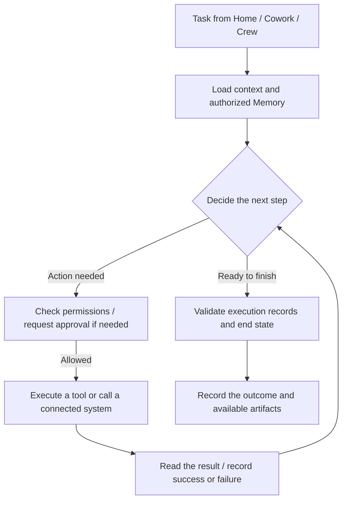

# Anna

> **Experimental source preview · CI was in progress at the initial source push (2026-09-22).** [Current main CI](https://github.com/Foxtailsss-Andy/Anna-Agent/actions/workflows/ci.yml?query=branch%3Amain) · [reviewed-candidate CI](https://github.com/Foxtailsss-Andy/Anna-Agent/actions/runs/35640135163). Local checks and independent review passed; use the linked current CI record for the live outcome.
>
> Measured scope: 24 synthetic heldout cases, 22 model inputs and 2 hard prechecks. C is one `deepseek-v4-pro` judgment with thinking enabled/high; D is `jev-1.13.0`. Both match 22/22 labels (12 recommendations + 10 abstentions). Jev p50 is 85.23% lower; at this run's off-peak/cache-miss prices estimated cost is 94.71% lower (peak reference 97.35%; not invoices). Reported total tokens are 57.98% higher. This does not establish production accuracy, Worker completion or whole-workflow acceleration.


**An AI companion for personal tasks, business workflows, and project collaboration.**

Anna is a personal open-source project exploring how an AI agent can carry work from a conversation through to a reviewable result. The local-first desktop app brings tasks, connected business systems, and collaboration together in **Home, Cowork, and Crew**.

The aim is to keep the work understandable: what Anna is doing, which tools she can use, what needs your decision, and where the result came from.

**Jev Crew · Experimental Source Preview** · macOS arm64 · [MIT License](LICENSE) · [CI](https://github.com/Foxtailsss-Andy/Anna-Agent/actions)

[中文](README.zh-CN.md) · [Explore Anna](#what-you-can-explore) · [Quick start](#quick-start) · [Current status](#current-status) · [Codex pet](#meet-anna-your-codex-companion) · [Development diary](https://github.com/Foxtailsss-Andy/Anna-Agent/wiki/Anna-Development-Diary)

> **Ask for an assignee suggestion, then decide**
>
> Crew can suggest a person or Worker for one unassigned task. Open the existing member picker, request a suggestion, inspect its source, and explicitly accept it or choose manually. A unique exact-role match uses a rule; Jev handles other eligible semantic choices and can abstain. Suggesting someone does not assign or run the task. This source preview adds explicit suggestions; see the [changes, evidence, and limits](docs/releases/jev-crew-preview.md). The [RC2 source release](https://github.com/Foxtailsss-Andy/Anna-Agent/releases/tag/workbench-rc2) remains a separate release record.

## Measured Jev comparison

On **24 synthetic heldout cases**, 22 were eligible for model judgment; two hard-precheck cases made no C/D call. Both models matched the frozen labels on **22/22**: 12 correct recommendations and 10 correct abstentions, with zero wrong labels, API or format errors. Existing role rules matched 12/22 on the same subset.

| Measure (22 eligible cases) | DeepSeek, one judgment (C) | Jev production adapter (D) |
| --- | ---: | ---: |
| Requested → returned model | `deepseek-v4-pro` → same | `jev-1.13.0` → same |
| Settings / provider requests | Thinking enabled, high; max 4096 / 22 | Typed Choice / 22 |
| Observed p50 / p95 | 2007.078 / 2692.501 ms | 296.349 / 421.889 ms |
| Reported input / output tokens | 4,887 / 2,873 | 11,233 / 1,026 |
| Estimated cost, peak/cache-miss reference | $0.017827920 | $0.000471786 |

Jev had **85.23% lower p50**, **84.33% lower p95** and **97.35% lower reference estimated cost**, with **equal label agreement**. Reported total tokens increased **57.98%**; different tokenizers prevent an equivalent-compute interpretation. The cost figure uses DeepSeek peak/cache-miss prices for budget accounting, not a bill. At this run's off-peak rates with the same cache-miss assumption, estimated cost is **94.71% lower**; cache hits may reduce DeepSeek cost further.

This is one small sequential comparison of model judgments, not production accuracy, browser end-to-end latency or measured speedup of the previous complete Crew/Host/OMP path (B). The **8 development cases are reported separately**. See [full results, denominators and method](evals/jev-crew/jev03-final-20260922-r1/REPORT.md).

## What you can explore

| Workspace | When to use it | What you can do |
| --- | --- | --- |
| **Home** | Work through a personal task or create a reusable resource. | Bring files into a conversation, follow the task plan, inspect tool activity, and review documents or Prompt artifacts. Skill and Python Tool creation are also part of the interface. |
| **Cowork** | Work with information from a connected business system. | View business dashboards, ask the Hiker assistant about available data, and access existing reimbursement workflows. Connector permissions determine the available operations. |
| **Crew** | Coordinate a project with people and specialist Workers. | Organize tasks and dependencies on a project graph, add context in channels, assign work, and review or return versioned artifacts for rework. |

Home includes execution controls, history, files, and Trace inspection. Crew keeps project context, task discussions, artifacts, and review decisions connected, so a result can be followed back to the work that produced it.

## Product walkthrough


*Create, Cowork, and Crew in one loop. The walkthrough illustrates the interface; the Hiker dashboard uses synthetic data. Live model and connector validation is documented separately below.*

<details>
<summary>Inside a Crew artifact review</summary>


A deliverable, its source task, the project channel, and the review decision stay connected in one workspace.

</details>

## Meet Anna, your Codex companion

Anna's iris flower, ivory blouse, and purple skirt now come as a little desktop companion. Bring her into Codex to keep you company while you work.

<p align="center">
  
  
</p>

<p align="center">
  <a href="https://github.com/Foxtailsss-Andy/Anna-Agent/releases/download/anna-pet-v1.0.0/anna-codex-pet-v1.0.0.zip"><strong>Download Anna for Codex</strong></a> · <a href="pets/README.md">Installation guide</a> · <a href="pets/anna-iris">Pet files</a>
</p>

*A still capture and animation from the shared pet artwork. Includes 9 animation states and 16 look directions; requires desktop support for custom v2 pets.*

## Current status

Anna is in active development. The current source is intended for developers and contributors exploring the project.

| Area | Status |
| --- | --- |
| **Jev Crew candidate** | Optional single-task suggestions with explicit adoption. A real browser → Jev → assignment → SQLite readback is verified on synthetic data. The [release record](docs/releases/jev-crew-preview.md) separates measured C/D judgments, accepted assignment behavior and remaining Worker/platform limits. |
| **RC2 source** | Fixes release validation around workdir identity/scope tests and CI evidence dependencies. Ordinary conversations continue through the shared Node Harness Host and Oh-my-Pi loop. See the [RC2 record](docs/releases/rc2-developer-preview.md); the [RC1 record](docs/releases/rc1-developer-preview.md) preserves the earlier behavior and failures. |
| **Earlier live validation** | Home document generation, Prompt creation, Stop, and next-turn context; Crew Worker delivery, review/rework, and contextual Anna; Hiker dashboard reads and an Agent capability query. See the [August 31–September 1 validation record](docs/superpowers/handoff/2026-08-31-harness-product-parity.md) for scope and remaining gates. |
| **External business operations** | The Hiker service used for that validation exposed read tools. Authorized write and read-back acceptance remain blocked on the service exposing the required capability. |
| **Desktop distribution** | Validation currently targets macOS arm64. The local application build is unsigned and unnotarized; Windows/Linux release acceptance remains open. |
| **Application releases** | [`v0.2.0` Developer Preview](https://github.com/Foxtailsss-Andy/Anna-Agent/releases/tag/v0.2.0) predates the current Harness execution path. The Codex pet has its own asset release. |

The historical RC2 validation used deterministic external transports for local identity, persistence, Gateway, and OMP execution. Its full live Provider/MCP gate remained blocked; the Jev judgment measurements above cover the new bounded suggestion scope. Full workbench scheduling, ask/answer, recovery, Memory, Sandbox, and Windows/Linux acceptance remain pending. Production readiness and benchmark results remain outside the current release claims. CI checks, interface demos, and live external-service runs provide different evidence; the [current acceptance goals](docs/product/anna-harness-product-parity-goal-2026-08-31.md) track those boundaries.

## Quick start

Requirements: **macOS arm64**, **Node.js ≥22.19.0**, **Python 3.12**, and **uv**.

```bash
git clone https://github.com/Foxtailsss-Andy/Anna-Agent.git
cd Anna-Agent
npm ci
uv sync --locked --extra dev
ANNA_OMP_BUN_ARCHIVE_URL=https://github.com/oven-sh/bun/releases/download/bun-v1.3.14/bun-darwin-aarch64.zip npm run harness:omp:prepare
npm run desktop:run
```

To run Agent tasks, configure your model provider locally; business features also require their connector configuration. The current documented model setup uses DeepSeek through an OpenAI-compatible transport.

Follow [DEVELOPMENT.md](DEVELOPMENT.md) for configuration paths, state isolation, and troubleshooting. Keep model credentials, connector secrets, and runtime state outside the Agent-readable task workspace. External model providers and connectors receive the requests you configure; local-first describes where the desktop app and its state run.

## How work moves through Anna

Anna advances a task through a **decide → act → observe → decide again** loop. The **Harness** surrounds that loop with context, permissions, execution limits, persistent state, and result checks.


```mermaid
flowchart TD
    Task[Task from Home / Cowork / Crew] --> Context[Load context and authorized Memory]
    Context --> Decide{Decide the next step}
    Decide -->|Action needed| Gate[Check permissions / request approval if needed]
    Gate -->|Allowed| Act[Execute a tool or call a connected system]
    Act --> Observe[Read the result / record success or failure]
    Observe --> Decide
    Decide -->|Ready to finish| Check[Validate execution records and end state]
    Check --> Outcome[Record the outcome and available artifacts]
```

| Stage | What happens |
| --- | --- |
| **1. Prepare context** | Load the request, relevant conversation, task files, available tools, and authorized channel Memory within the task's scope. |
| **2. Decide and plan** | The model uses that context and previous observations to choose the next action or propose a result, updating the task plan as work progresses. |
| **3. Check permission** | The Tool Gateway validates arguments and access scope. Actions that require approval wait for authorization before execution. |
| **4. Act** | Run an allowed tool to read a file, produce an artifact, or call an external system through a connector. Available operations depend on the task's permissions and the connected service. |
| **5. Observe and continue** | Return the actual tool result, error, or changed state to the model as context for its next decision. Work can continue through multiple iterations. |
| **6. Check and conclude** | When the loop proposes an outcome, the Harness validates execution records and the end state (Eval), then saves the result and any artifacts. Artifact checks and human review follow the relevant workflow; completion, failure, and cancellation remain distinct states. |

The loop is bounded by execution budgets and stop conditions. The Harness persists events and state so Trace can connect model calls, tool results, and the final outcome. Longer-term Memory retains its separate proposal and confirmation rules.

See [DEVELOPMENT.md](DEVELOPMENT.md), the [architecture terminology](CONTEXT.md), and the [current acceptance scope](docs/product/anna-harness-product-parity-goal-2026-08-31.md) for implementation details and validation boundaries.

## Build with us

Useful contributions start with a concrete task: what you tried, what you expected, and what actually happened. Reproducible failures, interaction feedback, connector improvements, and documentation fixes are welcome.

- [Report an issue](https://github.com/Foxtailsss-Andy/Anna-Agent/issues) with reproduction steps and sanitized evidence.
- Read [CONTRIBUTING.md](CONTRIBUTING.md) and choose a scoped item from the [community backlog](docs/product/anna-harness-first-community-backlog-2026-08-31.md).
- Follow the [development diary](https://github.com/Foxtailsss-Andy/Anna-Agent/wiki/Anna-Development-Diary) for the decisions, setbacks, and lessons behind Anna.

<details>
<summary>Repository verification commands</summary>

```bash
npm run typecheck
npm test -- --reporter=dot
npm run frontend:product-smoke
./.venv/bin/python -m pytest -q
npm run build
npm run release:verify
npm run evidence:verify:all
```

For desktop packaging checks:

```bash
npm run desktop:package
npm run desktop:smoke-asar
```

Live provider and business-system validation require separate configuration and evidence. See [DEVELOPMENT.md](DEVELOPMENT.md).

</details>

Please keep credentials, local state, runtime logs, provider responses, and real business data out of public contributions. Follow [SECURITY.md](SECURITY.md) to report vulnerabilities.

## Credits and license

Anna grew from a personal exploration of AI agents and Harness design. Pi Agent and Oh-my-Pi have been important technical references. Thank you to the open-source community and everyone sharing feedback along the way.

**[Hiker ERP](https://github.com/kc8zshnt6n-gif/Hiker-ERP)** is an external ERP collaboration by [kc8zshnt6n-gif](https://github.com/kc8zshnt6n-gif), connecting procurement, inventory, treasury, finance, and other enterprise workflows. If you are interested in enterprise software and AI agents working with business systems, take a look at its [product walkthrough and architecture](https://github.com/kc8zshnt6n-gif/Hiker-ERP).

The public Hiker repository contains product presentation materials; its source code remains private. Anna connects to explicitly exposed Hiker capabilities through MCP. Hiker's platform, server, deployment, and business data are not included here. Anna's license covers the Anna-side connector and UI integration, and does not extend to Hiker.

[Foxtailsss-Andy/Anna-Agent](https://github.com/Foxtailsss-Andy/Anna-Agent) is the canonical public repository. Anna is released under the [MIT License](LICENSE); third-party dependency notices are listed in [NOTICE.md](NOTICE.md).
