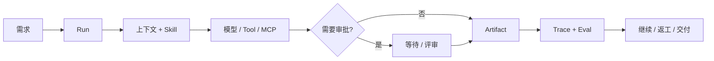

# Anna


Anna 是一个受治理、local-first 桌面 AI Agent，产品由 **Home、Cowork、Crew** 三大模块组成。本分支保留原有产品，将 Agent 执行迁移到单一 Node Harness Host 与实际 Oh-my-Pi Loop。

- **Home：** 个人对话、任务执行，以及共享工作界面中的 Skill、Prompt、Python Tool 产物创建。
- **Cowork：** 业务看板、Hiker MCP 助手及已有报销流程。
- **Crew：** 项目图、频道、理解上下文的 Anna、专业 Worker、产物、评审及已确认项目 Memory。

迁移替换 Agent 执行权，保留业务状态机、界面与数据。Python 可以继续承担身份、业务存储和连接器服务，不持有模型凭据、不运行旧 Agent Loop。接入进度与真实验收分别记录，单元测试通过不能证明产品已可交付。

**当前分支：[Harness 产品功能保真 Goal](docs/product/anna-harness-product-parity-goal-2026-08-31.md)** | macOS arm64 | MIT License | [CI](https://github.com/Foxtailsss-Andy/Anna-Agent/actions)

此前版本：[`v0.2.0` Developer Preview](https://github.com/Foxtailsss-Andy/Anna-Agent/releases/tag/v0.2.0)，发布于默认 Harness 切换之前。

[English](README.md) | [开发日记](https://github.com/Foxtailsss-Andy/Anna-Agent/wiki/Anna-Development-Diary) | [产品演示](#产品演示) | [快速开始](#快速开始) | [可以体验什么](#可以体验什么) | [架构](#anna-如何推进工作)

## 产品演示

以下演示记录迁移需要保留的原有产品设计，不作为真实 Harness 或 Hiker 调用证据。


*一个 GIF 展示三个产品页面：尚未启动任务的 Create 页面、完整的 Cowork Hiker 客户与合同看板，以及 Crew 工作流画布。Hiker 页面使用合成 fixture，不包含真实服务响应、凭据或业务数据。*

## 快速开始

环境要求：

- Node.js `>=22.19.0`
- Python 3.12 与 `uv`，用于受管业务适配器
- macOS arm64，当前桌面验收平台

```bash
npm ci
uv sync --locked --extra dev
ANNA_OMP_BUN_ARCHIVE_URL=https://github.com/oven-sh/bun/releases/download/bun-v1.3.14/bun-darwin-aarch64.zip npm run harness:omp:prepare
npm run desktop:run
```

在本地配置模型和业务连接器。模型凭据由 Node Host 持有，Python 业务适配器仅接收业务配置。配置和应用状态目录必须放在 Agent 可读工作目录之外。

每个新 checkout 准备一次固定版本的 Bun/OMP runtime，Worker 源码变化后必须重新绑定 Runtime。启动器不得回退旧 Python 或 Pi Agent Loop。配置、状态隔离与验证见 [DEVELOPMENT.md](DEVELOPMENT.md)。

## 可以体验什么

| 产品面 | 当前呈现的能力 |
| --- | --- |
| **Home** | Chat/Create、共享 LoopCard、工作目录、文件/画布、历史、执行控制和 Trace。 |
| **Cowork** | 确定性的 Hiker 看板、Agent 助手及已有业务审批流程。 |
| **Crew** | Graph x Channel x Memory、指派、Worker 执行、产物版本、评审和 Showcase。 |
| **Harness** | OMP 驱动模型/工具循环，Host 负责上下文、权限、Memory、规范事件与 Eval。 |

各产品面需通过当前 Goal 中的真实验收。确定性测试和演示 fixture 均不作为真实 Provider 或外部业务操作的证据。

## 频道与业务系统

以下流程属于本次产品功能保真的范围。

频道是 Anna 的协同层。每个频道让人、Anna 和专业 Agent 围绕相同任务、活动 Run、产物、@提及、评审决策与项目历史保持一致。一条消息可以补充上下文、调整正在执行的工作、点名成员或 Agent，也可以把团队带回正在讨论的具体任务和产物。

MCP 是 Anna 连接外部系统的边界。Anna 可以通过 MCP connector 获取经营数据、查看业务记录，并在 ERP 或其他企业系统中调用业务操作。读取范围受到约束；已接入治理闭环的外部写入会保留权限检查、人工审批、幂等、读回校验和审计证据。

## Anna 如何推进工作

Agent 链路为 `Home / Cowork / Crew -> 产品适配器 -> Node Harness Host -> 实际 OMP -> Host model transport / ToolGateway -> Contract Eval -> 终态事件`。业务 CRUD 和连接器操作复用已有领域服务；Agent 历史、Memory 装载及模型/工具执行权归属 Harness。

产品工作流保留明确的审批与评审边界：



共享 Runtime 建立在三个长期基础上：

- **Identity：** 工作空间、用户、频道和权限范围；
- **Judgment：** 对继续、等待、请求信息或结束作出明确判断；
- **Memory：** 区分任务上下文、候选记忆和已确认业务记忆。

配置缺失或 connector 不可用时，状态会保持可见并支持恢复。Anna 会如实呈现依赖状态和执行结果。

## Crew

Crew 将多人工作组织为可观察的项目图：

- 使用 SOP 模板和依赖关系拆解任务；
- 支持指派、启动、提交、评审、通过和退回返工；
- 将频道消息与产物卡片关联到具体节点；
- 从画布查看项目进度和等待处理的门禁；
- 在工作流内阅读和下载 Markdown 或 HTML 交付物。


*产物阅读器把交付物、来源任务、项目频道和审批决策放在同一个评审界面中。*

## Harness：执行与治理层

Harness v2 重点解决恢复能力和证据质量：

| 能力 | 契约 |
| --- | --- |
| **Durable Run / Event Store** | 持久化规范状态与事件，降低对单个在线进程的依赖。 |
| **Channel-scoped isolation** | 明确工作空间与频道边界。 |
| **Tool Gateway** | 执行 schema、权限、审批、幂等和审计约束。 |
| **Memory policy** | 区分候选记忆、已确认记忆和禁止写入的场景。 |
| **Trace / Eval** | 关联上下文、模型调用、工具、审批、重试和终局证据。 |
| **Scheduler / fencing** | 为主动运行、所有权、恢复和重复执行防护提供基础。 |

当前迁移覆盖已有 Home、Cowork、Crew 的 Agent 路径，包括不直接可见的草稿生成与匹配调用。独立 Preview 面板不作为产品入口，旧 Python Agent 不拥有回退执行权。

## 长期设计方向

| 企业工作需要 | Anna 的实现方式 |
| --- | --- |
| **让工作持续超过一次回答** | Run 保留状态、事件、产物和下一步动作。 |
| **控制自动化边界** | 外部写入保留权限、审批与审计。 |
| **从中断中恢复** | 等待、配置缺失、重试和失败都具有明确状态。 |
| **检查结果如何产生** | Trace/Eval 把执行路径连接到最终产物。 |
| **保留本地控制权** | Runtime 数据默认留在本地；外部 provider 和 connector 由用户显式启用。 |
| **扩展到企业业务域** | Connector、Skill 和 Run Profile 围绕共享 Runtime 契约增加领域能力。 |

## 验证

运行核心仓库门禁：

```bash
npm run typecheck
npm test -- --reporter=dot
npm run frontend:smoke
./.venv/bin/python -m pytest -q
npm run build
npm run release:verify
npm run evidence:verify:all
```

桌面打包 Smoke：

```bash
npm run desktop:package
npm run desktop:smoke-asar
```

CI 的确定性门禁不依赖私有 provider、本机运行状态或签名身份。Python 测试覆盖保留的业务服务及旧 Agent 禁用边界；真实 Provider 和 Hiker 验收单独记录，不能从 fixture 测试通过推导。

## Developer Preview 边界

当前版本适合：

- 保留原有 Home、Cowork、Crew 工作流并迁移其 Agent 执行；
- 在本地连接一个 OpenAI-compatible provider；
- 验证受控工具、执行控制、持久化历史和上下文协作；
- 参与社区 Backlog 中范围明确的改进；
- 基于真实 Trace 和失败案例继续迭代。

当前版本暂不承诺：

- production-ready 或 hosted cloud runtime；
- 只读 Hiker 服务端尚未开放的写入能力；
- 无限制 coding tools、穷尽恢复组合或 SWE-bench 成绩；
- 生产级 Review-to-Validated-Patch 审批闭环；
- 外部 WebSearch 或 MCP 服务持续可用；
- 已签名和 notarized 的 macOS 安装包；
- Windows/Linux 支持及跨平台发布验收。

## 外部项目边界

**Hiker** 是面向小型团队的外部 ERP 项目。Anna 保留其 Hiker 看板与 MCP 集成，实际读写能力取决于连接的服务端和授权；只读服务端无法满足写入验收。

Hiker 是外部合作项目，作者为 [kc8zshnt6n-gif](https://github.com/kc8zshnt6n-gif)。本仓库不包含 Hiker 平台、服务端源码、部署和业务数据，Hiker 目前尚未开源。Anna 的 MIT License 只覆盖 Anna 侧 MCP connector、界面集成及仓库中提交的其他文件，不延伸至 Hiker。

## 仓库与维护

该 GitHub 仓库创建于 2026 年 4 月 2 日，最初用于规划 Anna 项目。随着 Harness 技术持续发展，Pi Agent 等先进范式为本项目提供了大量技术参考与启发，并最终形成今天的 Anna。感谢 GitHub 社区。

[Foxtailsss-Andy/Anna-Agent](https://github.com/Foxtailsss-Andy/Anna-Agent) 是唯一公开维护仓库。发布里程碑、命名边界和后续 GitHub 维护流程记录在 [Anna Agent GitHub Milestone - 2026-08-24](docs/product/anna-agent-github-milestone-2026-08-24.md)。

深入了解项目和发布边界：

- [当前产品功能保真 Goal 与上线门禁](docs/product/anna-harness-product-parity-goal-2026-08-31.md)
- [社区 Backlog 与能力边界](docs/product/anna-harness-first-community-backlog-2026-08-31.md)
- [Harness-first SPEC 与验收标准 - 2026-08-30](docs/product/anna-harness-first-spec-2026-08-30.md)
- [Harness-first 更新：交付范围、验证结果与待完成项](docs/product/anna-harness-first-update-2026-08-30.md)
- [Harness-first SDD 计划与迁移状态](docs/superpowers/plans/2026-08-30-harness-first/00-plan.md)
- [Developer Preview Wayfinder](docs/product/anna-github-developer-preview-wayfinder-2026-08-23.md)
- [Developer Preview Spec](docs/product/anna-github-developer-preview-spec-2026-08-23.md)
- [Release tickets](docs/superpowers/plans/2026-08-23-github-developer-preview/00-tickets.md)

提交 Pull Request 前请阅读 [CONTRIBUTING.md](CONTRIBUTING.md)，报告安全问题前请阅读 [SECURITY.md](SECURITY.md)。请勿提交 `.anna/`、数据库、运行日志、provider 响应、API key、生成包或真实企业数据。

Anna 使用 [MIT License](LICENSE)。第三方依赖说明见 [NOTICE.md](NOTICE.md)。
