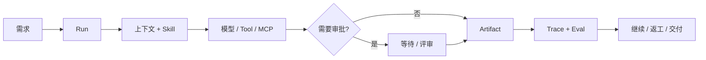

# Anna


Anna 是一个受治理、local-first 桌面 AI Agent。本分支交付 **Harness-first Developer Preview**：正常桌面入口由单一 Node Harness Host 与实际 Oh-my-Pi Loop 执行，不自动回退 Python 或 Pi。

- **执行任务。** 配置模型、提交目标、查看真实 Run 事件与最终回答，并可停止执行。
- **读取工作区。** 已准入的只读工具经 Host ToolGateway 执行；本版不开放原生 shell 和写入工具。
- **保留执行历史。** Harness 拥有 Run、Profile、Context/Memory、Skill、SQLite 事件和 Contract Eval。

本版主动收束范围。Crew、Create、Cowork、Hub 及 Hiker/MCP 业务操作不在默认 Preview 开放。旧源码和数据保留，后续迁移见[社区 Backlog](docs/product/anna-harness-first-community-backlog-2026-08-31.md)。

**当前分支：[Harness-first Preview Goal](docs/product/anna-harness-first-preview-goal-2026-08-31.md)** | macOS arm64 | MIT License | [CI](https://github.com/Foxtailsss-Andy/Anna-Agent/actions)

此前版本：[`v0.2.0` Developer Preview](https://github.com/Foxtailsss-Andy/Anna-Agent/releases/tag/v0.2.0)，发布于默认 Harness 切换之前。

[English](README.md) | [开发日记](https://github.com/Foxtailsss-Andy/Anna-Agent/wiki/Anna-Development-Diary) | [产品演示](#产品演示) | [快速开始](#快速开始) | [可以体验什么](#可以体验什么) | [架构](#anna-如何推进工作)

## 产品演示

以下为历史产品原型演示，不代表 Harness-first Preview 当前开放的功能范围。


*一个 GIF 展示三个产品页面：尚未启动任务的 Create 页面、完整的 Cowork Hiker 客户与合同看板，以及 Crew 工作流画布。Hiker 页面使用合成 fixture，不包含真实服务响应、凭据或业务数据。*

## 快速开始

环境要求：

- Node.js `>=22.19.0`
- macOS arm64，本次 Preview 的目标验证平台

```bash
npm ci
ANNA_OMP_BUN_ARCHIVE_URL=https://github.com/oven-sh/bun/releases/download/bun-v1.3.14/bun-darwin-aarch64.zip npm run harness:omp:prepare
npm run desktop:run
```

没有 provider 凭据时仍可进入设置。填写 OpenAI-compatible 模型端点、模型名、API key 和一个已有工作区后执行真实任务。默认 Preview Runtime 无需 Python。

每个新 checkout 准备一次固定版本的 Bun/OMP runtime；准备命令拒绝覆盖已经绑定的 runtime。正常启动使用单一 Preview Host，旧 sidecar 开关不再承担本版迁移切换。状态隔离、回退和保留的旧测试见 [DEVELOPMENT.md](DEVELOPMENT.md)。

## 可以体验什么

| 产品面 | 当前呈现的能力 |
| --- | --- |
| **任务** | 实际 OMP 执行、真实生命周期/工具/最终回答事件、停止及明确的 provider 失败状态。 |
| **设置** | 本地模型、端点、密钥、工作区配置；API 不返回密钥。 |
| **历史** | 重开后从同一 SQLite 状态读取已完成 Run 与规范事件。 |
| **Harness** | Host 拥有 Profile/Skill/Memory 装载、只读 ToolGateway 和终态前 Eval。 |

事件流呈现真实生命周期和最终消息，本版不承诺逐 token 文本流。确定性测试不能作为真实 Provider 调用的证据。

## 历史产品工作：频道与业务系统

以下协同与业务流程在默认 Preview 中保持关闭，等待后续迁移。

频道是 Anna 的协同层。每个频道让人、Anna 和专业 Agent 围绕相同任务、活动 Run、产物、@提及、评审决策与项目历史保持一致。一条消息可以补充上下文、调整正在执行的工作、点名成员或 Agent，也可以把团队带回正在讨论的具体任务和产物。

MCP 是 Anna 连接外部系统的边界。Anna 可以通过 MCP connector 获取经营数据、查看业务记录，并在 ERP 或其他企业系统中调用业务操作。读取范围受到约束；已接入治理闭环的外部写入会保留权限检查、人工审批、幂等、读回校验和审计证据。

## Anna 如何推进工作

本版默认链路为 `Desktop -> Node Harness Host -> 实际 OMP -> Host model transport / ToolGateway -> Contract Eval -> 终态事件`。已完成历史来自同一事件源，Memory 和工具均在 Harness 权限下加载。

下图是长期企业工作方向，其中审批和业务入口尚未在本版开放：



共享 Runtime 建立在三个长期基础上：

- **Identity：** 工作空间、用户、频道和权限范围；
- **Judgment：** 对继续、等待、请求信息或结束作出明确判断；
- **Memory：** 区分任务上下文、候选记忆和已确认业务记忆。

配置缺失或 connector 不可用时，状态会保持可见并支持恢复。Anna 会如实呈现依赖状态和执行结果。

## 历史产品工作：Crew

Crew 将多人工作组织为可观察的项目图：

- 使用 SOP 模板和依赖关系拆解任务；
- 支持指派、启动、提交、评审、通过和退回返工；
- 将频道消息与产物卡片关联到具体节点；
- 从画布查看项目进度和等待处理的门禁；
- 在工作流内阅读和下载 Markdown 或 HTML 交付物。


*产物阅读器把交付物、来源任务、项目频道和审批决策放在同一个评审界面中。*

## Harness：执行与治理层

Harness v2 重点解决恢复能力和证据质量：

| 能力 | 契约 |
| --- | --- |
| **Durable Run / Event Store** | 持久化规范状态与事件，降低对单个在线进程的依赖。 |
| **Channel-scoped isolation** | 明确工作空间与频道边界。 |
| **Tool Gateway** | 执行 schema、权限、审批、幂等和审计约束。 |
| **Memory policy** | 区分候选记忆、已确认记忆和禁止写入的场景。 |
| **Trace / Eval** | 关联上下文、模型调用、工具、审批、重试和终局证据。 |
| **Scheduler / fencing** | 为主动运行、所有权、恢复和重复执行防护提供基础。 |

本版 Harness 已接入正常桌面入口。Create、Cowork、Crew 和 Hub 的领域级迁移属于后续工作；旧 Python 源码不作为自动回退运行。

## 长期设计方向

| 企业工作需要 | Anna 的实现方式 |
| --- | --- |
| **让工作持续超过一次回答** | Run 保留状态、事件、产物和下一步动作。 |
| **控制自动化边界** | 外部写入保留权限、审批与审计。 |
| **从中断中恢复** | 等待、配置缺失、重试和失败都具有明确状态。 |
| **检查结果如何产生** | Trace/Eval 把执行路径连接到最终产物。 |
| **保留本地控制权** | Runtime 数据默认留在本地；外部 provider 和 connector 由用户显式启用。 |
| **扩展到企业业务域** | Connector、Skill 和 Run Profile 围绕共享 Runtime 契约增加领域能力。 |

## 验证

运行核心仓库门禁：

```bash
npm run typecheck
npm test -- --reporter=dot
npm run frontend:smoke
./.venv/bin/python -m pytest -q
npm run build
npm run release:verify
npm run evidence:verify:all
```

桌面打包 Smoke：

```bash
npm run desktop:package
npm run desktop:smoke-asar
```

CI 的确定性门禁不依赖私有 provider、本机运行状态或签名身份。Python 仅用于保留的旧实现回归测试；真实 Provider smoke 单独记录，不能从 fixture 测试通过推导。

## Developer Preview 边界

当前版本适合：

- 执行默认 Harness-first 任务链路；
- 在本地连接一个 OpenAI-compatible provider；
- 使用已准入的只读工作区工具、停止和持久化历史；
- 参与社区 Backlog 中范围明确的改进；
- 基于真实 Trace 和失败案例继续迭代。

当前版本暂不承诺：

- production-ready 或 hosted cloud runtime；
- 全业务迁移、Crew/Create/Cowork/Hub 或 Hiker/MCP 执行；
- 完整 coding tools、steer/ask-human 交互控制或 SWE-bench 成绩；
- 生产级 Review-to-Validated-Patch 审批闭环；
- 外部 WebSearch 或 MCP 服务持续可用；
- 已签名和 notarized 的 macOS 安装包；
- Windows/Linux 支持及跨平台发布验收。

## 外部项目边界

**Hiker** 是面向小型团队的外部 ERP 项目。仓库中保留的 Anna 侧 MCP 集成属于历史产品工作，不在默认 Harness-first Preview 开放。

Hiker 是外部合作项目，作者为 [kc8zshnt6n-gif](https://github.com/kc8zshnt6n-gif)。本仓库不包含 Hiker 平台、服务端源码、部署和业务数据，Hiker 目前尚未开源。Anna 的 MIT License 只覆盖 Anna 侧 MCP connector、界面集成及仓库中提交的其他文件，不延伸至 Hiker。

## 仓库与维护

该 GitHub 仓库创建于 2026 年 4 月 2 日，最初用于规划 Anna 项目。随着 Harness 技术持续发展，Pi Agent 等先进范式为本项目提供了大量技术参考与启发，并最终形成今天的 Anna。感谢 GitHub 社区。

[Foxtailsss-Andy/Anna-Agent](https://github.com/Foxtailsss-Andy/Anna-Agent) 是唯一公开维护仓库。发布里程碑、命名边界和后续 GitHub 维护流程记录在 [Anna Agent GitHub Milestone - 2026-08-24](docs/product/anna-agent-github-milestone-2026-08-24.md)。

深入了解项目和发布边界：

- [当前 Preview Goal 与上线门禁](docs/product/anna-harness-first-preview-goal-2026-08-31.md)
- [社区 Backlog 与能力边界](docs/product/anna-harness-first-community-backlog-2026-08-31.md)
- [Harness-first SPEC 与验收标准 - 2026-08-30](docs/product/anna-harness-first-spec-2026-08-30.md)
- [Harness-first 更新：交付范围、验证结果与待完成项](docs/product/anna-harness-first-update-2026-08-30.md)
- [Harness-first SDD 计划与迁移状态](docs/superpowers/plans/2026-08-30-harness-first/00-plan.md)
- [Developer Preview Wayfinder](docs/product/anna-github-developer-preview-wayfinder-2026-08-23.md)
- [Developer Preview Spec](docs/product/anna-github-developer-preview-spec-2026-08-23.md)
- [Release tickets](docs/superpowers/plans/2026-08-23-github-developer-preview/00-tickets.md)

提交 Pull Request 前请阅读 [CONTRIBUTING.md](CONTRIBUTING.md)，报告安全问题前请阅读 [SECURITY.md](SECURITY.md)。请勿提交 `.anna/`、数据库、运行日志、provider 响应、API key、生成包或真实企业数据。

Anna 使用 [MIT License](LICENSE)。第三方依赖说明见 [NOTICE.md](NOTICE.md)。
