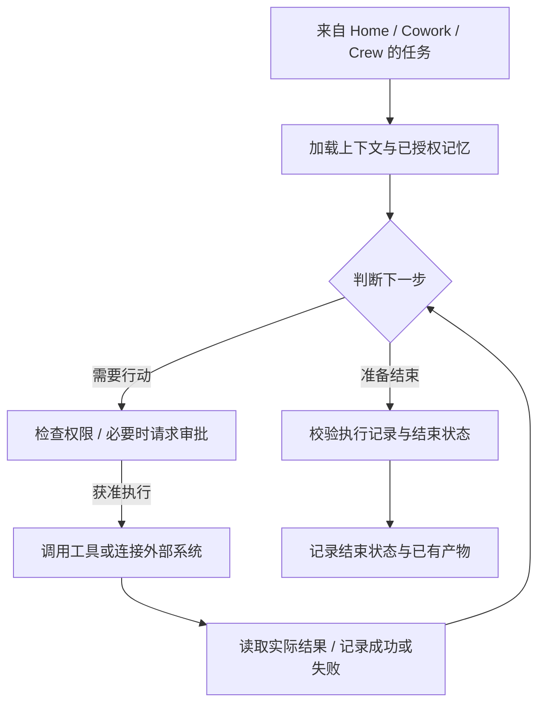

# Anna


**处理个人任务、连接业务系统、参与项目协作的 AI 伙伴。**

Anna 是一个个人开源项目，探索如何让 AI Agent 从一次对话出发，持续推进任务，并交付可审阅的结果。它以本地优先的桌面应用为载体，通过 **Home、Cowork、Crew** 三个工作空间，将任务、业务系统和协作连接起来。

我们希望工作过程始终清楚：Anna 正在做什么、可以使用哪些工具、哪里需要你作决定，以及结果是如何产生的。

**Developer Preview（开发者预览）** · macOS arm64 · [MIT License](LICENSE) · [CI](https://github.com/Foxtailsss-Andy/Anna-Agent/actions)

[English](README.md) · [可以体验什么](#可以体验什么) · [快速开始](#快速开始) · [当前进展](#当前进展) · [Codex 小宠物](#认识-anna你的-codex-小伙伴) · [开发日记](https://github.com/Foxtailsss-Andy/Anna-Agent/wiki/Anna-Development-Diary)

> **2026 年 9 月 5 日 · Anna 新的更新即将上线**
>
> 随着 [GPT-6 Astra](https://developers.openai.com/api/docs/models/gpt-6-astra) 的发布，我们正借助 Codex 中的 Astra，集中排查和修复 Anna 底层存在的问题，持续优化架构与运行稳定性。目前这项工作正在进行中，具体改动与验证结果会随下一次更新一同公布。感谢大家关注这个个人项目，也欢迎继续分享反馈。

## 可以体验什么

| 工作空间 | 适用时刻 | 可以做什么 |
| --- | --- | --- |
| **Home** | 处理个人任务，或制作可复用的工作资源。 | 带着文件开始对话，跟进任务计划，查看工具执行过程，审阅文档或 Prompt 产物。界面也保留 Skill 和 Python Tool 创建入口。 |
| **Cowork** | 围绕已连接的业务系统开展工作。 | 查看业务看板，向 Hiker 助手询问可用数据，进入已有报销流程。具体可用操作由连接器能力与权限决定。 |
| **Crew** | 与团队成员、专业 Worker 一起推进项目。 | 在项目图中组织任务与依赖，在频道中补充上下文、指派工作，审阅不同版本的产物，或提出意见后退回返工。 |

Home 提供执行控制、历史、文件与 Trace 查看入口。Crew 将项目上下文、任务讨论、产物和评审决策关联起来，方便从一份结果回到产生它的工作过程。

## 产品演示


*一个循环展示 Create、Cowork 与 Crew 界面。Hiker 看板使用合成数据；真实模型和连接器调用的验证记录见下方「当前进展」。*

<details>
<summary>查看 Crew 产物评审界面</summary>


交付物、来源任务、项目频道与评审决策保留在同一个工作空间中。

</details>

## 认识 Anna：你的 Codex 小伙伴

戴着鸢尾花、穿着米白上衣和紫色长裙的 Anna，现在也有了自己的桌面小宠物形象。欢迎把她带到 Codex 中，陪你一起工作。

<p align="center">
  
  
</p>

<p align="center">
  <a href="https://github.com/Foxtailsss-Andy/Anna-Agent/releases/download/anna-pet-v1.0.0/anna-codex-pet-v1.0.0.zip"><strong>下载 Anna Codex 小宠物</strong></a> · <a href="pets/README.md#中文安装说明">安装说明</a> · <a href="pets/anna-iris">宠物源文件</a>
</p>

*以上为共享宠物素材的静态截图与动画预览。包含 9 组动作和 16 个视线方向，需要支持自定义 v2 宠物的桌面版本。*

## 当前进展

Anna 正在持续开发中，当前源码面向希望体验项目、参与改进的开发者与贡献者。

| 范围 | 当前状态 |
| --- | --- |
| **当前 `main`** | Home、Cowork、Crew 通过共享 Node Harness Host 与 Oh-my-Pi 模型/工具循环执行任务，架构与稳定性优化仍在推进。 |
| **已记录的真实验证** | Home 文档生成、Prompt 创建、停止与下一轮上下文；Crew Worker 交付、评审返工及 Anna 对项目上下文的理解；Hiker 看板读取与 Agent 能力查询。具体范围及未完成项见 [8 月 31 日至 9 月 1 日验证记录](docs/superpowers/handoff/2026-08-31-harness-product-parity.md)。 |
| **外部业务操作** | 该次验证连接的 Hiker 服务只开放读取工具。授权写入与读回验收仍需等待服务端开放相应能力。 |
| **桌面分发** | 当前验证目标为 macOS arm64。本地应用构建尚未签名与公证，Windows/Linux 发布验收仍待完成。 |
| **应用版本** | [`v0.2.0` Developer Preview](https://github.com/Foxtailsss-Andy/Anna-Agent/releases/tag/v0.2.0) 发布于当前 Harness 执行路径之前。Codex 小宠物以独立素材版本发布。 |

生产可用性、完整故障恢复覆盖及基准测试成绩仍待验证。CI、界面演示和真实外部服务调用各自证明不同范围，具体要求见 [当前验收目标](docs/product/anna-harness-product-parity-goal-2026-08-31.md)。

## 快速开始

环境要求：**macOS arm64**、**Node.js ≥22.19.0**、**Python 3.12** 和 **uv**。

```bash
git clone https://github.com/Foxtailsss-Andy/Anna-Agent.git
cd Anna-Agent
npm ci
uv sync --locked --extra dev
ANNA_OMP_BUN_ARCHIVE_URL=https://github.com/oven-sh/bun/releases/download/bun-v1.3.14/bun-darwin-aarch64.zip npm run harness:omp:prepare
npm run desktop:run
```

执行 Agent 任务需要在本地配置模型 Provider；业务功能还需要对应的连接器配置。当前文档中的模型配置使用 OpenAI-compatible transport 连接 DeepSeek。

配置路径、状态隔离与排障步骤见 [DEVELOPMENT.md](DEVELOPMENT.md)。模型凭据、连接器密钥和运行状态应放在 Agent 可读任务目录之外。本地优先指桌面应用及状态在本机运行，外部模型与连接器仍会接收你配置的调用请求。

## Anna 如何推进工作

Anna 通过 **判断 → 行动 → 观察 → 再判断** 的循环推进任务。**Harness** 围绕这个循环，提供上下文、权限、执行预算、状态保存与结果校验，让每一步都有明确的条件和记录。



| 阶段 | 具体发生什么 |
| --- | --- |
| **1. 准备上下文** | 在任务授权范围内，加载用户需求、相关对话、任务文件、可用工具，以及已授权的频道记忆。 |
| **2. 判断与规划** | 模型结合上下文和此前的观察结果，选择下一步动作或提出结果，并随任务推进更新计划。 |
| **3. 检查权限** | Tool Gateway（工具网关）校验参数与访问范围；需要审批的动作先等待授权，再进入执行。 |
| **4. 执行动作** | 通过获准的工具读取文件、生成产物，或经连接器调用外部系统。具体能做什么，由任务权限和已连接服务的能力共同决定。 |
| **5. 观察并继续** | 将工具的实际返回、错误或状态变化放回上下文，供模型判断下一步，任务可以经过多轮循环持续推进。 |
| **6. 校验与结束** | 循环提出结束结果后，Harness 校验执行记录与结束状态（Eval），保存结果和已有产物。产物按对应工作流验证或进入人工评审，完成、失败与中止保留各自状态。 |

整个循环受执行预算与停止条件约束。Harness 持久化事件和状态，让 Trace（执行轨迹）串联模型调用、工具结果与最终结局；长期记忆仍遵循单独的提议与确认规则。

具体实现与验证范围见 [开发文档](DEVELOPMENT.md)、[架构术语表](CONTEXT.md) 和 [当前验收目标](docs/product/anna-harness-product-parity-goal-2026-08-31.md)。

## 一起改进 Anna

欢迎从一个具体任务开始分享：你尝试了什么、期待什么结果、实际发生了什么。可复现的失败、交互体验反馈、连接器改进和文档修正都很有帮助。

- [提交 Issue](https://github.com/Foxtailsss-Andy/Anna-Agent/issues)，附上复现步骤与脱敏后的证据。
- 阅读 [CONTRIBUTING.md](CONTRIBUTING.md)，从 [社区 Backlog](docs/product/anna-harness-first-community-backlog-2026-08-31.md) 中选择范围明确的改进。
- 通过 [开发日记](https://github.com/Foxtailsss-Andy/Anna-Agent/wiki/Anna-Development-Diary)，了解 Anna 背后的决策、弯路与经验。

<details>
<summary>仓库验证命令</summary>

```bash
npm run typecheck
npm test -- --reporter=dot
npm run frontend:product-smoke
./.venv/bin/python -m pytest -q
npm run build
npm run release:verify
npm run evidence:verify:all
```

桌面打包检查：

```bash
npm run desktop:package
npm run desktop:smoke-asar
```

真实 Provider 与业务系统验收需要单独配置和记录，详见 [DEVELOPMENT.md](DEVELOPMENT.md)。

</details>

公开贡献中请移除凭据、本地状态、运行日志、Provider 响应和真实业务数据。安全问题请按 [SECURITY.md](SECURITY.md) 提交。

## 致谢与许可

Anna 起源于对 AI Agent 和 Harness 设计的个人探索。Pi Agent 与 Oh-my-Pi 为项目提供了重要技术参考，感谢开源社区，以及一路分享反馈的朋友。

**Hiker** 是由 [kc8zshnt6n-gif](https://github.com/kc8zshnt6n-gif) 开发的外部 ERP 合作项目。本仓库不包含 Hiker 平台、服务端、部署与业务数据，Hiker 目前尚未开源。Anna 的许可覆盖 Anna 侧连接器与界面集成，不延伸至 Hiker。

[Foxtailsss-Andy/Anna-Agent](https://github.com/Foxtailsss-Andy/Anna-Agent) 是唯一公开维护仓库。Anna 使用 [MIT License](LICENSE)，第三方依赖说明见 [NOTICE.md](NOTICE.md)。
