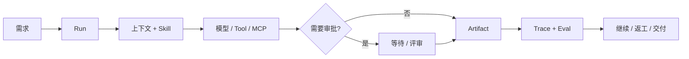

# Anna


Anna 是一个面向企业工作的受治理、local-first 桌面 AI Agent。它把直接对话、频道协同、业务工作流、专业 Associate 和通过 MCP 连接的业务系统放进同一个工作闭环，让任务可以暂停、恢复、评审并持续推进，同时保留完整状态。

- **与真正工作的 Agent 对话。** 向 Anna 提交目标、补充上下文、插话、续办，并查看对话背后的 Run。
- **通过频道完成协同。** 人、Anna 和专业 Agent 共享任务上下文、产物、决策、评审门与长期历史。
- **运行受治理的工作流。** 目标进入带状态、权限、审批、产物和下一步动作的 Run。
- **通过 MCP 连接业务系统。** 读取经营数据、查看业务记录，并在外部系统中执行受治理的业务操作。
- **复盘工作如何完成。** Trace 与 Eval 串联模型调用、工具、审批、重试和最终结果。

产品采用鸢尾花设计语言，并拥有独立的 Anna 角色形象，让 Chat、Workflows 与 Associate 形成一致体验。视觉体系用于强化产品完整性，受治理的工作执行仍是核心。

**当前版本：[`v0.2.0` Developer Preview](https://github.com/Foxtailsss-Andy/Anna-Agent/releases/tag/v0.2.0)** | macOS 源码预览 | MIT License | [CI](https://github.com/Foxtailsss-Andy/Anna-Agent/actions)

[English](README.md) | [产品演示](#产品演示) | [快速开始](#快速开始) | [可以体验什么](#可以体验什么) | [架构](#anna-如何推进工作)

## 产品演示


*一个 GIF 展示三个产品页面：尚未启动任务的 Create 页面、完整的 Cowork Hiker 客户与合同看板，以及 Crew 工作流画布。Hiker 页面使用合成 fixture，不包含真实服务响应、凭据或业务数据。*

## 快速开始

环境要求：

- Node.js `>=22.19.0`
- Python `>=3.12,<3.14`
- macOS，当前 Developer Preview 已完成验证的桌面平台

```bash
npm ci
python3.12 -m venv .venv
. .venv/bin/activate
python -m pip install -e '.[dev]'
npm run desktop:run
```

Anna 可以在没有 provider 凭据的情况下启动，并显示明确的 `not_configured` 状态。需要体验真实模型或业务系统调用时，可在本地 Runtime 设置中配置 OpenAI-compatible provider 或 MCP connector。

本地启用 Harness v2 sidecar：

```bash
ANNA_HARNESS_V2_BRIDGE_ENABLED=1 npm run desktop:run
```

该开关用于开发和验证，领域迁移状态仍以实际 Runtime 能力面板和发布边界为准。

## 可以体验什么

| 产品面 | 当前呈现的能力 |
| --- | --- |
| **Chat** | 后台流式 Run、停止/继续/插话、历史记录、工作空间上下文和明确的 provider 失败状态。 |
| **频道** | 围绕任务、@提及、产物、活动 Run、决策和评审历史的人机协同。 |
| **Create** | 带工作空间上下文、权限模式、校验与确认流程的 Skill、Prompt 和 Python Tool 草稿。 |
| **Cowork** | 报销、Hiker ERP 看板、审批、审计，以及位于受控边界上的外部 MCP connector。 |
| **Associate** | 专业 Agent 读取业务上下文、提出动作建议，并在统一治理模型下推进工作。 |
| **Crew** | SOP 项目、任务图、指派、频道、产物、评审门、返工、通知和交付。 |
| **MCP 系统** | 对外部业务数据与操作的结构化访问；写入动作保留权限、审批、幂等和审计。 |
| **Harness v2** | 持久事件、频道隔离、Tool Gateway、Memory policy、Trace/Eval、调度和恢复基础。 |

这些页面可以通过确定性 fixture 体验。真实 provider 和企业系统结果需要显式本地配置。

## 频道与已连接的业务系统

频道是 Anna 的协同层。每个频道让人、Anna 和专业 Agent 围绕相同任务、活动 Run、产物、@提及、评审决策与项目历史保持一致。一条消息可以补充上下文、调整正在执行的工作、点名成员或 Agent，也可以把团队带回正在讨论的具体任务和产物。

MCP 是 Anna 连接外部系统的边界。Anna 可以通过 MCP connector 获取经营数据、查看业务记录，并在 ERP 或其他企业系统中调用业务操作。读取范围受到约束；已接入治理闭环的外部写入会保留权限检查、人工审批、幂等、读回校验和审计证据。

## Anna 如何推进工作

企业任务通常会经历目标澄清、上下文装载、系统调用、产物生成、等待审批、返工和交付。Anna 把这些步骤保留在同一个可检查生命周期中：



共享 Runtime 建立在三个长期基础上：

- **Identity：** 工作空间、用户、频道和权限范围；
- **Judgment：** 对继续、等待、请求信息或结束作出明确判断；
- **Memory：** 区分任务上下文、候选记忆和已确认业务记忆。

配置缺失或 connector 不可用时，状态会保持可见并支持恢复。Anna 会如实呈现依赖状态和执行结果。

## Crew：项目、产物与人工门禁

Crew 将多人工作组织为可观察的项目图：

- 使用 SOP 模板和依赖关系拆解任务；
- 支持指派、启动、提交、评审、通过和退回返工；
- 将频道消息与产物卡片关联到具体节点；
- 从画布查看项目进度和等待处理的门禁；
- 在工作流内阅读和下载 Markdown 或 HTML 交付物。


*产物阅读器把交付物、来源任务、项目频道和审批决策放在同一个评审界面中。*

## Harness：执行与治理层

Harness v2 重点解决恢复能力和证据质量：

| 能力 | 契约 |
| --- | --- |
| **Durable Run / Event Store** | 持久化规范状态与事件，降低对单个在线进程的依赖。 |
| **Channel-scoped isolation** | 明确工作空间与频道边界。 |
| **Tool Gateway** | 执行 schema、权限、审批、幂等和审计约束。 |
| **Memory policy** | 区分候选记忆、已确认记忆和禁止写入的场景。 |
| **Trace / Eval** | 关联上下文、模型调用、工具、审批、重试和终局证据。 |
| **Scheduler / fencing** | 为主动运行、所有权、恢复和重复执行防护提供基础。 |

Harness v2 当前通过 opt-in bridge 暴露。Create 已有本地垂直切片；Cowork、Crew 和 Hub 的领域级迁移仍属于后续工作。

## Anna 的价值

| 企业工作需要 | Anna 的实现方式 |
| --- | --- |
| **让工作持续超过一次回答** | Run 保留状态、事件、产物和下一步动作。 |
| **控制自动化边界** | 外部写入保留权限、审批与审计。 |
| **从中断中恢复** | 等待、配置缺失、重试和失败都具有明确状态。 |
| **检查结果如何产生** | Trace/Eval 把执行路径连接到最终产物。 |
| **保留本地控制权** | Runtime 数据默认留在本地；外部 provider 和 connector 由用户显式启用。 |
| **扩展到企业业务域** | Connector、Skill 和 Run Profile 围绕共享 Runtime 契约增加领域能力。 |

## 验证

运行核心仓库门禁：

```bash
npm run typecheck
npm test -- --reporter=dot
npm run frontend:smoke
./.venv/bin/python -m pytest -q
npm run build
npm run release:verify
npm run evidence:verify:all
```

桌面打包 Smoke：

```bash
npm run desktop:package
npm run desktop:smoke-asar
```

CI 不依赖私有 provider、MCP endpoint、本机运行状态或签名身份。未提供凭据时，打包 Smoke 会如实报告模型和 MCP 为 `not_configured`。

## Developer Preview 边界

当前版本适合：

- 了解 Anna 的桌面 Agent Runtime 和 Harness 方向；
- 在本地连接一个 OpenAI-compatible provider；
- 体验 Chat/Create、Cowork 和 Crew 工作流；
- 使用确定性 fixture 验证 Run、Tool、Artifact、Trace 和审批契约；
- 基于真实 Trace 和失败案例继续迭代。

当前版本暂不承诺：

- production-ready 或 hosted cloud runtime；
- 所有业务域均完成 Legacy-to-Harness-v2 迁移；
- 生产级 Review-to-Validated-Patch 审批闭环；
- 外部 WebSearch 或 MCP 服务持续可用；
- 已签名和 notarized 的 macOS 安装包；
- Windows 安装包及跨平台发布验收。

## 外部项目边界

**Hiker** 是一套适用于小型团队的完整 ERP 系统，具备财务、供应链和营销能力。Anna 通过 MCP 连接 Hiker，获取 ERP 数据、查看业务上下文，并调用 Hiker 对外提供的受治理业务操作。

Hiker 是外部合作项目，作者为 [kc8zshnt6n-gif](https://github.com/kc8zshnt6n-gif)。本仓库不包含 Hiker 平台、服务端源码、部署和业务数据，Hiker 目前尚未开源。Anna 的 MIT License 只覆盖 Anna 侧 MCP connector、界面集成及仓库中提交的其他文件，不延伸至 Hiker。

## 仓库与维护

该 GitHub 仓库创建于 2026 年 4 月 2 日，最初用于规划 Anna 项目。随着 Harness 技术持续发展，Pi Agent 等先进范式为本项目提供了大量技术参考与启发，并最终形成今天的 Anna。感谢 GitHub 社区。

[Foxtailsss-Andy/Anna-Agent](https://github.com/Foxtailsss-Andy/Anna-Agent) 是唯一公开维护仓库。发布里程碑、命名边界和后续 GitHub 维护流程记录在 [Anna Agent GitHub Milestone - 2026-08-24](docs/product/anna-agent-github-milestone-2026-08-24.md)。

深入了解项目和发布边界：

- [Developer Preview Wayfinder](docs/product/anna-github-developer-preview-wayfinder-2026-08-23.md)
- [Developer Preview Spec](docs/product/anna-github-developer-preview-spec-2026-08-23.md)
- [Release tickets](docs/superpowers/plans/2026-08-23-github-developer-preview/00-tickets.md)

提交 Pull Request 前请阅读 [CONTRIBUTING.md](CONTRIBUTING.md)，报告安全问题前请阅读 [SECURITY.md](SECURITY.md)。请勿提交 `.anna/`、数据库、运行日志、provider 响应、API key、生成包或真实企业数据。

Anna 使用 [MIT License](LICENSE)。第三方依赖说明见 [NOTICE.md](NOTICE.md)。
