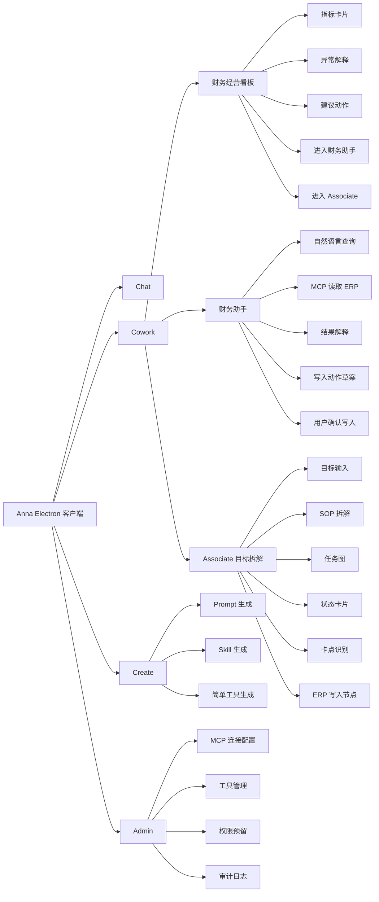
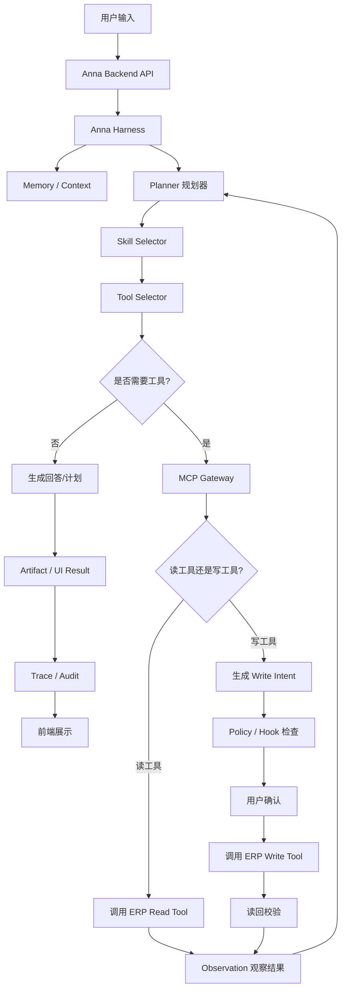
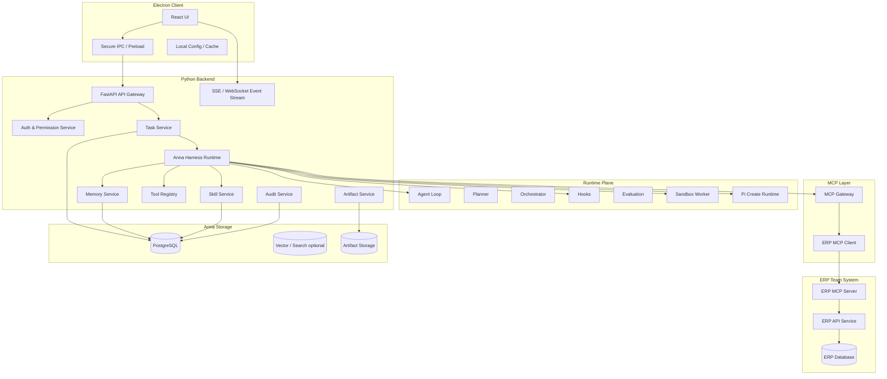
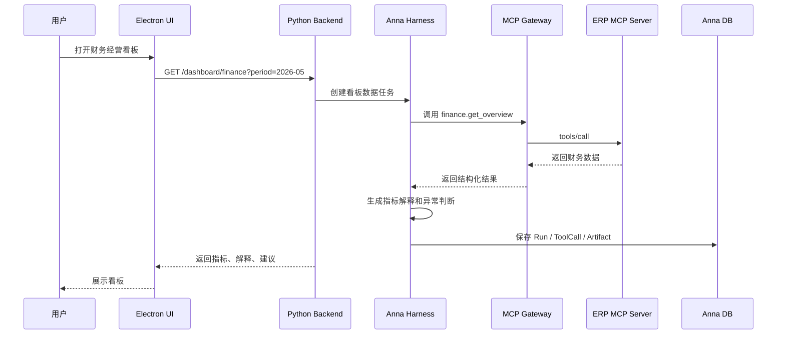
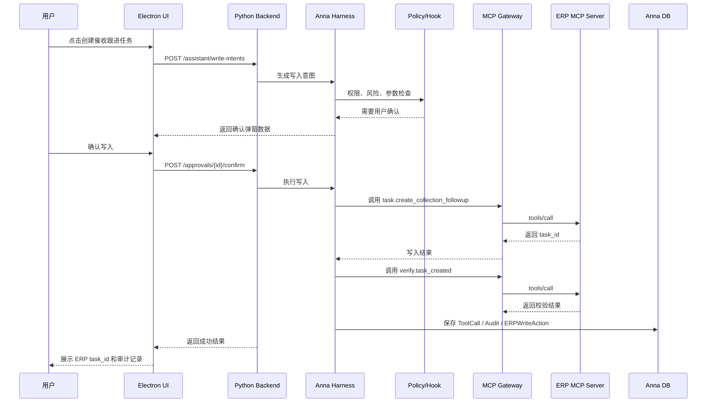
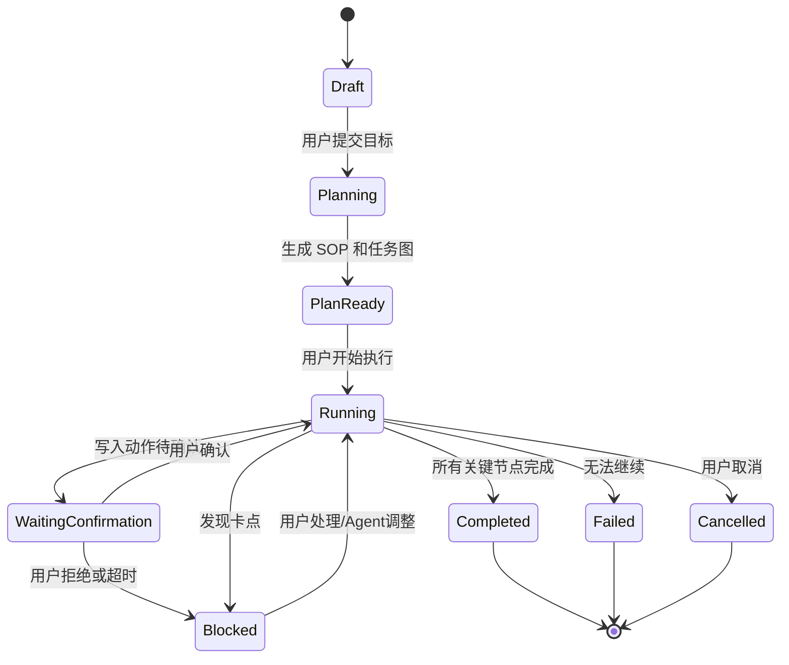
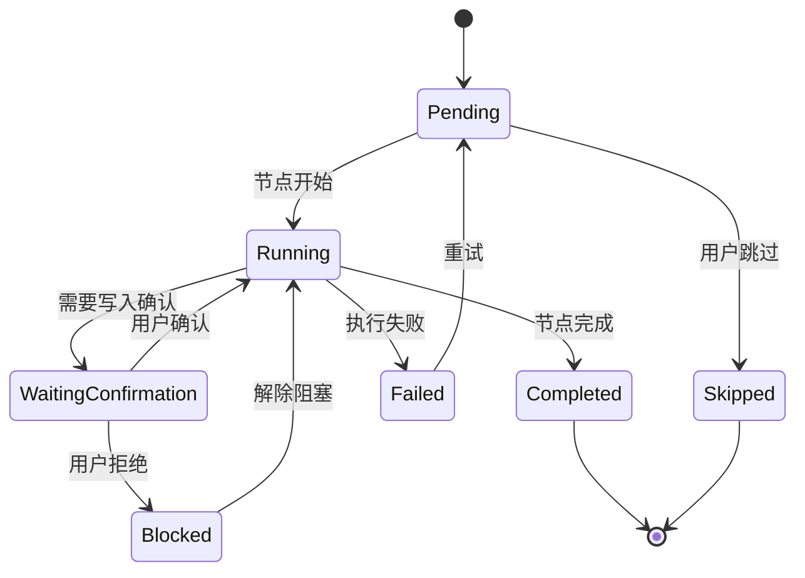
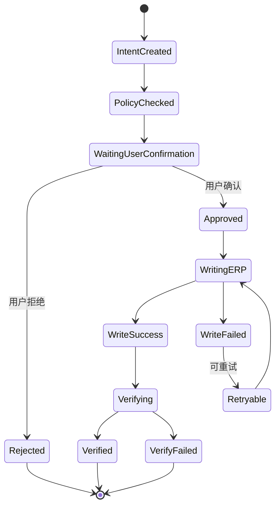

# Anna 产品需求文档 PRD v1.0

> **⚠️ 对齐说明(2026-06-28)**:本文档的「**定位与底座模型**」部分已在开发过程中**校正/升级**,最新架构基准见 [《Anna 架构与定义》v2.0](../design/2026-06-28-anna-aios-architecture-and-definition.md)。
> 变化要点:① 定位从「轻量助手(本文 §1 明示的 MVP 收敛——"第一版不追求做完整企业 AI 操作系统")」升级为「**企业级 AI Agent Runtime / 平台优先**」,沿本文已承认的 AIOS 北极星前进;② 新增/优化:Capability=Agent、异步无状态并发、配置化 Connector、Loop Engineering;③ Associate 已下线,Cowork 现为 财务看板(+copilot 抽屉)+报销+Hiker。
> **本文档的业务场景、写入治理/审批/审计、安全(凭证后端)、数据模型、ERP MCP 集成大部分仍然有效**,保留作历史与场景参考 —— 这是**校正与优化,不是推翻**。

> 产品代号：Anna  
> 文档类型：Product Requirements Document  
> 版本：v1.0  
> 阶段：MVP 开发指导版  
> 核心闭环：财务经营看板 + 财务助手 + Associate 目标拆解 + ERP MCP 真实写入  
> 技术方向：Electron 客户端 + Python 后端 + MCP Gateway + Anna Harness + Pi Create Runtime

---

## 1. 文档目标

本文档用于指导 Anna MVP 的产品、设计、前端、后端、Agent、MCP 联调与测试开发。

Anna 第一版不追求做完整企业 AI 操作系统，而是聚焦一个可被清晰演示、可持续扩展、能体现核心技术价值的企业 AI 助手闭环：

```text
用户进入 Anna
→ 查看财务经营看板
→ 发现业务异常或目标
→ 通过财务助手自然语言追问 ERP 数据
→ 进入 Associate 自动拆解复杂目标
→ 生成任务图、节点卡片和卡点判断
→ 用户确认真实写入动作
→ Anna 通过 MCP 写入 ERP
→ ERP 返回写入结果
→ Anna 读回校验、展示执行记录和审计日志
```

本 PRD 的重点不是“大而全”，而是把第一版做成一个能打穿业务、数据、Agent、MCP、写入、审计、可视化体验的产品原型。

---

## 2. 产品定位

### 2.1 一句话定位

**Anna 是一个面向企业业务团队的轻量企业 AI 助手，通过 MCP 连接 ERP 等业务系统，帮助用户看懂经营数据、追问财务问题、拆解复杂目标，并在用户确认后真实写入业务系统。**

### 2.2 产品边界

Anna 不是：

- 不是纯聊天机器人。
- 不是固定 BI 看板。
- 不是传统流程审批系统。
- 不是完整低代码平台。
- 不是重型企业 AI 操作系统。
- 不是只读数据分析工具。

Anna 是：

- 一个能连接企业系统的 AI 助手。
- 一个能解释经营数据的业务协同入口。
- 一个能把复杂目标拆成可执行节点的 Agent 工作台。
- 一个能在安全确认后真实调用 ERP 写入能力的执行型产品。
- 一个可通过 Skill、Prompt、Tool 持续扩展的企业助手底座。

### 2.3 MVP 核心价值

第一版 Anna 必须证明四件事：

1. **看得见数据**：能够通过 MCP 从 ERP 拉取真实业务数据。
2. **问得懂业务**：用户可以用自然语言追问财务经营问题。
3. **拆得开目标**：复杂目标可以被 Associate 自动拆成 SOP、任务节点和依赖关系。
4. **写得回系统**：用户确认后，Anna 可以通过 MCP 将动作真实写入 ERP，并完成读回校验和审计记录。

---

## 3. 产品原则

### 3.1 轻量优先

第一版强调“能跑通、能演示、能扩展”，不做重型多租户、不做复杂字段级权限、不做完整数据治理。

### 3.2 Cowork 优先

Chat 只是基础入口，真正的产品价值集中在 Cowork：

- 财务经营看板。
- 财务助手。
- Associate 目标拆解。
- MCP 调用与 ERP 写入。
- 执行过程可视化。

### 3.3 固定页面 + 动态内容

MVP 中 Kanban 使用固定页面结构，避免第一版陷入自定义看板系统的复杂度。页面布局固定，但卡片内容、异常解释、建议动作由 Agent / Skill / MCP 数据动态生成。

### 3.4 真实写入，但不裸奔

ERP 反向执行必须做到真实写入，但写入动作必须经过：

```text
Agent 生成写入意图
→ Anna Harness 参数校验
→ 权限与风险检查
→ 用户确认
→ MCP 写入
→ ERP 返回结果
→ Anna 读回校验
→ 审计记录
```

LLM 不能直接绕过 Anna Harness 调用高风险写入工具。

### 3.5 Python 优先

Agent、后端服务、MCP Client、数据处理、Skill 执行、简单工具生成尽量使用 Python。Electron 前端不可避免使用 TypeScript / JavaScript，但业务与 Agent 能力尽量沉到 Python 后端。

---

## 4. 目标用户与角色

## 4.1 MVP 阶段用户

MVP 阶段默认用户为“全权限演示用户”，用于演示完整闭环。

| 角色 | 说明 | MVP 权限 |
|---|---|---|
| 演示用户 | 面向客户、评审、内部演示的全权限用户 | 可查看看板、调用财务助手、创建 Associate 任务、确认 ERP 写入 |
| 系统管理员 | 配置 MCP、查看工具、管理基础权限和审计 | 可配置系统和连接 |
| 开发者 | 使用 Create 生成 Prompt / Skill / 简单工具 | 可创建和测试能力，但发布需确认 |
| 只读观察者 | 后续扩展角色 | MVP 可不做或仅保留接口 |

### 4.2 后续企业角色预留

| 角色 | 后续用途 |
|---|---|
| CFO / 财务负责人 | 看财务经营、异常、应收应付、现金流 |
| 经营负责人 | 看经营指标、任务推进、目标达成 |
| 财务专员 | 查询单据、创建待办、推进应收应付 |
| 部门负责人 | 查看部门相关指标和任务 |
| IT / 系统管理员 | 管理 MCP、工具、权限、模型和审计 |
| Agent 开发者 | 创建 Skill、Prompt、简单工具和业务助手 |

---

## 5. MVP 核心场景

## 5.1 场景一：财务经营看板

### 用户目标

用户打开 Anna 后，希望快速了解企业当前财务经营状况，看到关键指标、异常变化和可行动建议。

### 产品能力

- 通过 MCP 调用 ERP 财务数据。
- 在固定 Kanban 页面展示关键指标。
- 由 Agent 生成指标解释、异常判断和建议动作。
- 支持从指标卡片进入财务助手追问。
- 支持从异常建议进入 Associate 拆解行动计划。

### 示例问题

```text
本月收入为什么下降？
本月费用超预算了吗？
哪些客户应收账款逾期最多？
现金流风险在哪里？
这几个异常应该优先处理哪个？
```

---

## 5.2 场景二：财务助手

### 用户目标

用户通过自然语言查询 ERP 数据、理解财务问题，并生成可执行动作。

### 产品能力

- 自然语言理解财务查询意图。
- 自动选择 MCP 工具查询 ERP。
- 结构化展示查询结果。
- 对结果进行解释、归因和建议。
- 可以生成 ERP 写入动作草案。
- 用户确认后真实写入 ERP。

### 示例任务

```text
查一下本月逾期应收金额最高的 5 个客户。
帮我分析一下为什么本月费用超过预算。
给逾期超过 30 天且金额大于 10 万的客户创建催收跟进任务。
把这条财务分析结论写回 ERP 的经营备注。
```

---

## 5.3 场景三：Associate 目标拆解

### 用户目标

用户提出复杂业务目标后，希望 Anna 自动拆解计划、识别依赖、生成节点、持续推进，并在需要时调用 ERP 完成动作。

### MVP 目标示例

```text
帮我制定并推进本月应收账款回款改善计划，目标是把逾期 30 天以上应收金额降低 20%。
```

### 产品能力

- 理解复杂目标。
- 调用 ERP 获取必要数据。
- 自动生成 SOP。
- 生成任务节点和依赖关系。
- 用任务图和状态卡片展示。
- 识别卡点。
- 对可执行节点生成 ERP 写入动作。
- 用户确认后真实写入 ERP。
- 执行后读回校验并更新节点状态。

---

## 5.4 场景四：Create 轻量能力生产

### 用户目标

内部开发者或高级用户希望快速创建 Prompt、Skill 或简单 Python 工具，扩展 Anna 能力。

### MVP 产品能力

- 创建 Prompt 模板。
- 创建 Skill 文档。
- 生成简单 Python 工具脚本。
- 在沙箱中测试。
- 人工确认后保存到 Skill / Prompt 库。
- 暂不做完整应用开发平台。

---

## 6. MVP 功能范围

## 6.1 P0 必做

| 模块 | 功能 | 说明 |
|---|---|---|
| Electron 客户端 | 桌面应用壳 | Anna 主应用入口 |
| 登录 | 基础登录 | MVP 可用本地账号或演示账号 |
| 主导航 | Chat / Cowork / Create / Admin | 一级入口清晰 |
| Chat | 基础对话 | 展示 Prompt 与通用任务能力 |
| Cowork | 工作区首页 | 展示核心任务、看板入口、助手入口 |
| Kanban | 财务经营看板固定页 | 固定页面结构，动态内容生成 |
| Kanban | 指标卡片 | 收入、费用、利润、现金流、应收、应付 |
| Kanban | 异常解释 | Agent 生成指标解释与风险提示 |
| 财务助手 | 自然语言查询 | 通过 MCP 查询 ERP |
| 财务助手 | 数据解释 | 解释查询结果和生成建议 |
| 财务助手 | 写入动作生成 | 生成 ERP 写入草案 |
| 财务助手 | 真实写入 ERP | 用户确认后调用 MCP 写入 |
| Associate | 目标输入 | 输入复杂目标 |
| Associate | SOP 拆解 | Agent 自动生成步骤 |
| Associate | 任务图 | 展示节点和依赖 |
| Associate | 状态卡片 | 展示每个节点状态、输入、输出、风险 |
| Associate | 卡点识别 | 自动识别阻塞节点 |
| Associate | 写入节点执行 | 节点可触发 ERP 写入动作 |
| Create | Prompt 生成 | 生成并保存 Prompt |
| Create | Skill 生成 | 生成简单 Skill 文档 |
| Create | 简单工具生成 | 生成 Python 工具脚本草案 |
| Admin | MCP 配置 | ERP MCP Server 地址、凭证、状态 |
| Admin | 工具管理 | 查看 MCP 工具列表 |
| Admin | 审计日志 | 查看工具调用、写入动作、用户确认 |
| Harness | Agent Loop | 规划、工具调用、观察、输出 |
| Harness | MCP Gateway | 连接 ERP MCP Server |
| Harness | Tool Registry | 管理 MCP / API / CLI 工具 |
| Harness | Memory | 保存业务规则、任务上下文、Skill |
| Harness | Hook | 写入前检查、审批、审计 |
| Harness | Sandbox | Create 与工具测试隔离运行 |
| Harness | Trace | 全链路记录 |

---

## 6.2 P1 可做

| 模块 | 功能 |
|---|---|
| Chat | 文档 / PPT 生成简版 |
| Kanban | 指标下钻 |
| Kanban | 多期间对比 |
| 财务助手 | 多轮追问上下文增强 |
| Associate | 自动调整计划 |
| Associate | 复盘总结 |
| Create | Agent 配置生成 |
| Admin | 模型配置 |
| Admin | Skill 管理 |
| 权限 | 角色级工具权限 |
| 可视化 | 执行时间线 |

---

## 6.3 MVP 暂不做

| 模块 | 暂不做内容 |
|---|---|
| Kanban | 自定义看板搭建器 |
| Associate | 3D 办事大厅、重度工位视图 |
| Create | 完整应用开发平台 |
| 权限 | 复杂多租户、字段级权限 |
| 数据 | 完整企业语义层治理 |
| 工作流 | 多人实时协同审批流 |
| 生态 | Agent 市场、Skill 市场 |
| 模型 | 复杂模型路由与成本中心 |

---

## 7. 产品信息架构



---

## 8. 用户主路径

## 8.1 主路径一：财务经营看板到 ERP 写入

```text
1. 用户登录 Anna
2. 进入 Cowork
3. 打开财务经营看板
4. Anna 通过 MCP 获取 ERP 财务数据
5. 看板展示关键指标和异常解释
6. 用户点击“逾期应收异常”
7. 财务助手打开并带入上下文
8. 用户问：帮我找出最需要跟进的客户
9. Anna 调用 ERP MCP 查询客户应收明细
10. Anna 生成分析结果和建议动作
11. 用户选择：创建催收跟进任务
12. Anna 生成写入草案
13. 用户确认写入
14. Anna 通过 MCP 写入 ERP
15. Anna 读回校验写入结果
16. 页面展示写入成功、ERP 单号/任务号、审计记录
```

---

## 8.2 主路径二：Associate 复杂目标推进

```text
1. 用户进入 Cowork / Associate
2. 输入复杂目标：
   “帮我制定并推进本月应收回款改善计划，目标是逾期 30 天以上金额降低 20%”
3. Anna 理解目标并调用 MCP 获取应收数据
4. Anna 拆解 SOP
5. Anna 生成任务节点和依赖关系
6. 页面展示任务图和节点卡片
7. Anna 标出关键卡点：大客户逾期、责任人缺失、跟进记录不足
8. 用户点击某个节点“生成跟进任务”
9. Anna 生成 ERP 写入动作
10. 用户确认
11. Anna 写入 ERP
12. Anna 读回校验并将节点状态改为“已执行”
13. Associate 更新整体目标进度
```

---

## 8.3 主路径三：Create 生成 Skill

```text
1. 用户进入 Create
2. 输入：创建一个“逾期应收分析 Skill”
3. Anna 生成 Skill 名称、适用场景、输入、步骤、可调用工具、输出格式
4. 用户预览并修改
5. Anna 在沙箱中测试 Skill
6. 用户保存 Skill
7. Skill 出现在财务助手或 Associate 可用能力中
```

---

## 9. 关键页面需求

## 9.1 全局布局

### 页面结构

```text
左侧主导航：
- Chat
- Cowork
- Create
- Admin

顶部栏：
- 当前工作区
- 当前用户
- MCP 连接状态
- 后端服务状态
- 模型状态

主内容区：
- 各模块核心页面

右侧可选抽屉：
- Agent 执行日志
- 工具调用记录
- 审计记录
- 当前上下文
```

---

## 9.2 Chat 页面

### 定位

Chat 是基础能力入口，重点展示 Prompt 能力和简单任务执行，不作为 MVP 的核心复杂工作区。

### P0 功能

| 功能 | 需求 |
|---|---|
| 基础对话 | 支持用户输入自然语言并获得回答 |
| Prompt 模板 | 提供 3-5 个模板，如总结、分析、生成任务计划 |
| 对话结果 | 支持复制、保存 |
| 进入 Cowork | 对话中可选择“转为 Associate 目标” |

### 验收标准

- 用户可以完成一轮基础问答。
- 用户可以使用内置 Prompt 模板。
- 用户可以将对话中的复杂目标带入 Associate。

---

## 9.3 Cowork 首页

### 定位

Cowork 是 Anna 的核心工作区，聚合财务经营看板、财务助手和 Associate。

### P0 内容

| 区域 | 内容 |
|---|---|
| 顶部概览 | 当前 ERP 连接状态、最近数据同步时间、今日任务数 |
| 快捷入口 | 财务经营看板、财务助手、Associate |
| 最近执行 | 最近 Agent 任务、工具调用、写入动作 |
| 风险提醒 | 从看板生成的异常或待处理事项 |

---

## 9.4 财务经营看板

### 定位

固定页面 + 动态内容。第一版不是自定义看板，而是一个可演示、可追问、可下推动作的财务经营看板。

### 页面结构

```text
财务经营看板
├─ 顶部：期间选择、刷新按钮、数据来源、ERP 连接状态
├─ 指标区：收入、费用、利润、现金流、应收、应付
├─ 异常区：本期异常、风险等级、原因解释
├─ 建议区：Anna 建议动作
├─ 明细区：关键客户、单据、费用项
└─ 操作区：追问财务助手、生成 Associate 目标、创建 ERP 动作
```

### 指标卡片

| 指标 | 说明 |
|---|---|
| 本月收入 | ERP 财务或销售数据 |
| 本月费用 | ERP 费用数据 |
| 毛利 / 利润 | 根据 ERP 指标或公式计算 |
| 现金流余额 | ERP 资金或现金流数据 |
| 应收账款 | 应收总额、逾期金额 |
| 应付账款 | 应付总额、近期到期 |

### 生成型内容

| 内容 | 生成方式 |
|---|---|
| 指标解释 | Agent 基于 ERP 数据和业务规则生成 |
| 异常判断 | 规则 + Agent 解释 |
| 建议动作 | Skill + Agent 生成 |
| 追问建议 | 根据当前指标上下文生成 |

### 交互

| 操作 | 行为 |
|---|---|
| 刷新看板 | 后端重新调用 MCP 获取数据 |
| 点击指标 | 打开指标详情或财务助手 |
| 点击异常 | 带上下文进入财务助手 |
| 点击建议动作 | 生成 Associate 目标或写入动作 |
| 创建催收任务 | 进入写入确认弹窗 |

### 验收标准

- 看板能从 ERP MCP 拉取数据。
- 指标卡片显示真实数据。
- 至少生成 3 条异常或解释。
- 用户可从某个异常进入财务助手。
- 用户可从建议动作发起一个 ERP 写入流程。

---

## 9.5 财务助手

### 定位

财务助手是自然语言访问 ERP 财务数据和触发 ERP 写入的核心入口。

### 能力范围

| 能力 | 说明 |
|---|---|
| 查询 | 查询收入、费用、应收、应付、客户、单据、预算等 |
| 分析 | 对结果进行归因、排序、异常解释 |
| 建议 | 生成下一步业务建议 |
| 写入 | 生成并确认 ERP 写入动作 |
| 读回 | 写入后查询 ERP 验证结果 |

### 页面结构

```text
财务助手
├─ 对话区
├─ 数据结果卡片
├─ 工具调用记录
├─ 建议动作卡片
├─ 写入确认弹窗
└─ 执行结果 / 审计记录
```

### 支持问题示例

```text
本月费用最高的 5 个科目是什么？
本月收入比上月下降多少，主要原因是什么？
逾期超过 30 天的应收有哪些？
帮我找出应该优先催收的客户。
把这条分析结论写入 ERP 的经营备注。
给这些客户创建催收跟进任务。
```

### 写入动作类型

MVP 建议支持低风险但真实可见的 ERP 写入动作：

| 写入动作 | 说明 | 风险等级 |
|---|---|---|
| 创建催收跟进任务 | 在 ERP 中为客户/应收单生成跟进任务 | 中 |
| 写入经营分析备注 | 将 Anna 分析结论写入 ERP 备注/分析记录 | 低 |
| 创建待处理事项 | 在 ERP 中创建财务待办 | 低 |
| 生成草稿单据 | 创建草稿态单据，不直接审批通过 | 中 |
| 更新跟进状态 | 将某条跟进记录状态更新为已创建/已提醒 | 中 |

MVP 不建议直接做：

- 真实付款。
- 自动审批通过。
- 删除单据。
- 修改金额。
- 修改客户主数据。
- 修改会计凭证核心字段。

如果演示必须展示强写入，应优先在 ERP 演示环境中执行，并选择“新增任务/备注/草稿单”这类可审计、可撤销、低财务风险的真实写入。

### 写入确认弹窗

写入前必须展示：

| 字段 | 说明 |
|---|---|
| 动作名称 | 例如“创建催收跟进任务” |
| 目标对象 | 客户、单据、任务对象 |
| 写入字段 | 即将写入的字段和值 |
| 数据来源 | 由哪些查询结果生成 |
| 风险等级 | 低 / 中 / 高 |
| 影响说明 | 对 ERP 的影响 |
| 幂等键 | 防止重复写入 |
| 操作人 | 当前用户 |
| 确认按钮 | 用户确认后才执行 |
| 取消按钮 | 取消写入 |

### 验收标准

- 自然语言查询能触发正确 MCP 读工具。
- 财务助手能展示结构化结果和自然语言解释。
- 至少一个写入动作可以真实写入 ERP。
- 写入前必须弹出确认。
- 写入后必须展示 ERP 返回 ID。
- 写入后必须通过读工具校验结果。
- 审计日志可查看完整调用链。

---

## 9.6 Associate 目标拆解

### 定位

Associate 解决复杂目标没人拆、没人盯、没人判断、没人推进的问题。MVP 采用“任务图 + 状态卡片 + 卡点识别”的轻量可视化。

### 页面结构

```text
Associate
├─ 目标输入区
├─ 目标摘要区
├─ SOP 列表
├─ 任务图视图
├─ 节点状态卡片
├─ 卡点识别区
├─ 建议动作区
└─ 执行日志 / 工具调用 / 写入记录
```

### 核心功能

| 功能 | 说明 |
|---|---|
| 目标理解 | 提取目标、约束、时间、指标 |
| 数据准备 | 调用 MCP 获取目标相关 ERP 数据 |
| SOP 拆解 | 生成步骤 |
| 依赖生成 | 生成节点依赖关系 |
| 节点状态 | 每个节点有状态、负责人、输入、输出 |
| 卡点识别 | 标出阻塞节点 |
| 建议动作 | 给出下一步可执行动作 |
| 写入执行 | 对某些节点触发 ERP 写入 |
| 进度更新 | 写入或反馈后更新任务图 |

### 任务图节点类型

| 节点类型 | 示例 |
|---|---|
| 数据查询节点 | 查询逾期应收客户 |
| 分析节点 | 识别优先催收对象 |
| 决策节点 | 选择催收策略 |
| 写入节点 | 创建催收跟进任务 |
| 人工确认节点 | 用户确认写入 |
| 校验节点 | 读回 ERP 校验任务创建成功 |
| 总结节点 | 生成目标推进总结 |

### 节点卡片字段

| 字段 | 说明 |
|---|---|
| 节点名称 | 例如“识别重点逾期客户” |
| 节点类型 | 查询 / 分析 / 写入 / 确认 / 校验 |
| 状态 | 待开始 / 运行中 / 待确认 / 已完成 / 阻塞 / 失败 |
| 输入 | 所需数据或前置节点 |
| 输出 | 当前节点产物 |
| 依赖 | 前置节点 |
| 风险 | 是否涉及写入 |
| 建议动作 | 下一步推荐 |
| 执行按钮 | 运行、确认、重试、跳过 |

### 卡点识别规则

MVP 可采用规则 + Agent 判断：

| 卡点类型 | 判断方式 |
|---|---|
| 数据缺失 | MCP 返回空值或字段不足 |
| 责任人缺失 | 节点无法分配对象 |
| 写入待确认 | 写入动作未确认 |
| ERP 调用失败 | MCP tool call 失败 |
| 指标异常严重 | 逾期金额、费用超预算等超阈值 |
| 依赖未完成 | 前置节点未完成 |

### 验收标准

- 用户输入复杂目标后，Associate 能生成至少 5 个节点。
- 节点之间存在依赖关系。
- 页面能以任务图展示节点状态。
- 至少一个节点调用 ERP MCP 读取数据。
- 至少一个节点可触发 ERP 写入确认。
- 写入成功后节点状态变为已完成。
- 卡点区域能展示至少一个可能风险或阻塞点。

---

## 9.7 Create

### 定位

Create 是 Anna 的能力生产入口。MVP 只做轻量版本，不做完整应用开发。

### P0 功能

| 功能 | 说明 |
|---|---|
| Prompt 生成 | 根据目标生成 Prompt 模板 |
| Skill 生成 | 生成 Skill 文档 |
| 简单 Python 工具生成 | 生成工具脚本草案 |
| 沙箱测试 | 在隔离环境中运行测试 |
| 保存 | 保存到本地库或后端库 |

### 暂不做

- 完整应用生成。
- 自动部署。
- 无审核发布生产工具。
- 可视化应用搭建器。

### 验收标准

- 可以生成一个“逾期应收分析 Skill”。
- Skill 至少包括适用场景、输入、步骤、工具、输出格式。
- 可以保存 Skill。
- 财务助手或 Associate 可以引用该 Skill。

---

## 9.8 Admin

### 定位

Admin 不是第一版的展示重点，但必须支撑 MCP、工具、权限、审计。

### P0 功能

| 功能 | 说明 |
|---|---|
| MCP 连接配置 | 配置 ERP MCP Server |
| MCP 连接测试 | 检查连接是否可用 |
| 工具列表 | 展示 ERP MCP 暴露的 tools |
| 工具详情 | 查看 schema、读写类型、风险等级 |
| 审计日志 | 查看用户确认、MCP 调用、写入结果 |
| 角色权限接口 | MVP 可默认全权限，但保留数据结构 |

### 验收标准

- 管理员可配置 ERP MCP Server 地址。
- 可查看 MCP 工具列表。
- 可查看每次写入动作的审计日志。
- 可区分读工具和写工具。
- 写工具可配置为“需要用户确认”。

---

## 10. ERP MCP 集成需求

## 10.1 MCP 集成定位

Anna 后端作为 MCP Client，通过 MCP Gateway 连接 ERP MCP Server。

```text
Anna Frontend
→ Anna Backend
→ Anna MCP Gateway
→ ERP MCP Server
→ ERP Service / Database
```

### 10.2 MCP 工具分类

| 类型 | 说明 | 示例 |
|---|---|---|
| Read Tool | 查询 ERP 数据 | 查询应收、费用、收入、客户 |
| Write Tool | 写入 ERP 数据 | 创建任务、写备注、创建草稿单 |
| Validate Tool | 校验参数或业务规则 | 校验客户、校验单据状态 |
| Verify Tool | 写入后读回校验 | 根据 ID 查询写入结果 |

### 10.3 MVP 建议工具清单

#### 读取类工具

| 工具名 | 用途 | 输入 | 输出 |
|---|---|---|---|
| `finance.get_overview` | 获取财务经营概览 | period | 收入、费用、利润、现金流、应收、应付 |
| `finance.get_receivables` | 查询应收账款 | period, overdue_days, customer_id | 应收列表 |
| `finance.get_payables` | 查询应付账款 | period, due_days, supplier_id | 应付列表 |
| `finance.get_expense_breakdown` | 查询费用明细 | period, department, category | 费用科目与明细 |
| `finance.get_revenue_breakdown` | 查询收入明细 | period, customer_id, product_id | 收入明细 |
| `customer.get_profile` | 查询客户信息 | customer_id | 客户资料 |
| `task.get_followup_tasks` | 查询跟进任务 | customer_id, status | 跟进任务列表 |

#### 写入类工具

| 工具名 | 用途 | 输入 | 输出 |
|---|---|---|---|
| `task.create_collection_followup` | 创建催收跟进任务 | customer_id, receivable_ids, owner, due_date, note, idempotency_key | task_id, status |
| `finance.create_analysis_note` | 写入经营分析备注 | period, title, content, source_refs, idempotency_key | note_id, status |
| `task.create_todo` | 创建财务待办 | title, owner, due_date, related_object, note, idempotency_key | todo_id, status |
| `finance.create_draft_action` | 创建草稿动作单 | action_type, payload, reason, idempotency_key | draft_id, status |
| `task.update_followup_status` | 更新跟进任务状态 | task_id, status, note, idempotency_key | task_id, status |

#### 校验类工具

| 工具名 | 用途 |
|---|---|
| `validate.customer_exists` | 校验客户是否存在 |
| `validate.receivable_ids` | 校验应收单据是否存在 |
| `validate.write_permission` | 校验当前用户是否可写 |
| `verify.task_created` | 写入后校验任务是否创建成功 |
| `verify.note_created` | 写入后校验备注是否创建成功 |

### 10.4 写入工具参数要求

所有写入工具必须包含或由 Anna 补充以下字段：

| 字段 | 说明 |
|---|---|
| `actor_user_id` | 当前操作用户 |
| `workspace_id` | 当前工作区 |
| `source` | 来源，固定为 Anna |
| `source_task_id` | Anna 任务 ID |
| `source_run_id` | Anna 运行 ID |
| `reason` | 写入原因 |
| `idempotency_key` | 幂等键，防止重复写入 |
| `dry_run` | 是否仅预演 |
| `confirmed_at` | 用户确认时间 |
| `confirmation_id` | 用户确认记录 ID |

### 10.5 ERP 写入原则

| 原则 | 要求 |
|---|---|
| 必须真实写入 | 不能只返回 mock 成功 |
| 必须可读回 | 写入后能通过 read / verify 工具查到 |
| 必须可审计 | ERP 侧和 Anna 侧均有记录 |
| 必须幂等 | 重试不能重复创建多条 |
| 必须有确认 | 前端用户确认后才调用写入 |
| 必须可定位 | 返回 ERP 对象 ID |
| 尽量可撤销 | 优先写入任务、备注、草稿、待办 |

---

## 11. Agent 运行机制

## 11.1 运行总览



### 11.2 Agent Loop

Anna MVP 的 Agent Loop：

```text
1. Receive：接收用户输入或页面事件
2. Context Build：构建上下文，包括用户、页面、ERP 数据、Memory、Skill
3. Plan：规划任务步骤
4. Tool Select：选择 MCP / API / CLI 工具
5. Execute Read：执行读取工具
6. Observe：观察结果
7. Reason：分析和生成下一步
8. Write Intent：如果需要写入，生成写入意图
9. Policy Check：权限、风险、参数、幂等检查
10. Confirm：用户确认
11. Execute Write：执行 ERP 写入
12. Verify：读回校验
13. Summarize：总结结果
14. Trace：记录全链路
```

### 11.3 写入保护机制

LLM 只能生成写入意图，不直接执行写入。

```text
LLM 输出：
{
  "intent": "create_collection_followup",
  "target": "...",
  "reason": "...",
  "proposed_payload": {...}
}

Anna Harness 负责：
- 校验工具是否存在
- 校验字段是否合法
- 校验风险等级
- 校验是否需要用户确认
- 生成 idempotency_key
- 生成确认弹窗
- 用户确认后执行 MCP tool call
```

---

## 12. 系统架构



### 12.1 技术栈建议

| 层 | 技术 |
|---|---|
| 客户端 | Electron + React + TypeScript |
| 后端 | Python + FastAPI |
| 实时事件 | SSE 或 WebSocket |
| Agent Runtime | Anna Harness，吸收 Hermes-style Memory / Tool / Hook / Skill / Agent Loop |
| Create Runtime | Pi Agent 思路，轻量 coding / tool generation，运行在 Sandbox |
| MCP | Python MCP Client / MCP Gateway |
| 数据库 | PostgreSQL |
| 缓存 | Redis 可选 |
| Artifact | 本地文件存储 / MinIO / S3 兼容 |
| 沙箱 | Docker 起步 |
| 日志 | 结构化日志 + Audit 表 |
| 可视化 | React Flow / Mermaid / ECharts |

---

## 13. 数据流转图

## 13.1 读取数据流



## 13.2 写入数据流



---

## 14. 核心对象模型

## 14.1 User

| 字段 | 类型 | 说明 |
|---|---|---|
| id | string | 用户 ID |
| name | string | 用户名 |
| role_ids | string[] | 角色 |
| workspace_ids | string[] | 可访问工作区 |
| is_demo_full_access | boolean | 是否全权限演示用户 |

## 14.2 Workspace

| 字段 | 类型 | 说明 |
|---|---|---|
| id | string | 工作区 ID |
| name | string | 工作区名称 |
| erp_connection_id | string | ERP 连接 |
| settings | json | 配置 |

## 14.3 MCPConnection

| 字段 | 类型 | 说明 |
|---|---|---|
| id | string | 连接 ID |
| name | string | 连接名称 |
| server_url | string | MCP Server 地址 |
| auth_type | enum | none / api_key / oauth / basic |
| status | enum | connected / disconnected / error |
| last_checked_at | datetime | 最近检查时间 |

## 14.4 MCPTool

| 字段 | 类型 | 说明 |
|---|---|---|
| id | string | 工具 ID |
| connection_id | string | 所属连接 |
| name | string | 工具名 |
| description | string | 工具描述 |
| input_schema | json | 输入 schema |
| output_schema | json | 输出 schema |
| tool_type | enum | read / write / validate / verify |
| risk_level | enum | low / medium / high |
| requires_confirmation | boolean | 是否需要用户确认 |
| enabled | boolean | 是否启用 |

## 14.5 Agent

| 字段 | 类型 | 说明 |
|---|---|---|
| id | string | Agent ID |
| name | string | Agent 名称 |
| type | enum | finance_assistant / associate / dashboard / create |
| prompt_id | string | 关联 Prompt |
| skill_ids | string[] | 可用 Skill |
| allowed_tool_ids | string[] | 可用工具 |
| memory_scope | enum | session / workspace / business |
| enabled | boolean | 是否启用 |

## 14.6 Skill

| 字段 | 类型 | 说明 |
|---|---|---|
| id | string | Skill ID |
| name | string | Skill 名称 |
| description | string | 说明 |
| trigger | string | 触发场景 |
| instructions | markdown | Skill 内容 |
| allowed_tools | string[] | 可用工具 |
| test_cases | json[] | 测试用例 |
| version | string | 版本 |
| status | enum | draft / active / archived |

## 14.7 Goal

| 字段 | 类型 | 说明 |
|---|---|---|
| id | string | 目标 ID |
| title | string | 目标标题 |
| description | string | 用户输入 |
| owner_user_id | string | 创建人 |
| workspace_id | string | 工作区 |
| status | enum | draft / planning / running / blocked / completed / failed |
| success_metric | string | 成功指标 |
| created_at | datetime | 创建时间 |

## 14.8 PlanNode

| 字段 | 类型 | 说明 |
|---|---|---|
| id | string | 节点 ID |
| goal_id | string | 所属目标 |
| title | string | 节点名称 |
| node_type | enum | query / analysis / decision / write / confirm / verify / summary |
| status | enum | pending / running / waiting_confirmation / completed / blocked / failed / skipped |
| dependencies | string[] | 前置节点 |
| input | json | 输入 |
| output | json | 输出 |
| risk_level | enum | low / medium / high |
| suggested_action | string | 建议动作 |

## 14.9 Run

| 字段 | 类型 | 说明 |
|---|---|---|
| id | string | 运行 ID |
| agent_id | string | Agent |
| goal_id | string | 可选目标 |
| node_id | string | 可选节点 |
| user_id | string | 触发用户 |
| status | enum | queued / running / waiting_confirmation / completed / failed / cancelled |
| input | json | 输入 |
| output | json | 输出 |
| started_at | datetime | 开始时间 |
| ended_at | datetime | 结束时间 |

## 14.10 ToolCall

| 字段 | 类型 | 说明 |
|---|---|---|
| id | string | 调用 ID |
| run_id | string | 所属运行 |
| tool_id | string | 工具 ID |
| tool_name | string | 工具名 |
| call_type | enum | read / write / validate / verify |
| input | json | 输入参数 |
| output | json | 输出 |
| status | enum | pending / running / success / error |
| error_message | string | 错误 |
| created_at | datetime | 创建时间 |

## 14.11 ApprovalRequest

| 字段 | 类型 | 说明 |
|---|---|---|
| id | string | 确认 ID |
| run_id | string | 所属运行 |
| action_type | string | 动作类型 |
| payload | json | 待确认参数 |
| risk_level | enum | low / medium / high |
| status | enum | pending / approved / rejected / expired |
| approved_by | string | 确认人 |
| approved_at | datetime | 确认时间 |

## 14.12 ERPWriteAction

| 字段 | 类型 | 说明 |
|---|---|---|
| id | string | 写入动作 ID |
| approval_id | string | 对应确认 |
| tool_call_id | string | 写入工具调用 |
| erp_object_type | string | ERP 对象类型 |
| erp_object_id | string | ERP 返回对象 ID |
| idempotency_key | string | 幂等键 |
| verify_status | enum | pending / verified / failed |
| status | enum | success / failed / partial |
| created_at | datetime | 创建时间 |

## 14.13 AuditLog

| 字段 | 类型 | 说明 |
|---|---|---|
| id | string | 审计 ID |
| actor_user_id | string | 操作人 |
| action | string | 行为 |
| target_type | string | 对象类型 |
| target_id | string | 对象 ID |
| detail | json | 详情 |
| ip | string | IP |
| created_at | datetime | 时间 |

---

## 15. 任务状态机

## 15.1 Goal 状态机



## 15.2 PlanNode 状态机



## 15.3 ERP 写入状态机



---

## 16. 权限矩阵

MVP 默认演示用户全权限，但后端对象和接口必须按权限模型设计。

| 功能 / 角色 | 演示用户 | 系统管理员 | 开发者 | 业务用户 | 只读观察者 |
|---|---:|---:|---:|---:|---:|
| 登录 | ✅ | ✅ | ✅ | ✅ | ✅ |
| 使用 Chat | ✅ | ✅ | ✅ | ✅ | ✅ |
| 查看财务看板 | ✅ | ✅ | ✅ | ✅ | ✅ |
| 使用财务助手查询 | ✅ | ✅ | ✅ | ✅ | ❌ |
| 创建 Associate 目标 | ✅ | ✅ | ✅ | ✅ | ❌ |
| 执行读取类 MCP 工具 | ✅ | ✅ | ✅ | ✅ | ❌ |
| 发起写入意图 | ✅ | ✅ | ❌ | ✅ | ❌ |
| 确认 ERP 写入 | ✅ | ✅ | ❌ | 按权限 | ❌ |
| 配置 MCP 连接 | ✅ | ✅ | ❌ | ❌ | ❌ |
| 查看工具列表 | ✅ | ✅ | ✅ | ❌ | ❌ |
| 创建 Prompt | ✅ | ✅ | ✅ | ❌ | ❌ |
| 创建 Skill | ✅ | ✅ | ✅ | ❌ | ❌ |
| 发布 Skill | ✅ | ✅ | 按审核 | ❌ | ❌ |
| 查看审计日志 | ✅ | ✅ | ❌ | 部分 | ❌ |
| 管理用户权限 | ✅ | ✅ | ❌ | ❌ | ❌ |

---

## 17. API 需求草案

## 17.1 Auth

```http
POST /api/auth/login
GET  /api/auth/me
POST /api/auth/logout
```

## 17.2 MCP 管理

```http
GET  /api/mcp/connections
POST /api/mcp/connections
POST /api/mcp/connections/{id}/test
GET  /api/mcp/connections/{id}/tools
GET  /api/mcp/tools/{tool_id}
PATCH /api/mcp/tools/{tool_id}
```

## 17.3 财务看板

```http
GET  /api/dashboard/finance?period=YYYY-MM
POST /api/dashboard/finance/refresh
GET  /api/dashboard/finance/insights?period=YYYY-MM
```

## 17.4 财务助手

```http
POST /api/assistant/finance/chat
GET  /api/assistant/finance/sessions/{session_id}
POST /api/assistant/finance/write-intents
```

## 17.5 Associate

```http
POST /api/associate/goals
GET  /api/associate/goals/{goal_id}
POST /api/associate/goals/{goal_id}/plan
POST /api/associate/nodes/{node_id}/run
POST /api/associate/nodes/{node_id}/retry
POST /api/associate/nodes/{node_id}/skip
```

## 17.6 写入确认

```http
GET  /api/approvals/{approval_id}
POST /api/approvals/{approval_id}/approve
POST /api/approvals/{approval_id}/reject
GET  /api/erp-write-actions/{id}
```

## 17.7 Create

```http
POST /api/create/prompts
POST /api/create/skills
POST /api/create/tools/generate
POST /api/create/tools/test
GET  /api/skills
GET  /api/prompts
```

## 17.8 Trace / Audit

```http
GET /api/runs/{run_id}/events
GET /api/runs/{run_id}/tool-calls
GET /api/audit-logs
```

---

## 18. 非功能需求

## 18.1 性能

| 项目 | 要求 |
|---|---|
| 看板首次加载 | 5 秒内返回基础数据，生成型解释可流式补充 |
| 财务助手首 token | 3 秒内开始响应 |
| MCP 读工具调用 | 单次 10 秒超时 |
| MCP 写工具调用 | 单次 15 秒超时 |
| Associate 目标拆解 | 10 秒内生成第一版任务图 |
| 写入读回校验 | 15 秒内完成，失败可展示“写入成功但校验延迟” |

## 18.2 可靠性

- MCP 调用失败必须展示明确错误。
- 写入动作必须支持幂等。
- 写入成功但读回失败时，不能直接判定失败，应展示“待校验”。
- Agent 任务中断后可以查看已完成步骤。
- 审计日志不能因前端关闭而丢失。

## 18.3 安全

- ERP 凭证不能暴露到 Electron 前端。
- Electron Renderer 不直接持有 MCP 密钥。
- 写入工具默认需要确认。
- 高风险写入必须走 Hook / Policy。
- Create 生成的代码必须先在 Sandbox 测试。
- 审计日志记录用户、工具、参数、结果、时间。
- 前端展示敏感字段时预留脱敏能力。
- 所有写入都要有 idempotency_key。

## 18.4 可观测性

每次 Agent 运行至少记录：

- 用户输入。
- Agent 类型。
- 使用的 Prompt / Skill。
- MCP 工具名。
- 工具参数。
- 工具结果。
- 写入确认记录。
- ERP 返回对象 ID。
- 最终输出。
- 错误信息。

---

## 19. MVP 演示脚本

## 19.1 演示准备

- ERP MCP Server 已启动。
- Anna Admin 已配置 MCP 连接。
- ERP 演示环境中已有财务数据。
- 至少支持一个真实写入工具。
- Anna 使用全权限演示账号登录。

## 19.2 演示流程

### Step 1：打开 Cowork

展示 Anna 不是简单聊天，而是企业协同工作区。

### Step 2：打开财务经营看板

看板通过 MCP 拉取 ERP 数据，显示：

- 本月收入。
- 本月费用。
- 本月利润。
- 逾期应收金额。
- 现金流风险。
- Anna 生成的异常解释。

### Step 3：点击异常进入财务助手

用户点击“逾期应收偏高”，进入财务助手并自动带入上下文。

用户提问：

```text
帮我找出最需要优先催收的 5 个客户，并说明原因。
```

Anna 调用 MCP，返回客户列表、逾期金额、逾期天数、风险说明。

### Step 4：真实写入 ERP

用户继续：

```text
给这 5 个客户创建催收跟进任务，负责人设为张三，截止日期设为本周五。
```

Anna 生成写入草案，展示确认弹窗。

用户点击确认。

Anna 调用 ERP MCP 写入工具，ERP 返回任务 ID。

Anna 读回校验并展示：

```text
已成功在 ERP 创建 5 条催收跟进任务。
ERP 任务号：...
```

### Step 5：进入 Associate

用户输入：

```text
帮我推进本月应收回款改善计划，目标是逾期 30 天以上金额降低 20%。
```

Anna 生成：

- SOP。
- 任务图。
- 节点状态卡片。
- 卡点识别。
- 需要写入 ERP 的任务节点。

### Step 6：展示审计日志

进入 Admin / 审计日志，展示：

- 谁发起写入。
- 何时确认。
- 调用了哪个 MCP 工具。
- 参数是什么。
- ERP 返回 ID。
- 校验状态。

### Step 7：Create 简单展示

进入 Create，生成“逾期应收分析 Skill”，展示 Anna 能持续生产自己的业务能力。

---

## 20. 验收清单

## 20.1 端到端验收

| 编号 | 验收项 | 必须通过 |
|---|---|---|
| E2E-01 | 用户可登录 Anna Electron 客户端 | ✅ |
| E2E-02 | Admin 可配置 ERP MCP Server | ✅ |
| E2E-03 | Anna 可发现 ERP MCP tools | ✅ |
| E2E-04 | 财务看板可展示 ERP 真实数据 | ✅ |
| E2E-05 | 财务看板可生成异常解释 | ✅ |
| E2E-06 | 财务助手可自然语言查询 ERP | ✅ |
| E2E-07 | 财务助手可生成写入草案 | ✅ |
| E2E-08 | 写入前必须用户确认 | ✅ |
| E2E-09 | 用户确认后可真实写入 ERP | ✅ |
| E2E-10 | 写入后可读回校验 | ✅ |
| E2E-11 | Associate 可生成任务图 | ✅ |
| E2E-12 | Associate 可识别卡点 | ✅ |
| E2E-13 | Associate 节点可触发写入动作 | ✅ |
| E2E-14 | 审计日志完整记录写入链路 | ✅ |
| E2E-15 | Create 可生成一个 Skill | ✅ |

---

## 21. 开发里程碑

## 21.1 第 1 阶段：基础骨架

目标：跑通 Electron + Python 后端 + MCP 连接。

交付：

- Electron 应用壳。
- 主导航。
- Python API 服务。
- 登录演示账号。
- MCP 连接配置。
- MCP tools/list。
- 基础审计表。

## 21.2 第 2 阶段：财务看板

目标：跑通 ERP 读取和看板展示。

交付：

- 财务看板固定页面。
- finance.get_overview 对接。
- 指标卡片。
- 异常解释生成。
- 工具调用记录。

## 21.3 第 3 阶段：财务助手

目标：跑通自然语言查询和 ERP 读工具调用。

交付：

- 财务助手对话页。
- Tool Selector。
- MCP read tool 调用。
- 结构化结果卡片。
- Agent 解释输出。

## 21.4 第 4 阶段：ERP 真实写入

目标：跑通最核心的真实写入能力。

交付：

- 写入意图生成。
- Policy / Hook 检查。
- 用户确认弹窗。
- MCP write tool 调用。
- ERP 返回 ID 展示。
- 读回校验。
- 审计日志。

## 21.5 第 5 阶段：Associate

目标：跑通复杂目标拆解和任务图。

交付：

- 目标输入。
- SOP 生成。
- 任务节点生成。
- React Flow 任务图。
- 节点状态卡片。
- 卡点识别。
- 节点写入动作。

## 21.6 第 6 阶段：Create 和打磨

目标：展示可扩展能力和打磨演示体验。

交付：

- Prompt 生成。
- Skill 生成。
- 简单工具生成。
- 沙箱测试简版。
- 演示脚本固化。
- 错误处理和 UI 打磨。

---

## 22. 风险与应对

| 风险 | 影响 | 应对 |
|---|---|---|
| ERP MCP Server 未按期完成 | 无法演示真实调用 | 准备 Mock MCP Server，但最终演示必须切真实 ERP |
| 写入动作过高风险 | 演示不安全 | 选择任务、备注、草稿单等低风险真实写入 |
| LLM 生成错误参数 | 写入失败或脏数据 | schema 校验、dry_run、用户确认、读回校验 |
| 重复点击导致重复写入 | 重复创建 ERP 对象 | idempotency_key |
| 看板解释不稳定 | 演示效果波动 | 固定 Prompt + Skill + 规则阈值 |
| Associate 过度复杂 | 开发延期 | 第一版只做任务图、状态卡片、卡点识别 |
| Create 范围失控 | 偏离核心闭环 | 只做 Prompt / Skill / 简单工具 |
| Electron 安全问题 | 凭证泄露 | 凭证只在后端，前端通过 API 调用 |
| 权限暂未完善 | 后续返工 | MVP 全权限，但对象模型预留权限字段 |
| MCP 写入失败 | 演示中断 | 错误提示、重试、准备备用写入动作 |

---

## 23. 开放问题

1. ERP 团队能否提供 `task.create_collection_followup` 或等价真实写入工具？
2. ERP 写入对象优先选择“任务”“备注”“草稿单”中的哪一个？
3. 财务看板第一版的指标口径由 ERP 提供还是 Anna 计算？
4. 财务助手是否需要支持多期间对比？
5. Associate 任务图是否使用 React Flow？
6. Create 第一版是否必须接入 Pi Runtime，还是先做后端 Prompt / Skill 生成？
7. MVP 演示环境是否允许连接真实 ERP 演示库？
8. 写入动作是否需要 ERP 侧提供撤销接口？

---

## 24. 第一版开发优先级总结

Anna MVP 的开发顺序应该是：

```text
1. MCP 连接与工具发现
2. ERP 财务数据读取
3. 财务经营看板固定页
4. 财务助手自然语言查询
5. ERP 写入确认与真实写入
6. 写入后读回校验和审计
7. Associate 目标拆解与任务图
8. Associate 节点写入动作
9. Create 轻量能力生产
10. 权限、UI、演示打磨
```

第一版成功的标志不是功能多，而是这个闭环足够强：

```text
看板发现问题
→ 助手分析问题
→ Associate 拆解目标
→ Anna 真实写回 ERP
→ 审计可追踪
```

只要这个闭环稳定，Anna 就已经具备成为轻量企业 AI 助手的产品雏形。
