# Anna 企业 AI 助手产品规划与 MVP 架构设计

> **⚠️ 对齐说明(2026-06-28)**:本文档的「**定位与底座模型**」部分已在开发过程中**校正/升级**,最新架构基准见 [《Anna 架构与定义》v2.0](../design/2026-06-28-anna-aios-architecture-and-definition.md)。
> 变化要点:① 定位从「轻量企业 AI 助手」升级为「**企业级 AI Agent Runtime / 平台优先**」(本文 §1 已承认「基于企业级 AI OS 的思路」,北极星不变);② 底座由**自有 model-agnostic loop** 实现,**不再依赖 Hermes Harness / Pi Create**(见 `docs/design/2026-06-11-anna-architecture-review-and-hermes-adr.md`);③ Associate 已下线;④ 新增/优化:Capability=Agent、异步无状态并发、配置化 Connector、Loop Engineering。
> **本文档的 Cowork-first、Agent/Skill/Memory/MCP、治理与安全原则大部分仍然有效**,保留作历史与场景参考 —— 这是**校正与优化,不是推翻**。

**版本**：v0.1  
**日期**：2026-05-27  
**定位关键词**：企业 AI 助手、Cowork-first、MCP 连接 ERP、Hermes Harness、Pi Create、Electron 桌面端、Python 后端、轻量可扩展

---

## 1. 背景与设计前提

Anna 的目标不是复刻一个完整的“企业 AI 操作系统”，而是基于企业级 AI OS 的思路做一个更轻、更快、更容易拓展的 **企业 AI 助手**。这类大型企业 AI OS 更偏大企业、多租户、强治理、CEO/CFO 体验和企业级 AI OS 定位；Anna 则应该聚焦“企业一线场景中真正能办事的智能助手”，通过 MCP 与 ERP 产品打通，用 Agent、Skill、Memory、Sandbox 和数据呈现能力完成可演示、可扩展、可持续迭代的企业智能协作。

本规划基于以下已确定前提：

1. **前后端分离**：Electron 负责桌面端体验与本地壳，业务能力、Agent Runtime、MCP、权限、审计主要在 Python 后端服务完成。
2. **核心演示打通 ERP**：与另一个团队开发的 ERP 产品通过 MCP 打通，实现 ERP 数据读取、语义化处理、可视化呈现，并在必要场景中反向下推 ERP 执行。
3. **技术语言尽量选择 Python**：Harness、MCP Client/Gateway、Agent Runtime Adapter、Memory、Evaluation、Sandbox Worker 尽量使用 Python 实现。
4. **Chat 是基础能力**：Chat 体现 Prompt 能力与基础任务执行能力，不作为最复杂的产品战场。
5. **Cowork 是产品核心**：Kanban、个人助手、Associate 都属于 Cowork 的核心表达；MCP 连接、数据处理、Agent 执行和效果呈现都应在 Cowork 中体现。
6. **Kanban 不应完全硬编码**：Kanban 应是“Agent + Skill + 数据能力”的产物，可以读取 ERP 数据、理解业务状态、生成看板结构、识别异常和推动处理。
7. **个人助手是直接 Agent 体现**：用户可通过个人助手调用不同业务 Agent，经由 MCP 获取 ERP 数据，并在受控情况下反向写入或触发 ERP 流程。
8. **Associate 是复杂协同 Agent**：用户只提出复杂目标，Anna 自动拆解 SOP、生成依赖关系、分派执行节点、持续检查反馈、识别卡点、调整安排并推动下一步。
9. **Create 基于 Pi Agent**：Create 用于生产 Anna 所需的 Agent、Skill、连接器、页面原型，也支持 Vibe Coding；但其整体运行在 Hermes-style Harness 底座之上。
10. **Harness 是系统底座**：Harness 需要提供 Orchestration、Memory、Tool、MCP/API/CLI、Hook、Agent Loop、Evaluation、Sandbox。
11. **数据层保留接口**：企业数据语义化非常复杂，MVP 不做完整数据平台，但必须预留 Business Memory、Semantic Mapping、Role/Permission、Business Object 等接口。
12. **MVP 用户全权限**：MVP 阶段可以假设演示用户拥有全权限，但系统模型必须保留权限接口，避免后续重构。

---

## 2. 产品定位

### 2.1 一句话定位

> **Anna 是一个面向企业业务场景的轻量企业 AI 助手，通过 MCP 连接 ERP 等业务系统，用 Agent 和 Skill 帮用户查询数据、理解业务、拆解任务、推动协同和生成交付物。**

### 2.2 与大型企业 AI OS 的差异化定位

| 维度 | 大型企业 AI OS 方向 | Anna 方向 |
|---|---|---|
| 产品定位 | 企业 AI 操作系统 | 轻量企业 AI 助手 |
| 目标客户 | 1000-10000 人规模组织 | 中小企业、业务团队、部门级试点、ERP 联合演示客户 |
| 组织复杂度 | 多租户、强权限、强治理 | 轻权限、快接入、保留治理接口 |
| 核心体验 | CEO/CFO/管理看板、企业全局 AI OS | Cowork 业务助手、个人助手、复杂任务推进 |
| 扩展方式 | 平台型生态、Agent 市场、企业级开发体系 | Agent + Skill + MCP Connector 快速扩展 |
| 技术策略 | 大团队深度重构 Agent 底座 | Hermes Harness + Pi Create + Python 服务化 |
| MVP 重点 | 企业级完整平台感 | ERP 数据调用、智能协作、可视化执行闭环 |

### 2.3 产品原则

1. **轻而完整**：不做大而全 OS，但核心路径必须完整：目标输入 → Agent 拆解 → MCP 调用 → 数据处理 → 呈现 → 人工确认 → 执行/反馈。
2. **Cowork-first**：Chat 是入口，Cowork 是价值中心，Create 是能力生产工具，Admin 是治理与配置入口。
3. **Agent 不黑箱**：任务状态、调用工具、数据来源、阻塞点、下一步动作都要可见。
4. **MCP 是业务系统连接主通道**：ERP 数据读取、业务动作下推、资源暴露和工具调用优先通过 MCP 封装。
5. **Skill 是可复用最小单元**：企业场景能力不要只写死在页面中，应沉淀为 Skill。
6. **Memory 不是简单聊天记忆**：业务规则、ERP 对象解释、字段口径、SOP、历史处理经验都可以进入 Business Memory。
7. **先演示价值，再补齐治理**：MVP 用户可以是全权限，但代码、对象模型和接口必须支持后续 RBAC/ABAC。
8. **前端灵活，后端稳定**：Electron 快速搭建体验，Python 后端承载稳定运行、权限、审计、MCP 与 Agent 调度。
9. **Create 服务于 Anna 自身扩展**：Create 的首要目标不是泛化代码编辑器，而是生产 Anna 的 Agent、Skill、Connector 和业务页面。
10. **所有写操作受控**：读取 ERP 可以先做通，反向写入 ERP 必须经过策略、确认、审计和可回滚设计。

---

## 3. 用户角色

### 3.1 MVP 阶段用户角色

| 角色 | 描述 | MVP 权限策略 | 主要关注点 |
|---|---|---|---|
| Demo Super User | 演示用户，默认拥有全部业务数据与操作权限 | 全权限 | 快速看到 Anna 调用 ERP、分析数据、生成看板、推动任务 |
| 业务负责人 | 部门经理、财务负责人、运营负责人 | MVP 中可合并到 Demo Super User | 经营数据、异常识别、任务推进 |
| 普通业务用户 | 销售、采购、财务、人事、生产等业务人员 | MVP 中可模拟 | 查询数据、生成报告、发起/跟进业务事项 |
| AI Builder | 创建 Agent、Skill、Prompt、Connector 的人员 | 可使用 Create | 快速构建 Anna 新能力 |
| 系统管理员 | 配置模型、MCP Server、ERP 连接、权限、审计 | MVP 简化 | 接入、配置、运行状态 |
| ERP 联调工程师 | 负责 ERP MCP Server 与接口稳定性 | 仅开发/联调环境 | 确保 ERP 数据与动作可通过 MCP 调用 |

### 3.2 后续正式版角色

| 角色 | 职责 | 关键权限 |
|---|---|---|
| Tenant Owner / 企业所有者 | 企业级配置、购买、全局策略 | 租户管理、计费、全局安全策略 |
| Workspace Admin | 工作区配置 | 成员、角色、连接器、模型策略 |
| Business Admin | 某业务域负责人 | 业务 Agent、业务数据、审批策略 |
| AI Builder | 能力构建者 | 创建/测试/发布 Agent 与 Skill |
| Agent Operator | 业务执行者 | 运行 Agent、提交任务、处理审批 |
| Viewer | 只读用户 | 查看结果、报告、看板 |
| Auditor | 审计用户 | 查看审计、运行轨迹、工具调用记录 |
| Integration Admin | 集成管理员 | MCP Server、凭证、ERP 连接、Webhook |

---

## 4. 核心场景

### 4.1 Chat：基础对话与 Prompt 能力

**目标**：证明 Anna 具备基础企业助手能力。  
**典型场景**：

- 解释 ERP 业务字段、单据状态、指标含义。
- 基于用户 Prompt 生成报告、邮件、会议纪要、SOP 草案。
- 调用简单 Skill 完成基础任务，如“帮我汇总今天待处理采购单”。
- 将自然语言转换为 Cowork 任务或 Associate 目标。

**产品边界**：Chat 不承担复杂业务流程主界面，不追求把所有功能塞进聊天框。

---

### 4.2 Cowork / Kanban：Agent 驱动的企业业务看板

**目标**：让用户看到 Anna 能连接 ERP、理解业务数据、生成状态视图并推进问题处理。

**典型场景**：

- 经营看板：收入、订单、库存、应收、应付、毛利、异常波动。
- 采购看板：待审批采购单、缺料风险、供应商交付异常、付款风险。
- 财务看板：应收逾期、费用异常、付款计划、现金流预警。
- 生产看板：订单排产、工序状态、异常停滞、瓶颈工位。

**关键要求**：

- Kanban 不应只是硬编码 BI 页面。
- Kanban 应由 Agent 调用 ERP MCP 数据、Skill 规则、业务 Memory 后生成。
- 页面可以有固定布局模板，但卡片内容、风险解释、下一步建议应由 Agent 产生。
- 用户可从卡片进入详情、追问原因、生成任务、发起执行动作。

---

### 4.3 Cowork / 个人助手：基于 ERP 的业务 Agent

**目标**：让业务用户通过自然语言完成数据查询、判断和受控业务动作。

**典型场景**：

- “帮我查一下本周逾期应收客户，并按金额和风险排序。”
- “为什么 A 产品本月毛利下降？”
- “帮我找出库存不足但销售订单已确认的物料。”
- “对这些待付款申请做合规检查，给出风险意见。”
- “帮我把这 3 个异常采购单生成催办任务，推送给负责人。”
- “确认后，在 ERP 中发起付款审批/采购变更/出库提醒。”

**关键要求**：

- 读操作可以较快开放。
- 写操作必须确认、审批、审计。
- 所有 ERP 调用必须可追踪数据来源和工具调用参数。
- 用户看到的不是“AI 猜测”，而是“ERP 数据 + 业务规则 + Agent 分析”的结果。

---

### 4.4 Cowork / Associate：复杂目标协同推进

**目标**：解决复杂协同中的“没人拆、没人盯、没人判断、没人推进”。

**Associate 的核心能力**：

1. 理解用户复杂目标。
2. 自动拆解 SOP。
3. 生成任务依赖关系。
4. 分派执行节点。
5. 持续检查反馈。
6. 识别卡点。
7. 动态调整安排。
8. 推动下一步。
9. 生成阶段性汇报和最终交付物。

**典型场景**：

- “完成本月经营复盘，并形成管理层汇报。”
- “推动采购异常闭环，找出原因、责任人和解决方案。”
- “完成一个新客户从合同到开票到交付的全流程跟进。”
- “把 ERP 中所有逾期应收按客户、业务员、风险等级拆解成催收计划。”
- “完成某产品缺料风险排查，并推动采购、库存、生产三方处理。”

**呈现形态建议**：

Associate 不要做成普通任务列表，而应做成可视化“办事大厅 / 工位 / 产线”：

- 每个执行节点是一个 Workcell。
- 每个 Workcell 有输入、处理人/Agent、工具、状态、输出。
- 节点之间有依赖关系。
- 卡住的节点被突出显示。
- 用户可以点击查看：为什么卡住、需要谁、下一步是什么。
- MVP 可以先用 DAG 图 + 节点卡片 + 右侧详情面板实现。

---

### 4.5 Create：基于 Pi Agent 的能力生产

**目标**：帮助团队快速生产 Anna 需要的 Agent、Skill、Connector、页面和测试用例。

**Create 的首要服务对象**：

- Anna 产品团队。
- AI Builder。
- 业务实施顾问。
- 连接器开发人员。
- 高阶企业用户。

**Create 典型能力**：

- 通过自然语言创建 Skill。
- 生成 ERP MCP Tool Wrapper。
- 生成业务 Agent Prompt 与 Tool Policy。
- 生成 Kanban 卡片模板。
- 生成 Associate SOP 模板。
- 根据一次成功任务自动建议沉淀为 Skill。
- Vibe Coding：快速生成前端页面、后端接口、测试脚本和样例数据处理代码。

**边界**：

- Pi Agent 在 Create 中作为轻量高效的 coding / skill generation runtime。
- Pi 产物必须进入测试、评估、人工审核后才能发布。
- Pi 运行在 Harness 管控的 Sandbox 内，不直接拥有生产 ERP 凭证。

---

### 4.6 Admin：轻量治理与系统配置

**目标**：MVP 先满足演示和后续扩展，不做复杂企业治理平台。

**MVP Admin 能力**：

- 模型配置。
- MCP Server 配置。
- ERP 连接状态。
- Agent / Skill 列表。
- Tool 权限开关。
- Memory 管理入口。
- 任务运行记录。
- 审计日志。
- 沙箱状态。
- Demo 用户权限配置。

---

## 5. 用户主路径

### 5.1 首次配置路径

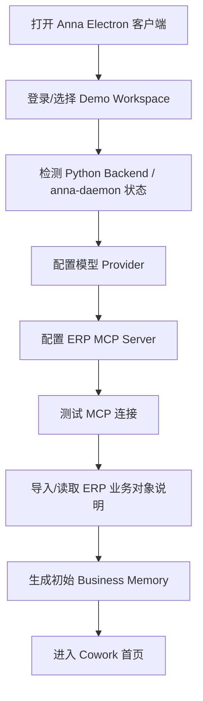

### 5.2 Chat 基础任务路径

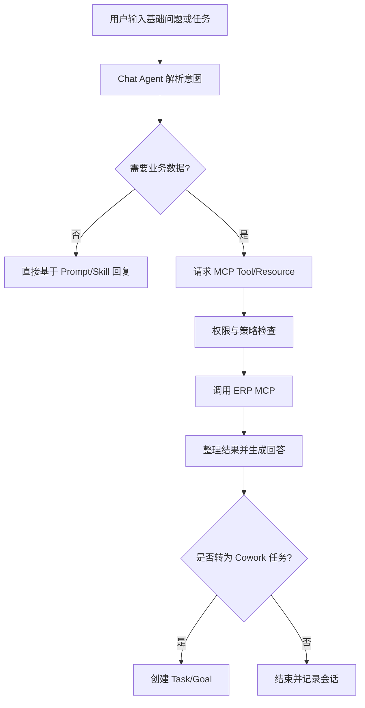

### 5.3 Cowork Kanban 主路径

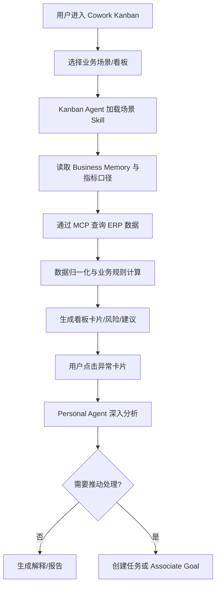

### 5.4 个人助手主路径

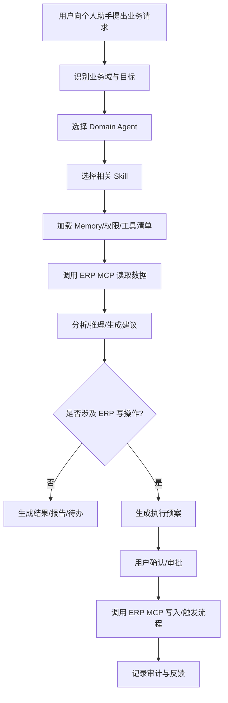

### 5.5 Associate 复杂目标路径

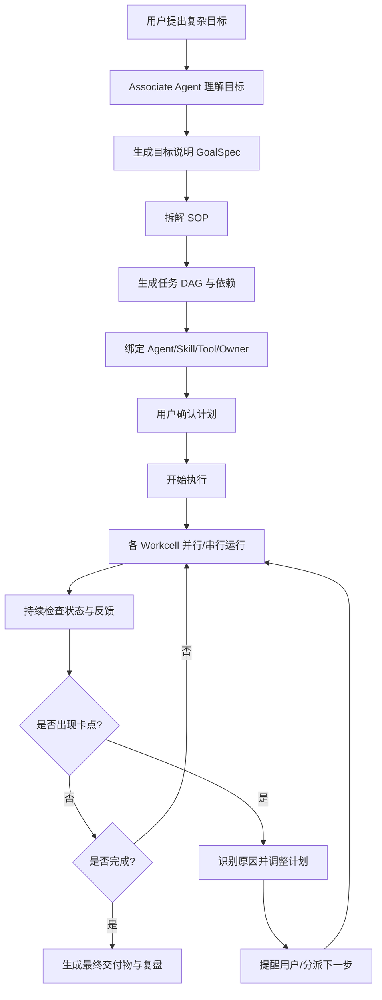

### 5.6 Create 能力生产路径

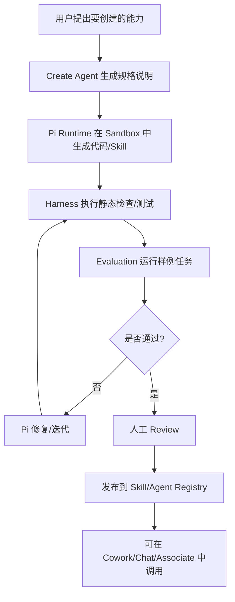

---

## 6. 功能地图

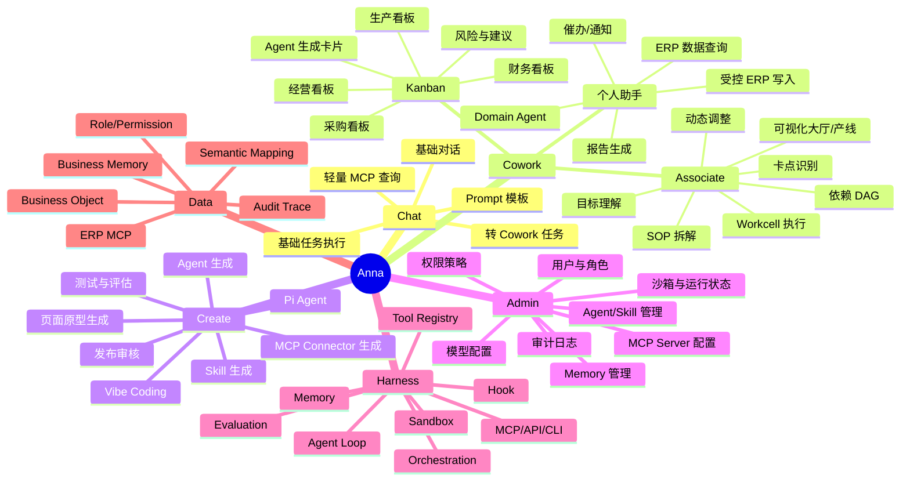

---

## 7. 任务流程图

### 7.1 通用任务流程

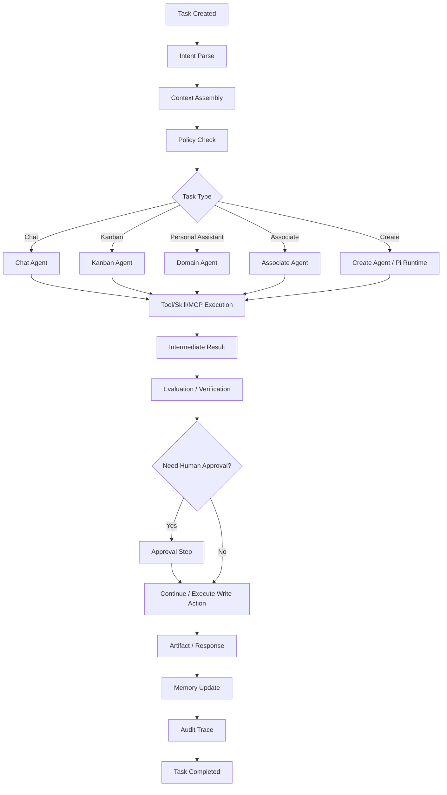

### 7.2 ERP 读写任务流程

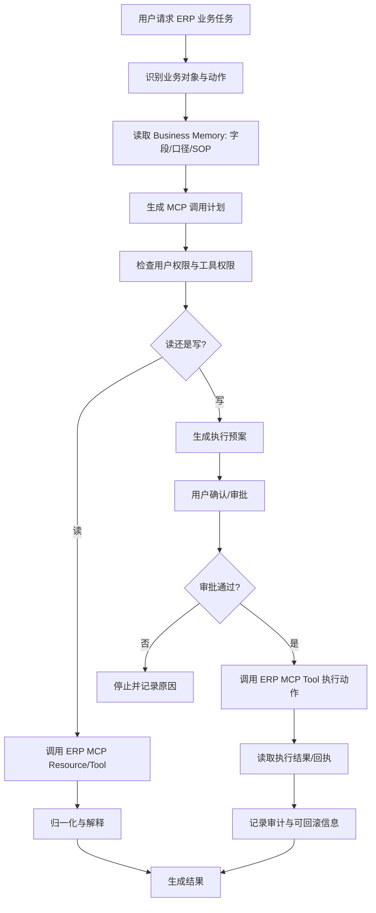

---

## 8. Agent 运行机制图

### 8.1 Harness Agent Loop

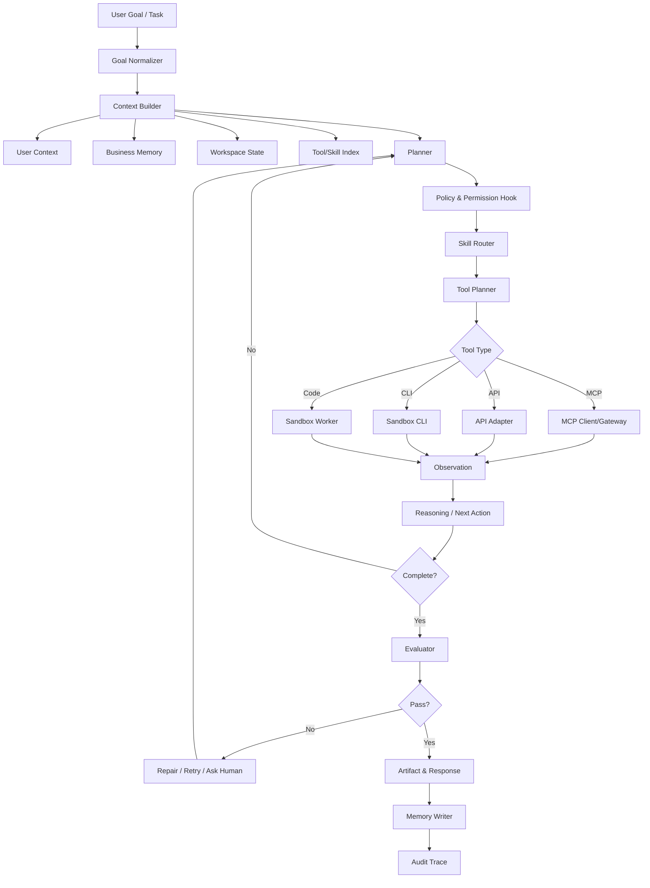

### 8.2 多 Runtime 编排

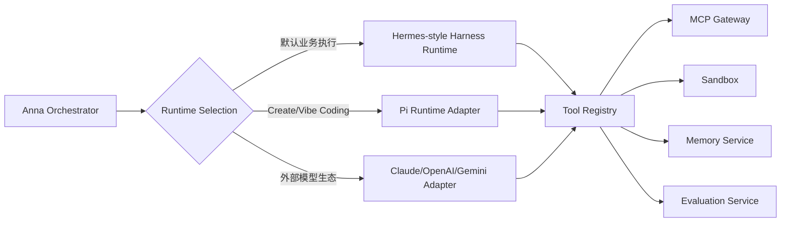

### 8.3 Agent 类型分层

| Agent 类型 | 所属模块 | 核心职责 | 是否允许 ERP 写入 | MVP 优先级 |
|---|---|---|---|---|
| Chat Agent | Chat | 基础问答、Prompt 执行、轻量任务 | 默认不允许 | P0 |
| Kanban Agent | Cowork | 生成业务看板、异常卡片、建议 | 不直接写入 | P0 |
| Domain Agent | 个人助手 | 财务/采购/销售/生产等业务查询与建议 | 审批后允许 | P0 |
| Associate Agent | Cowork | 复杂目标拆解、任务 DAG、推进协同 | 节点审批后允许 | P0/P1 |
| Create Agent | Create | 创建 Skill/Agent/Connector/页面 | 不允许生产写入 | P1 |
| Admin Agent | Admin | 配置建议、诊断运行状态 | 不直接操作敏感配置 | P2 |
| Eval Agent | Harness | 评估输出质量、检查任务结果 | 不允许 | P1 |

---

## 9. 系统架构图

### 9.1 总体系统架构

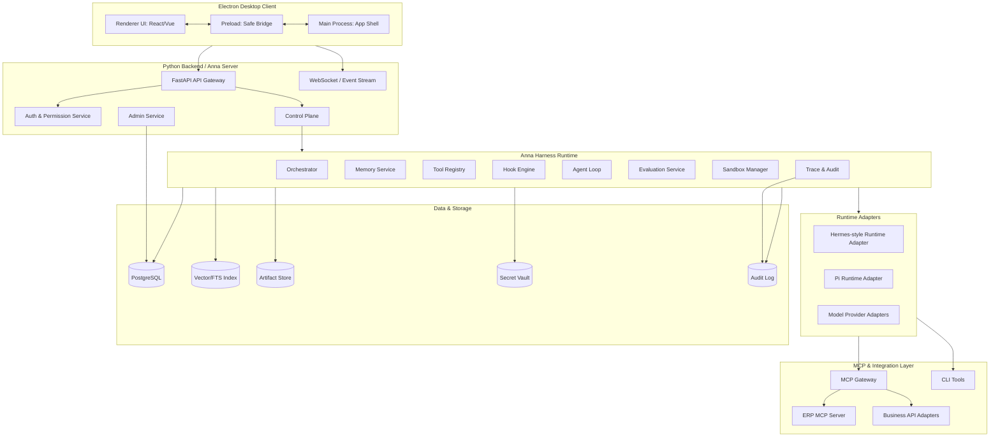

### 9.2 Electron + Python 的部署形态

| 形态 | 说明 | 适合阶段 |
|---|---|---|
| Local Sidecar Mode | Electron 启动本地 Python anna-daemon，适合 Demo 与单机 PoC | MVP 演示 |
| Server Mode | Electron 连接远端 Anna Server，适合团队协作、权限、审计和集中 MCP | 内测/正式版 |
| Hybrid Mode | 本地只负责 UI 与局部 Sandbox，敏感 MCP/权限/Memory 在远端 | 企业部署 |

**建议**：MVP 可以使用 Local Sidecar Mode 快速演示，但架构上按 Server Mode 设计 API、鉴权、事件流和存储，避免后续重构。

### 9.3 前后端职责边界

| 层 | 应该做 | 不应该做 |
|---|---|---|
| Electron Renderer | UI 展示、用户交互、可视化图表、任务状态展示 | 直接持有 ERP 凭证、直接执行 Agent、直接调用生产 ERP |
| Electron Main | 窗口管理、更新、启动本地 sidecar、安全 IPC | 业务决策、MCP 调用、敏感权限判断 |
| Preload | 暴露极少量安全 API | 暴露 Node 全能力 |
| Python API Gateway | 统一 API、WebSocket、鉴权入口 | 复杂 Agent 内部状态硬编码 |
| Control Plane | 任务、目标、策略、Runtime 选择、审批 | 直接写死业务页面逻辑 |
| Harness Runtime | Agent loop、Tool、Memory、Sandbox、Eval | 企业权限源头 |
| MCP Gateway | 连接 ERP/外部系统、工具注册、参数校验 | 业务 UI 展示 |
| Data Layer | 存储、索引、审计、Memory、Artifact | 代替业务系统成为新的 ERP |

---

## 10. 数据流转图

### 10.1 ERP 数据查询流

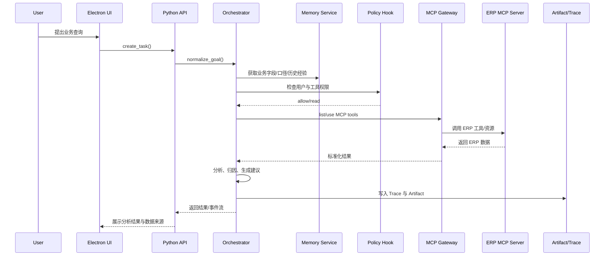

### 10.2 ERP 写入/反向下推流

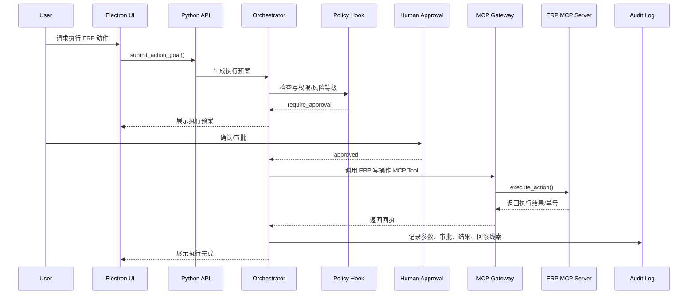

### 10.3 Memory 写入流

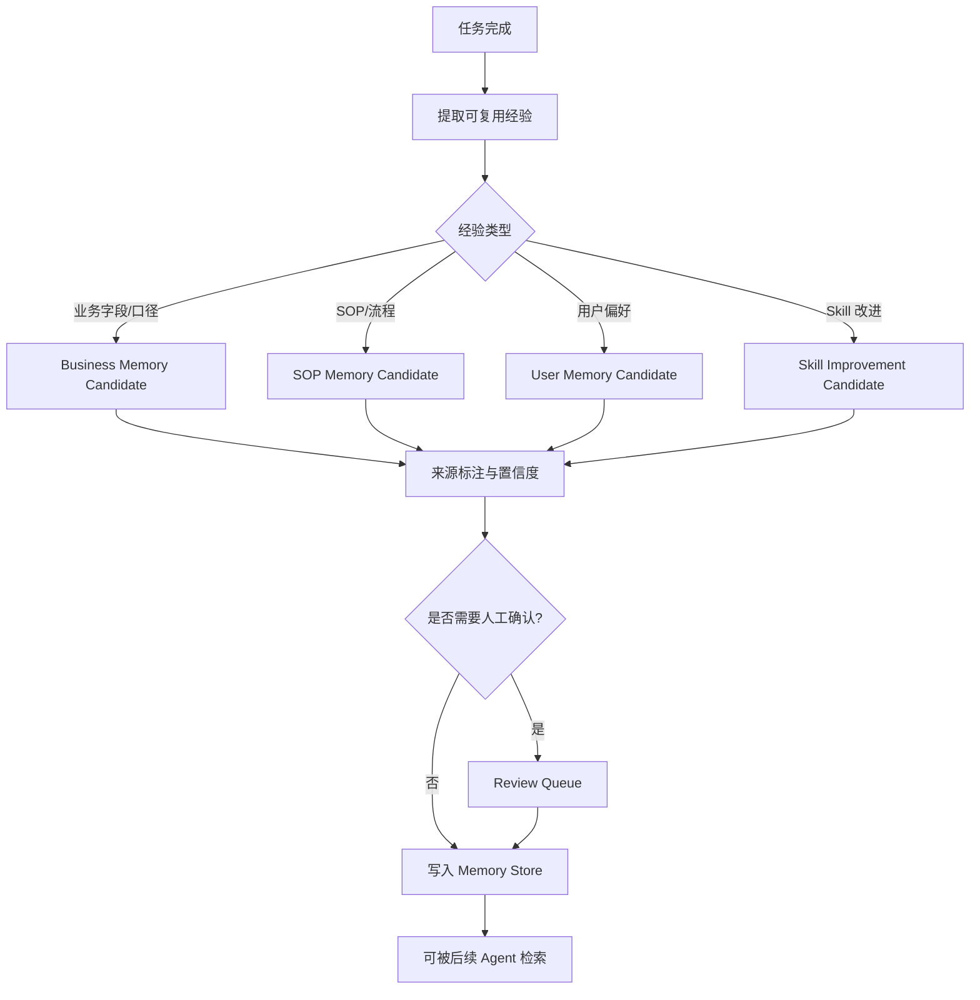

---

## 11. 核心对象模型

### 11.1 对象总览

| 对象 | 说明 | 关键字段 | 关系 |
|---|---|---|---|
| Tenant | 企业租户，MVP 可只有一个 | id, name, settings | 包含 Workspace/User/Role |
| Workspace | 工作空间，业务团队或演示空间 | id, tenant_id, name, default_model | 包含 Task/Agent/Skill/Memory |
| User | 用户 | id, name, email, role_ids | 发起 Task、审批 Action |
| Role | 角色 | id, name, scope | 绑定 Permission |
| Permission | 权限 | id, action, resource, condition | 被 Policy 使用 |
| Policy | 策略 | id, type, rule, risk_level | 控制 Tool/Memory/ERP 动作 |
| Agent | 智能体定义 | id, name, type, prompt, tool_policy, skill_ids | 调用 Skill/Tool/Memory |
| Skill | 可复用能力单元 | id, name, version, description, inputs, outputs, tests | 被 Agent 调用 |
| Tool | 工具抽象 | id, name, type, schema, risk_level | 可映射 MCP/API/CLI |
| MCPServer | MCP 服务 | id, name, endpoint, auth_ref, status | 暴露 MCPTool/MCPResource |
| MCPTool | MCP 工具 | name, schema, read_write, risk_level | 被 Tool Registry 管理 |
| MCPResource | MCP 资源 | uri, description, mime_type | 供 Agent 获取上下文 |
| DataSource | 数据源 | id, type, connection_ref | ERP/DB/File/API |
| BusinessObject | 业务对象 | id, name, fields, relations, source | 如订单、采购单、发票 |
| SemanticMapping | 语义映射 | business_object, field_map, metric_formula | ERP 字段到业务语言 |
| MemoryItem | 记忆项 | id, type, content, source, confidence, scope | 支持 User/Workspace/Business |
| Goal | 用户目标 | id, title, description, owner, status | 可拆解 SOP/TaskNode |
| SOP | 流程模板 | id, name, steps, dependencies | 可从 Goal 生成 |
| Task | 任务 | id, goal_id, type, status, priority | 包含 Run/Artifact |
| TaskNode | DAG 节点/Workcell | id, task_id, deps, agent_id, status | Associate 核心 |
| Run | 一次 Agent 运行 | id, task_id, runtime, model, status | 产生 ToolCall/Trace |
| ToolCall | 工具调用记录 | id, run_id, tool, params, result, status | 审计与复盘 |
| Artifact | 交付物 | id, type, uri, metadata | 报告、图表、表格、页面 |
| Approval | 审批 | id, action_id, approver, decision | 控制写操作 |
| Evaluation | 评估结果 | id, run_id, metrics, passed | 质量控制 |
| Sandbox | 沙箱实例 | id, runtime, status, limits | 运行代码/工具 |
| AuditEvent | 审计事件 | id, actor, action, resource, timestamp | 全链路记录 |
| Notification | 通知 | id, target, channel, content | 催办/提醒 |
| Workcell | Associate 可视节点 | id, node_id, visual_state, owner | 办事大厅/产线展示 |

### 11.2 关系图

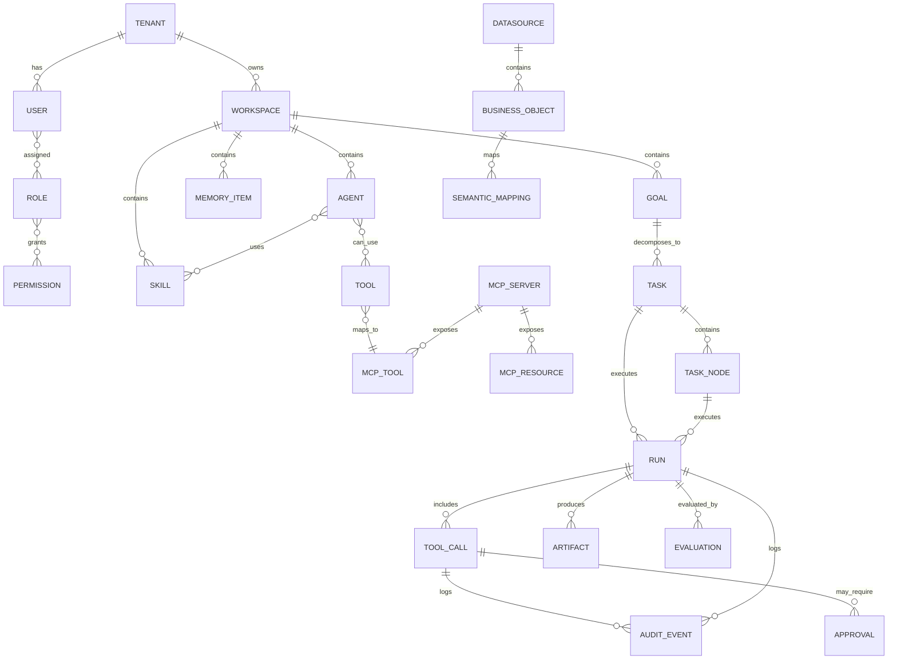

---

## 12. 任务状态机

### 12.1 Task 状态定义

| 状态 | 含义 | 进入条件 | 可转移到 |
|---|---|---|---|
| DRAFT | 草稿 | 用户输入但未提交 | SUBMITTED, CANCELLED |
| SUBMITTED | 已提交 | 用户确认任务 | ANALYZING |
| ANALYZING | 解析中 | Agent 正在理解意图 | PLANNING, WAITING_CONTEXT, FAILED |
| WAITING_CONTEXT | 等待上下文 | 缺少数据、权限、参数 | ANALYZING, CANCELLED |
| PLANNING | 规划中 | 生成执行计划/SOP/DAG | PLAN_READY, FAILED |
| PLAN_READY | 计划已生成 | 等待用户确认 | WAITING_APPROVAL, READY, CANCELLED |
| WAITING_APPROVAL | 等待审批 | 涉及高风险动作或写操作 | READY, CANCELLED |
| READY | 可执行 | 计划和权限已满足 | RUNNING |
| RUNNING | 执行中 | Agent/Tool/Sandbox 正在运行 | BLOCKED, VERIFYING, PARTIAL_SUCCESS, FAILED |
| BLOCKED | 阻塞 | 缺人、缺数据、工具失败、权限不足 | RUNNING, WAITING_CONTEXT, CANCELLED |
| PARTIAL_SUCCESS | 部分成功 | 部分节点完成，部分失败或等待 | RUNNING, VERIFYING, BLOCKED |
| VERIFYING | 验证中 | 执行完毕，正在评估 | COMPLETED, FAILED, NEEDS_REPAIR |
| NEEDS_REPAIR | 需要修复 | Eval 未通过或结果不可信 | PLANNING, RUNNING, CANCELLED |
| COMPLETED | 已完成 | 交付物与验证通过 | ARCHIVED |
| FAILED | 失败 | 无法恢复或超过重试 | ARCHIVED, PLANNING |
| CANCELLED | 已取消 | 用户或策略中止 | ARCHIVED |
| ROLLED_BACK | 已回滚 | 已执行动作被补偿/回滚 | ARCHIVED |
| ARCHIVED | 已归档 | 任务关闭 | - |

### 12.2 Task 状态机图

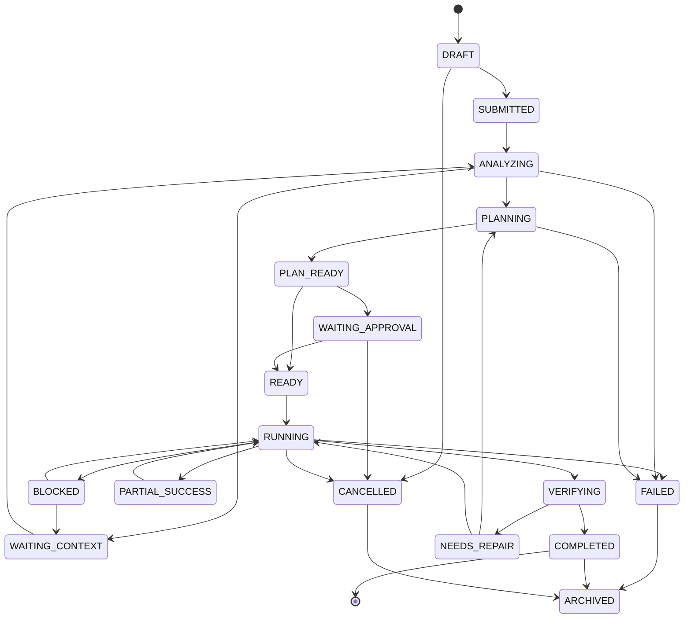

### 12.3 Associate Workcell 状态

| 状态 | 含义 | UI 表现 |
|---|---|---|
| NOT_STARTED | 未开始 | 灰色节点 |
| READY | 依赖满足，等待执行 | 蓝色待办 |
| RUNNING | 正在执行 | 动态进度 |
| WAITING_HUMAN | 等待人工输入/确认 | 黄色提醒 |
| WAITING_TOOL | 等待工具或 ERP 返回 | 蓝色 loading |
| BLOCKED | 卡住 | 红色高亮 |
| REVIEWING | 等待验证/复核 | 紫色 |
| DONE | 完成 | 绿色 |
| FAILED | 失败 | 红色 |
| SKIPPED | 被跳过 | 灰色虚线 |
| REPLANNED | 已重排 | 带重排标识 |

---

## 13. 权限矩阵

### 13.1 权限设计原则

MVP 用户可以全权限，但权限模型必须从第一版存在。建议采用 **RBAC + ABAC + Tool Policy** 三层：

1. **RBAC**：用户属于角色，角色拥有模块级权限。
2. **ABAC**：根据部门、业务域、数据范围、任务风险、时间、环境判断是否允许。
3. **Tool Policy**：每个 MCP Tool/API/CLI Tool 单独定义 read/write、风险等级、是否需要审批。

### 13.2 角色权限矩阵

| 功能/权限 | Demo Super User | Workspace Admin | Business Admin | AI Builder | Business User | Viewer | Auditor | Integration Admin |
|---|---:|---:|---:|---:|---:|---:|---:|---:|
| 使用 Chat | ✅ | ✅ | ✅ | ✅ | ✅ | ✅ | ✅ | ✅ |
| 使用 Cowork Kanban | ✅ | ✅ | ✅ | ✅ | ✅ | ✅ | ✅ | ✅ |
| 使用个人助手 | ✅ | ✅ | ✅ | ✅ | ✅ | ⚠️ 只读 | ⚠️ 只读 | ✅ |
| 创建 Associate Goal | ✅ | ✅ | ✅ | ✅ | ✅ | ❌ | ❌ | ✅ |
| 查看 Associate 执行图 | ✅ | ✅ | ✅ | ✅ | ✅ | ✅ | ✅ | ✅ |
| 执行 ERP 读操作 | ✅ | ✅ | ✅ | ⚠️ 测试环境 | ✅ 按数据范围 | ✅ 只读 | ✅ 只读 | ✅ |
| 执行 ERP 写操作 | ✅ | ⚠️ 审批 | ⚠️ 审批 | ❌ | ⚠️ 审批 | ❌ | ❌ | ⚠️ 联调环境 |
| 创建 Skill | ✅ | ✅ | ✅ | ✅ | ❌ | ❌ | ❌ | ✅ |
| 发布 Skill | ✅ | ✅ | ⚠️ 业务域内 | ⚠️ 需审核 | ❌ | ❌ | ❌ | ⚠️ 技术类 |
| 使用 Create/Vibe Coding | ✅ | ✅ | ⚠️ | ✅ | ❌ | ❌ | ❌ | ✅ |
| 配置 MCP Server | ✅ | ⚠️ | ❌ | ❌ | ❌ | ❌ | ✅ 只读 | ✅ |
| 管理模型配置 | ✅ | ✅ | ❌ | ❌ | ❌ | ❌ | ✅ 只读 | ❌ |
| 查看审计日志 | ✅ | ✅ | ⚠️ 业务域内 | ❌ | ❌ | ❌ | ✅ | ✅ 技术日志 |
| 管理 Memory | ✅ | ✅ | ⚠️ 业务域内 | ⚠️ Skill Memory | ❌ | ❌ | ✅ 只读 | ❌ |
| 管理用户/角色 | ✅ | ✅ | ❌ | ❌ | ❌ | ❌ | ✅ 只读 | ❌ |
| 管理凭证 | ✅ | ⚠️ | ❌ | ❌ | ❌ | ❌ | ✅ 只读元数据 | ✅ |
| 查看成本/运行统计 | ✅ | ✅ | ⚠️ 业务域内 | ⚠️ 自己创建能力 | ❌ | ❌ | ✅ | ✅ |

说明：

- ✅：允许
- ❌：不允许
- ⚠️：受条件、审批、环境或数据范围限制

### 13.3 Tool 风险等级

| 风险等级 | 示例 | 默认策略 |
|---|---|---|
| L0 只读低风险 | 查询公开帮助、读取无敏感配置 | 允许 |
| L1 业务只读 | 查询 ERP 订单、库存、应收 | 按数据权限允许 |
| L2 敏感只读 | 薪资、客户隐私、合同金额 | 需要更高角色或脱敏 |
| L3 低风险写 | 创建草稿、生成待办、发送给自己 | 需要确认 |
| L4 业务写 | 发起审批、修改单据、发送通知 | 需要审批与审计 |
| L5 高风险写 | 付款、删除、批量导出、权限变更 | MVP 禁止或强审批 |

---

## 14. MVP 范围

### 14.1 MVP 目标

MVP 的核心目标不是展示所有功能，而是完成一个可信闭环：

> **用户在 Anna 中提出业务目标，Anna 通过 MCP 调用 ERP 数据，利用 Agent/Skill 生成业务看板或执行计划，在 Cowork 中可视化呈现，用户可追问、确认并推动下一步，系统留下审计和可复用 Skill/Memory。**

### 14.2 MVP 必做范围 P0

| 模块 | P0 功能 | 验收标准 |
|---|---|---|
| Electron Client | 桌面端启动、登录 Demo Workspace、Chat/Cowork/Create/Admin 导航 | 可安装/运行，UI 稳定 |
| Python Backend | FastAPI、WebSocket 事件流、任务 API、基础鉴权 | 前后端分离可运行 |
| Chat | 基础对话、Prompt 模板、简单 MCP 查询 | 能通过对话查询 ERP 数据 |
| Cowork Kanban | 1-2 个业务看板，Agent 生成卡片、风险、建议 | 看板内容来自 MCP 数据，不是纯静态 |
| 个人助手 | 1 个 Domain Agent，如财务/采购助手 | 能读取 ERP 数据、解释异常、生成建议 |
| Associate | 复杂目标拆解、SOP、DAG/Workcell 可视化、基础推进 | 能把一个目标拆成可视节点并跟踪状态 |
| MCP Integration | ERP MCP Server 连接、Tool 列表、Tool 调用、错误处理 | 能稳定读取 ERP 示例数据 |
| Harness | Orchestration、Memory、Tool Registry、MCP Client、Hook、Agent Loop、Eval、Sandbox 最小实现 | 能完成一次可追踪 Agent 运行 |
| Memory | Business Memory 初版：字段口径、业务规则、SOP 片段 | Agent 能检索并用于回答 |
| Create | Pi Runtime 在 Sandbox 里生成一个 Skill 草案 | Skill 经过测试后能被注册调用 |
| Admin | MCP 配置、模型配置、Agent/Skill 列表、运行日志 | 演示时可配置和查看 |
| Audit | 任务、工具调用、ERP 参数、审批记录 | 可追踪一次任务全过程 |
| 权限接口 | Demo 全权限，但保留 Role/Permission/Policy 对象 | 后续无需推倒重来 |

### 14.3 MVP 可选范围 P1

| 模块 | P1 功能 |
|---|---|
| Associate | 卡点识别、自动重排、催办通知 |
| Create | 页面原型生成、Connector 生成、Skill 版本管理 |
| Evaluation | 任务成功率、工具错误率、输出质量评分 |
| Sandbox | Docker 隔离、网络 allowlist |
| Memory | 人工 Review Queue、Memory 置信度 |
| Admin | Tool 风险等级、审批策略配置 |
| Notification | 飞书/钉钉/企业微信通知 |
| Artifact | PPT/报告/表格导出 |

### 14.4 MVP 不做范围

| 不做项 | 原因 |
|---|---|
| 完整多租户商业化 | 当前定位轻量演示，先保证闭环 |
| 复杂组织权限模型 | MVP 用户全权限，但保留接口 |
| 完整企业数据中台 | 数据语义化接口保留，先通过 ERP MCP + Business Memory 实现 |
| 通用低代码平台 | Create 聚焦 Anna 能力生产，不做泛低代码 |
| 大规模 Agent Marketplace | 先做本地 Skill Registry |
| 全自动高风险 ERP 写操作 | 必须等权限、审批、回滚成熟 |
| 完整 BI 替代 | Kanban 是 Agent 驱动业务协作，不是传统 BI |
| 完整移动端 | Electron 桌面端优先 |
| 完整流程引擎替代 | Associate 是 Agent 协同推进，不替代 BPM |

### 14.5 推荐 MVP 演示脚本

**演示主题**：采购/财务异常协同处理。

1. 用户打开 Anna，进入 Cowork。
2. Kanban Agent 通过 ERP MCP 读取采购单、库存、付款、供应商数据。
3. Anna 生成“采购异常看板”：延期交付、缺料风险、付款异常、待审批单据。
4. 用户点击一个异常卡片：“为什么这个采购单会影响生产？”
5. 个人助手调用 ERP 数据，分析销售订单、库存、采购到货、生产计划之间的关系。
6. 用户说：“帮我推动这个问题闭环。”
7. Associate 生成目标：完成采购异常闭环。
8. Associate 拆解 SOP：确认缺料 → 联系供应商 → 评估替代物料 → 更新交期 → 通知生产 → 形成报告。
9. UI 展示 Workcell/DAG，每个节点有状态、负责人、Agent、下一步。
10. 某节点卡住，Anna 标识“等待供应商反馈”，建议催办。
11. 用户确认后，Anna 通过 MCP 或通知工具生成催办任务。
12. 完成后，Anna 生成复盘报告，并建议将该流程沉淀为“采购异常闭环 Skill”。
13. Create 使用 Pi Runtime 生成 Skill 草案，经过测试后注册到 Skill Registry。
14. Admin 展示本次任务的 MCP 调用、审计记录、模型消耗和 Skill 版本。

这个脚本能一次性体现：MCP 连接、Cowork、Kanban、个人助手、Associate、Create、Harness、Memory、Audit。

---

## 15. 技术实现建议

### 15.1 推荐技术栈

| 层 | 建议 |
|---|---|
| Desktop | Electron + React/Vue + TypeScript |
| Backend | Python + FastAPI |
| Event Stream | WebSocket / Server-Sent Events |
| Agent Runtime | Hermes-style Harness Runtime |
| Create Runtime | Pi Runtime Adapter |
| MCP | Python MCP Client + MCP Gateway |
| Database | PostgreSQL |
| Search/Memory | PostgreSQL FTS + pgvector / Qdrant 可选 |
| Cache/Queue | Redis |
| Task Queue | Celery / Dramatiq / Temporal Python SDK |
| Artifact | MinIO/S3/local filesystem for MVP |
| Sandbox | Local subprocess for earliest PoC, Docker for MVP, Firecracker/K8s later |
| Observability | OpenTelemetry + structured logs |
| Eval | 自研小型 Eval runner + 样例集 |
| Secret | 本地开发 .env，MVP 使用 Vault/KMS 接口抽象 |

### 15.2 模块拆分建议

```text
anna/
  apps/
    desktop/                 # Electron
    web/                     # 可选，后续 Web 版
  services/
    api/                     # FastAPI Gateway
    harness/                 # Agent Runtime
    mcp_gateway/             # MCP Client/Gateway
    memory/                  # Memory Service
    eval/                    # Evaluation
    sandbox/                 # Sandbox Manager
    admin/                   # Admin Service
  packages/
    agent_sdk/               # Anna Agent/Skill SDK
    connector_sdk/           # MCP/ERP Connector SDK
    shared_schema/           # Pydantic/JSON Schema
  skills/
    finance/
    procurement/
    kanban/
    associate/
  runtimes/
    hermes_adapter/
    pi_adapter/
  tests/
    eval_cases/
    integration/
```

### 15.3 Harness 最小接口

```python
class HarnessRuntime:
    async def create_session(self, context: RuntimeContext) -> Session:
        ...

    async def run_task(self, task: TaskSpec) -> RunHandle:
        ...

    async def stream_events(self, run_id: str):
        ...

    async def call_tool(self, call: ToolCallSpec) -> ToolResult:
        ...

    async def evaluate(self, run_id: str) -> EvaluationResult:
        ...

    async def write_memory(self, item: MemoryCandidate) -> MemoryWriteResult:
        ...
```

### 15.4 Agent 定义建议

```yaml
id: procurement_exception_agent
name: 采购异常处理助手
type: domain_agent
runtime: hermes_harness
description: 分析采购异常、缺料风险、供应商交付与生产影响
skills:
  - procurement_data_analysis
  - shortage_risk_reasoning
  - supplier_followup_sop
tools:
  - erp.purchase_order.query
  - erp.inventory.query
  - erp.production_plan.query
  - notification.create_task
tool_policy:
  default: read_only
  write_requires_approval: true
memory_scope:
  - workspace
  - business_domain:procurement
eval_cases:
  - shortage_risk_case_001
  - delayed_purchase_case_001
```

---

## 16. 关键设计取舍

### 16.1 为什么 Chat 不做重

Chat 适合作为入口和基础能力展示，但企业用户真正需要的是“看见业务、推进业务、追踪结果”。如果 Chat 过重，会把复杂协同、可视化状态、工具调用、审批和审计都塞进对话流，体验会混乱。Anna 应该让 Chat 轻，Cowork 重。

### 16.2 为什么 Cowork 是核心

Cowork 是 Anna 与普通 AI 助手的分水岭。普通助手回答问题，Cowork 让 Agent 连接业务系统、生成状态视图、识别问题、推动协同。Anna 的演示价值、客户感知和后续扩展都应围绕 Cowork 展开。

### 16.3 为什么 Kanban 不能纯硬编码

纯硬编码 Kanban 很容易变成普通 BI 或 ERP 看板，无法体现 Anna 的 Agent 能力。正确方式是：UI 模板可以固定，数据、解释、风险、建议和下一步由 Agent/Skill 生成。这样同一个 Kanban 框架可以扩展到财务、采购、生产、人事等不同场景。

### 16.4 为什么 Associate 应做可视化大厅/产线

Associate 解决的是复杂协同推进问题。用户最需要的不是又一个任务列表，而是看到“事情正在被谁/哪个 Agent/哪个系统处理，卡在哪里，下一步怎么办”。办事大厅/工位/产线的可视化更符合这个心智。

### 16.5 为什么 Create 用 Pi，但底座用 Hermes-style Harness

Pi 轻便、高效，适合生成代码、Skill、Connector、页面和测试；但企业业务执行需要 Memory、Tool Policy、Audit、Sandbox、Evaluation、MCP 等更完整治理。Create 可以用 Pi 做“创造引擎”，但 Pi 必须运行在 Anna Harness 的管控下。

---

## 17. 风险与缓解

| 风险 | 表现 | 缓解 |
|---|---|---|
| ERP MCP 不稳定 | 演示调用失败、字段不一致 | 先定义 MCP 合同、准备 mock server、增加 fallback 数据 |
| Agent 结果不可控 | 看板内容漂移、解释不一致 | 固定 Skill 模板、Business Memory、Eval cases |
| Kanban 被做成静态页面 | 不能体现 Agent 能力 | 卡片生成逻辑必须通过 Agent/Skill 运行 |
| Associate 过于复杂 | MVP 做不完 | 先做 DAG + Workcell + 状态推进，不做完整自动调度 |
| 权限后补困难 | 后期重构成本高 | MVP 就保留 User/Role/Policy/ToolRisk 对象 |
| Pi 产物风险 | 生成不安全代码 | Sandbox + 测试 + 人工 Review + 不给生产凭证 |
| Electron 安全风险 | Renderer 获得 Node 权限导致本地风险 | nodeIntegration=false、contextIsolation=true、sandbox=true、严格 IPC |
| 数据语义复杂 | Agent 不理解 ERP 字段 | 初期只做 1-2 个业务对象的 Semantic Mapping |
| 写操作风险 | 错误修改 ERP | MVP 写操作先做草稿/审批/模拟，正式写入必须人工确认 |
| 范围膨胀 | 同时做 Chat/Cowork/Create/Admin 太深 | P0 聚焦 ERP MCP + Cowork 闭环 |

---

## 18. 里程碑建议

### 18.1 8 周 MVP 计划

| 周期 | 目标 | 交付物 |
|---|---|---|
| 第 1 周 | 架构打底 | Electron 壳、FastAPI、任务 API、WebSocket、基础 UI |
| 第 2 周 | MCP 联通 | ERP MCP Client/Gateway、Tool 列表、读数据 Demo |
| 第 3 周 | Harness 雏形 | Orchestrator、Tool Registry、Memory、Trace |
| 第 4 周 | Chat + 个人助手 | 基础 Chat、Domain Agent、ERP 查询与解释 |
| 第 5 周 | Cowork Kanban | Agent 生成看板卡片、异常解释、数据来源 |
| 第 6 周 | Associate MVP | Goal → SOP → DAG → Workcell 可视化 |
| 第 7 周 | Create MVP | Pi Sandbox 生成 Skill 草案、测试、注册 |
| 第 8 周 | 演示闭环 | 审计、Eval、错误处理、完整演示脚本打磨 |

### 18.2 MVP 验收指标

| 指标 | 目标 |
|---|---|
| ERP MCP 查询成功率 | 演示环境 ≥ 95% |
| 端到端任务完成时间 | 常见查询 ≤ 30 秒，复杂 Associate 规划 ≤ 2 分钟 |
| Kanban 数据真实来源 | 100% 来自 MCP 或标注为 mock |
| 工具调用可追踪 | 100% 有 ToolCall 记录 |
| 写操作确认 | 100% 需要用户确认 |
| Skill 生成闭环 | 至少 1 个 Skill 可由 Create 生成、测试并调用 |
| Associate 可视化 | 至少支持 5-8 个 Workcell 的 DAG 展示 |
| Demo 稳定性 | 连续演示 3 次无阻断性失败 |

---

## 19. 参考资料

以下资料用于确认关键技术边界和架构假设：

1. Model Context Protocol 官方介绍：MCP 是连接 AI 应用与外部数据源、工具和工作流的开放标准。  
   https://modelcontextprotocol.io/docs/getting-started/intro

2. MCP Tools 规范：MCP Server 可暴露可被模型调用的工具，工具包含名称和输入 schema。  
   https://modelcontextprotocol.io/specification/2025-06-18/server/tools

3. MCP Resources 规范：MCP Server 可暴露资源，为模型提供文件、数据库 schema、应用上下文等。  
   https://modelcontextprotocol.io/specification/2025-06-18/server/resources

4. Electron 官方介绍：Electron 通过 Chromium 和 Node.js 构建跨平台桌面应用。  
   https://electronjs.org/

5. Electron 安全文档：建议启用 context isolation、process sandboxing，并谨慎处理 Node.js 集成。  
   https://electronjs.org/docs/latest/tutorial/security

6. Electron Process Sandboxing：sandbox 限制渲染进程访问系统资源。  
   https://electronjs.org/docs/latest/tutorial/sandbox

7. Hermes Agent 官方文档：Hermes 具备学习循环、Skills、Memory、Tools 等能力。  
   https://hermes-agent.nousresearch.com/docs/

8. Hermes Architecture 文档：Hermes 插件系统可注册 tools、hooks、CLI commands，并支持 memory providers/context engines。  
   https://hermes-agent.nousresearch.com/docs/developer-guide/architecture

9. Hermes GitHub：NousResearch/hermes-agent。  
   https://github.com/NousResearch/hermes-agent

10. Pi Agent GitHub：Pi Agent Harness mono repo，包括 coding agent CLI、agent runtime、多模型 API。  
   https://github.com/earendil-works/pi

11. Pi Coding Agent NPM：Pi coding agent CLI 包含 read、bash、edit、write 等工具。  
   https://www.npmjs.com/package/@earendil-works/pi-coding-agent
