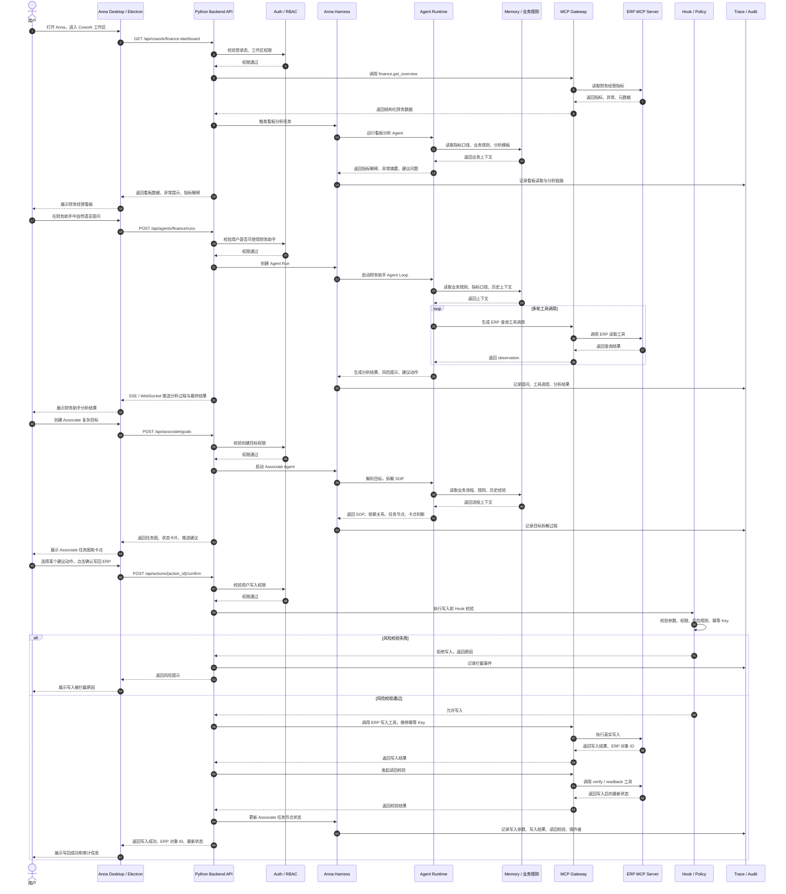

> **⚠️ 对齐说明(2026-06-28)**:本文档的「**定位与底座模型**」部分已在开发过程中**校正/升级**,最新架构基准见 [《Anna 架构与定义》v2.0](../design/2026-06-28-anna-aios-architecture-and-definition.md)。变化要点:定位升级为「企业级 AI Agent Runtime / 平台优先」;底座为自有 model-agnostic loop(非 Hermes/Pi);Associate 已下线,Cowork 现为 财务看板(+copilot)+报销+Hiker;新增 Capability=Agent、异步无状态并发、配置化 Connector、Loop Engineering。**时序图、数据流、治理/安全/MCP 集成大部分仍有效**,保留作参考 —— **校正与优化,不是推翻**。

下面是四张图的**文字版结构**，最后补充一个可直接放进技术文档里的 **Mermaid 时序图**，用于指导前后端、Agent、MCP、ERP 联调开发。

---

# 1. Anna 整体系统架构图：文字版

## 1.1 产品定位

Anna 是一个轻量企业 AI 助手，基于：

```text
Electron 桌面端
+ Python 后端
+ Anna Harness Agent 底座
+ MCP Gateway
+ ERP 系统读写能力
```

核心演示闭环是：

```text
看板发现问题
→ 财务助手分析
→ Associate 拆解推进
→ 用户确认
→ 写回 ERP
→ 读回校验
→ 审计留痕
```

MVP 核心模块是：

```text
财务经营看板
+ 财务助手
+ Associate 目标拆解
+ ERP 真实写入
```

---

## 1.2 架构分层

```text
Anna
├─ 1. 用户与入口层
│  ├─ 企业用户
│  ├─ 管理员
│  ├─ 开发者
│  ├─ 演示用户
│  └─ Anna Desktop（Electron）
│     ├─ Chat
│     ├─ Cowork
│     ├─ Create
│     └─ Admin
│
├─ 2. 应用与业务能力层
│  ├─ Chat
│  │  ├─ 基础对话
│  │  ├─ Prompt 模板
│  │  ├─ 通用任务执行
│  │  └─ 对话转任务
│  │
│  ├─ Cowork（核心）
│  │  ├─ 财务经营看板
│  │  ├─ 财务助手
│  │  ├─ Associate 目标拆解
│  │  ├─ 任务执行与结果呈现
│  │  └─ ERP 反向写入
│  │
│  ├─ Create
│  │  ├─ Prompt 生成
│  │  ├─ Skill 生成
│  │  ├─ 简单工具生成
│  │  └─ 产物审核
│  │
│  └─ Admin
│     ├─ 角色权限
│     ├─ MCP 配置
│     ├─ 工具管理
│     └─ 审计日志
│
├─ 3. Anna Harness 底座能力层
│  ├─ Orchestration
│  ├─ Memory
│  ├─ Tool Registry
│  ├─ MCP Gateway
│  ├─ Hook
│  ├─ Agent Loop
│  ├─ Sandbox
│  ├─ Evaluation
│  ├─ Trace
│  ├─ Artifact
│  └─ Model Router
│
├─ 4. Agent Runtime
│  ├─ 财务助手 Agent
│  ├─ 看板分析 Agent
│  ├─ Associate Agent
│  └─ Create Agent
│
├─ 5. 数据与集成层
│  ├─ MCP Server（ERP）
│  │  ├─ 财务数据
│  │  ├─ 业务单据
│  │  ├─ 任务 / 待办
│  │  ├─ 组织与权限接口
│  │  └─ 业务规则 / 口径 Memory
│  │
│  ├─ API / CLI
│  ├─ 本地文件
│  └─ 其他业务系统（预留）
│
└─ 6. 安全与治理
   ├─ 登录认证
   ├─ 权限控制
   ├─ 写操作确认
   ├─ 审计留痕
   ├─ 凭证后端管理
   └─ 风险动作拦截
```

---

## 1.3 开发理解

Anna 的架构原则是：

```text
Electron 负责交互
Python 后端负责业务、Agent、MCP、权限、审计
MCP Gateway 负责连接 ERP
Harness 负责任务编排、工具调用、Agent Loop、Memory、Hook
ERP 写入必须经过用户确认、权限校验、风险校验、读回校验和审计
```

Electron 不直接持有 ERP 凭证，不直接调用 ERP 写接口。

---

# 2. Anna 产品功能蓝图：文字版

## 2.1 产品功能总览

```text
Anna 产品功能蓝图
├─ 1. 基础入口 Chat
├─ 2. 核心工作区 Cowork
│  ├─ Kanban 财务经营看板
│  ├─ 财务助手
│  └─ Associate
├─ 3. Create 轻量能力生产
├─ 4. Admin 管理后台
└─ 5. 底座与连接能力
   ├─ Harness
   ├─ MCP
   └─ Data
```

---

## 2.2 Chat：基础入口

Chat 是基础能力展示，不追求复杂。

```text
Chat
├─ 基础对话
├─ Prompt 模板
├─ 通用任务执行
└─ 对话转任务
```

Chat 主要解决：

```text
用户可以自然语言提问
用户可以使用 Prompt 模板完成基础任务
用户可以把对话中的问题转入 Cowork 或 Associate
```

---

## 2.3 Cowork：核心工作区

Cowork 是 Anna 的主战场，承载 MVP 的核心演示。

```text
Cowork
├─ A. Kanban 财务经营看板
│  ├─ 固定页面
│  ├─ 核心指标展示
│  ├─ 异常识别
│  ├─ 指标解释
│  └─ 内容可生成
│
├─ B. 财务助手
│  ├─ 自然语言查询 ERP
│  ├─ 数据解释
│  ├─ 风险提示
│  ├─ 操作建议
│  └─ ERP 真实写入
│
└─ C. Associate
   ├─ 复杂目标输入
   ├─ SOP 拆解
   ├─ 依赖关系生成
   ├─ 任务图
   ├─ 状态卡片
   ├─ 卡点识别
   └─ 推进下一步
```

Cowork 的核心产品链路是：

```text
看板发现问题
→ 财务助手分析问题
→ Associate 拆解目标
→ 生成任务推进方案
→ 用户确认写入动作
→ 写回 ERP
```

---

## 2.4 Create：轻量能力生产

Create 第一版只做轻量能力，不做完整应用开发平台。

```text
Create
├─ Prompt 生成
├─ Skill 生成
├─ 简单工具生成
└─ 人工审核
```

MVP 中 Create 可以进一步收敛，优先级低于 Cowork 和 ERP 写入。

---

## 2.5 Admin：后台管理

```text
Admin
├─ 角色权限
├─ MCP 配置
├─ 工具管理
├─ 审计日志
└─ 基础系统设置
```

Admin 的第一版目标不是做复杂多租户系统，而是支撑：

```text
ERP MCP 连接配置
工具可见性管理
写入动作审计
基础权限控制
```

---

## 2.6 底座与连接能力

```text
底座与连接能力
├─ Harness
│  ├─ Orchestration
│  ├─ Memory
│  ├─ Tool
│  ├─ Hook
│  ├─ Agent Loop
│  ├─ Sandbox
│  └─ Evaluation
│
├─ MCP
│  ├─ ERP 数据读取
│  ├─ ERP 真实写入
│  └─ 调用审计
│
└─ Data
   ├─ 业务规则 Memory
   ├─ 角色权限接口
   └─ 外部系统预留
```

---

## 2.7 MVP 交付重点

```text
MVP 交付重点
├─ 1. 财务经营看板
├─ 2. 财务助手
├─ 3. Associate 目标拆解
└─ 4. ERP 真实写入
```

---

# 3. Anna 核心交互逻辑图：文字版

## 3.1 主路径

```text
用户进入 Anna
→ 查看财务经营看板
→ 发起财务助手分析
→ 返回分析结果
→ 发起 Associate 目标
→ Associate 自动推进
→ 用户确认并写回 ERP
→ 读回校验与审计
```

---

## 3.2 用户交互流程

```text
1. 进入 Anna
   ├─ 打开 Electron 客户端
   └─ 进入 Cowork 工作区

2. 查看财务经营看板
   ├─ 浏览核心指标
   └─ 系统标记异常项

3. 发起财务助手分析
   ├─ 用户用自然语言提问
   └─ 财务助手调用 MCP 查询 ERP

4. 返回分析结果
   ├─ 指标解释
   ├─ 风险提示
   └─ 建议动作

5. 发起 Associate 目标
   ├─ 用户输入复杂目标
   └─ 示例：优化本月应收回款推进

6. Associate 自动推进
   ├─ 拆解 SOP
   ├─ 生成依赖关系
   ├─ 输出任务图与状态卡片
   └─ 识别卡点

7. 确认并写回 ERP
   ├─ 用户确认写操作
   ├─ Harness 校验参数与权限
   └─ 通过 MCP 真实写入 ERP

8. 读回校验与审计
   ├─ 读取写入结果
   ├─ 更新状态
   └─ 留下审计日志
```

---

## 3.3 系统内部机制

```text
系统内部机制
├─ Agent Loop
│  ├─ 持续感知上下文
│  ├─ 驱动任务状态更新
│  └─ 支持多轮迭代优化
│
├─ Tool / MCP 调用
│  ├─ 调用 ERP 查询工具
│  ├─ 读取数据与元数据
│  └─ 支持读写操作
│
├─ Hook 风险拦截
│  ├─ 敏感操作拦截
│  ├─ 参数与权限校验
│  └─ 风险规则匹配
│
├─ Sandbox 执行
│  ├─ 隔离环境执行
│  ├─ 模拟写入预校验
│  └─ 保障系统安全
│
└─ Trace 记录
   ├─ 记录关键链路
   ├─ 追踪调用与结果
   └─ 便于审计与回溯
```

---

## 3.4 动作分类

```text
用户动作
├─ 打开 Anna
├─ 查看看板
├─ 提问
├─ 输入目标
└─ 确认写入

Agent 动作
├─ 分析指标
├─ 调用工具
├─ 拆解 SOP
├─ 生成任务图
├─ 识别卡点
└─ 生成建议动作

系统治理动作
├─ 权限校验
├─ 风险拦截
├─ 沙箱执行
├─ 写入确认
├─ 读回校验
└─ 审计留痕
```

---

# 4. Anna PRD 功能模块图：文字版

## 4.1 全局框架

```text
A. 全局框架
├─ 登录 / 鉴权
├─ 主导航
├─ 工作区切换
├─ 全局搜索（可预留）
├─ 消息 / 通知（可预留）
└─ 操作日志入口
```

---

## 4.2 Chat 页面

```text
B. Chat 页面
├─ 对话区
├─ Prompt 模板区
├─ 结果输出区
├─ 对话历史
└─ 转任务入口
```

---

## 4.3 Cowork 页面：核心

```text
C. Cowork 页面（核心）
├─ 1. 财务经营看板
│  ├─ 指标区
│  ├─ 图表区
│  ├─ 异常提示区
│  └─ 指标解释区
│
├─ 2. 财务助手
│  ├─ 提问输入框
│  ├─ 对话记录
│  ├─ 数据结果区
│  ├─ 建议动作区
│  └─ 写入确认弹窗
│
└─ 3. Associate
   ├─ 目标输入区
   ├─ SOP 拆解区
   ├─ 任务图区
   ├─ 状态卡片区
   ├─ 卡点识别区
   └─ 推进操作区
```

---

## 4.4 Create 页面

```text
D. Create 页面
├─ Prompt 生成
├─ Skill 生成
├─ 简单工具生成
└─ 审核发布
```

---

## 4.5 Admin 页面

```text
E. Admin 页面
├─ 角色权限管理
├─ MCP 连接配置
├─ 工具管理
├─ 审计日志
└─ 系统设置
```

---

## 4.6 底层通用模块

```text
F. 底层通用模块（平台能力层）
├─ Agent Runtime
├─ Memory
├─ MCP Gateway
├─ Hook / 审批
├─ Trace / Audit
├─ Sandbox
└─ Artifact
```

---

## 4.7 外部集成

```text
G. 外部集成（连接层）
├─ ERP MCP Server
├─ API / CLI
├─ 本地文件
└─ 其他业务系统（预留）
```

---

## 4.8 开发重点

```text
开发重点
├─ 前后端分离
├─ Python 后端优先
├─ Electron 桌面端
├─ 权限与写入安全
└─ ERP 真实写入闭环
```

---

# 5. Anna 核心闭环时序图

下面这个时序图用于指导开发，覆盖：

```text
看板读取
→ 财务助手分析
→ Associate 拆解
→ 用户确认
→ ERP 真实写入
→ 读回校验
→ 审计留痕
```



---

# 6. 开发落点拆解

## 6.1 前端需要实现

```text
Electron / Web UI
├─ 主导航
│  ├─ Chat
│  ├─ Cowork
│  ├─ Create
│  └─ Admin
│
├─ Cowork
│  ├─ 财务经营看板固定页
│  ├─ 财务助手对话面板
│  ├─ Associate 任务图
│  ├─ 状态卡片
│  ├─ 卡点高亮
│  └─ 写入确认弹窗
│
├─ 流式交互
│  ├─ Agent 执行过程展示
│  ├─ 工具调用状态展示
│  └─ 结果实时更新
│
└─ 安全交互
   ├─ 写入前二次确认
   ├─ 风险提示
   └─ 审计信息展示
```

---

## 6.2 后端需要实现

```text
Python Backend
├─ Auth / RBAC
│  ├─ 登录认证
│  ├─ 用户角色
│  ├─ 模块权限
│  └─ 工具权限
│
├─ Cowork Service
│  ├─ 财务看板数据接口
│  ├─ 财务助手运行接口
│  ├─ Associate 目标接口
│  └─ 任务状态管理
│
├─ Anna Harness
│  ├─ Agent Runtime
│  ├─ Agent Loop
│  ├─ Tool Registry
│  ├─ MCP Gateway
│  ├─ Memory
│  ├─ Hook / Policy
│  ├─ Sandbox
│  ├─ Trace
│  └─ Artifact
│
├─ MCP Integration
│  ├─ ERP MCP Server 连接
│  ├─ 工具发现
│  ├─ 读取工具调用
│  ├─ 写入工具调用
│  ├─ 幂等处理
│  └─ 读回校验
│
└─ Audit
   ├─ 用户行为日志
   ├─ Agent 运行日志
   ├─ MCP 调用日志
   ├─ 写入确认日志
   └─ 读回校验日志
```

---

## 6.3 ERP MCP 需要支持的工具

```text
读取类工具
├─ finance.get_overview
├─ finance.get_receivables
├─ finance.get_payables
├─ finance.get_revenue_breakdown
├─ finance.get_expense_breakdown
└─ task.get_followup_tasks

写入类工具
├─ task.create_collection_followup
├─ task.create_todo
├─ finance.create_analysis_note
├─ finance.create_draft_action
└─ task.update_followup_status

校验类工具
├─ validate.write_permission
├─ validate.customer_exists
├─ validate.receivable_ids
├─ verify.task_created
└─ verify.note_created
```

---

## 6.4 第一版推荐 API 草案

```text
认证与权限
POST   /api/auth/login
GET    /api/me
GET    /api/permissions

财务经营看板
GET    /api/cowork/finance-dashboard
GET    /api/cowork/finance-dashboard/anomalies

财务助手
POST   /api/agents/finance/runs
GET    /api/agents/runs/{run_id}
GET    /api/agents/runs/{run_id}/events
POST   /api/agents/runs/{run_id}/cancel

Associate
POST   /api/associate/goals
GET    /api/associate/goals/{goal_id}
GET    /api/associate/goals/{goal_id}/graph
POST   /api/associate/nodes/{node_id}/feedback
POST   /api/associate/nodes/{node_id}/advance

ERP 写入动作
POST   /api/actions/{action_id}/preview
POST   /api/actions/{action_id}/confirm
POST   /api/actions/{action_id}/execute
GET    /api/actions/{action_id}/verify

MCP 管理
GET    /api/mcp/tools
POST   /api/mcp/tools/{tool_name}/call
GET    /api/mcp/status

审计
GET    /api/audit/runs/{run_id}
GET    /api/audit/actions/{action_id}
GET    /api/audit/mcp-calls
```

---

# 7. 开发优先级建议

```text
第一优先级：打通闭环
1. Electron 主框架
2. Python Backend
3. MCP Server 连接
4. 财务经营看板读取
5. 财务助手查询 ERP
6. ERP 真实写入
7. 写入确认弹窗
8. 读回校验
9. 审计日志

第二优先级：体现智能
10. 看板异常解释
11. 财务助手风险提示
12. Associate SOP 拆解
13. 任务图与状态卡片
14. 卡点识别

第三优先级：增强平台感
15. Admin MCP 配置
16. 工具管理
17. Create Prompt / Skill 生成
18. Sandbox
19. Evaluation
```

第一版开发验收标准可以压缩成一句话：

```text
用户能在 Cowork 看板中发现财务问题，通过财务助手分析原因，再由 Associate 拆解推进方案，最后经用户确认后真实写入 ERP，并完成读回校验和审计留痕。
```
