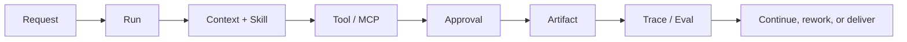

# Anna

## A local AI agent for enterprise workflows

> Start with a request. End with a traceable Run, an Artifact, and a clear next action.

Anna is a local-first desktop AI agent for enterprise workflows. It brings conversation, tools, approvals, memory, and execution evidence into one working loop, extending AI from “a useful answer” to “work that can continue and be checked.”


**Current version: `0.2.0 Developer Preview`** · Local macOS preview · MIT License

[Quick start](#quick-start) · [中文版](./ANNA-RELEASE-ZH.md) · [License](../../LICENSE) · [Security](../../SECURITY.md)

## What is Anna?

Anna is built around an Agent Runtime with three durable foundations:

- **Identity**: the current workspace, user, and permission boundary;
- **Judgment**: an explicit decision to continue, wait, request more information, or finish;
- **Memory**: a controlled distinction between confirmed business memory and task context.

Anna runs as a desktop application and keeps runtime state local by default. Models and enterprise systems connect through a configurable OpenAI-compatible provider and MCP connectors. When credentials are missing, Anna reports `not_configured` instead of inventing model output, tool output, or success states.

## The problem it addresses

Enterprise work rarely ends with one prompt. It moves through clarification, context gathering, system calls, artifact creation, approval, rework, and review. A chat transcript alone does not preserve the state of that work or answer who did what, why a result was accepted, and whether the path can be reproduced.

Anna turns a piece of work into a continuous, inspectable loop:



## Core experiences

### 1. Chat: make conversation resumable work

- Stream responses through a background Run;
- keep state available after a page disconnects;
- stop, continue, interject, resume, and inspect history;
- retain run state, events, and foundational Trace signals;
- choose a model Profile, Skill, and local workspace;
- surface explicit failure and configuration states when a provider is unavailable.

Chat is designed for research, analysis, writing, knowledge work, and tasks that need more than one turn.

### 2. Create: turn a description into a reusable capability

Create turns “build this capability for me” into a reviewable draft flow:

- generate Skill, Prompt, or Python Tool drafts;
- use files from a workspace as context;
- distinguish `ask` and `bypass` permission modes;
- keep draft, validation, and confirmation steps before activation;
- opt into the local Harness v2 Create slice for durable Runs and event streams.

### 3. Cowork: put business actions behind approval and audit

Cowork brings enterprise workbench scenarios together while keeping external systems at the edge:

- **Reimbursement**: draft creation, policy checks, missing-field collection, submit intent, approval, and audit;
- **Hiker integration**: a read-only entry point for global customer and business analysis through an external MCP; Hiker is a collaborative project authored by [kc8zshnt6n-gif](https://github.com/kc8zshnt6n-gif) and is not currently open source;
- **Associate**: receivables recovery, node execution, and approval collaboration;
- **MCP connectors**: configure, probe, and display connector state independently;
- external writes require explicit permission and human-in-the-loop approval.

These surfaces can be explored with deterministic fixtures. Real model and business-system results require a configured provider or MCP connector.

### 4. Crew: give collaborative work structure, artifacts, and a loop

Crew turns multi-person work from a message stream into an observable project graph:

- projects, SOP templates, inbox, and team views;
- task decomposition, assignment, start, submission, review, and rework;
- nodes, dependencies, progress, and pending gates on a project canvas;
- channel messages linked to concrete tasks and artifacts;
- Markdown/HTML artifact reading, download, notifications, and node navigation.


*This screenshot is a synthetic repository walkthrough showing the relationship between the project graph, channel, and review card.*

### 5. Harness: make each Agent step explainable

Harness v2 is Anna's execution and governance layer, focused on recoverability and evidence quality:

- **Durable Run / Event Store**: persist run state and canonical events;
- **Channel-scoped isolation**: preserve workspace and channel boundaries;
- **Tool Gateway**: apply schema, permission, approval, and audit controls;
- **Event cursor / resume**: inspect and recover from an event sequence;
- **Memory policy**: separate candidate memory, confirmed memory, and disabled writes;
- **Trace / Eval**: connect model, tool, approval, retry, and terminal evidence;
- **Scheduler and execution fencing**: provide the foundation for proactive runs and recovery.


*The same artifact can be read, reviewed, approved, or returned for rework inside the workflow.*

Harness v2 is currently exposed through an opt-in bridge. The Create vertical slice has a local implementation; domain-level migration for Cowork, Crew, and Hub remains follow-up work. The boundary is surfaced explicitly in the capability view.

## Why it matters

| Value | How Anna delivers it |
| --- | --- |
| **From conversation to delivery** | Every piece of work has a Run, state, artifact, and next action. |
| **Controlled automation** | Read-only tools can run within scope; external writes retain permission, approval, and audit. |
| **Recoverable failure** | Interruptions, waiting states, missing configuration, and unavailable connectors remain explicit and resumable. |
| **Reviewable outcomes** | Trace/Eval evidence connects context, model calls, tools, approvals, and terminal state. |
| **Local control** | Runtime state, databases, and configuration stay on the machine by default; external providers are opt-in. |
| **A clear extension boundary** | Business domains enter through Connectors, Skills, and Run Profiles while the Runtime keeps shared governance. |

## A typical Anna run

1. The user submits a goal from Home, Cowork, or Crew.
2. Anna creates a Run with identity and workspace scope.
3. The Runtime loads the Skill, context, and allowed tools.
4. The Agent calls a model or MCP and records events in the local Journal/Event Store.
5. An external write enters an approval or waiting state.
6. Anna returns an Artifact, state, and Trace evidence.
7. The user continues, reworks, approves, or carries the result into the next task.

## Quick start

### Requirements

- Node.js `>=22.19.0`
- Python `>=3.12,<3.14`
- The current Developer Preview is validated on macOS; Windows packaging is follow-up work

### Launch the desktop preview

```bash
npm ci
python3.12 -m venv .venv
. .venv/bin/activate
python -m pip install -e '.[dev]'
npm run desktop:run
```

Configure the local runtime from the app settings. Real Chat or business-connector runs require provider/MCP credentials. Without them, Anna still starts and reports `not_configured` clearly.

### Try the Harness v2 sidecar

```bash
ANNA_HARNESS_V2_BRIDGE_ENABLED=1 npm run desktop:run
```

Live Harness v2 requires a complete OpenAI-compatible configuration: an HTTPS endpoint, model name, and API key. This switch is for local development and validation; it does not mean every business domain has migrated.

## Verification and quality gates

The repository includes reproducible type, test, build, evidence, and desktop packaging checks:

```bash
npm run typecheck
npm test -- --reporter=dot
npm run frontend:smoke
./.venv/bin/python -m pytest -q
npm run build
npm run release:verify
npm run evidence:verify:all
npm run desktop:package
npm run desktop:smoke-asar
```

CI runs the core gates without a private provider, MCP endpoint, local runtime state, or signing identity.

## Developer Preview boundaries

This version is suitable for:

- understanding Anna's desktop Agent Runtime and Harness direction;
- connecting one OpenAI-compatible provider locally;
- exploring Chat/Create, Cowork, and Crew workflows;
- exercising deterministic Run, Tool, Artifact, Trace, and approval contracts;
- iterating from real Traces and failure cases.

This version does not claim:

- production readiness or a hosted cloud runtime;
- complete Legacy-to-Harness-v2 migration for Cowork, Crew, Create, and Hub;
- production Review-to-Validated-Patch approval;
- guaranteed external WebSearch or MCP availability;
- signed/notarized macOS installers;
- Windows installer and cross-platform release acceptance.

## Open source and contribution

Anna is released under the MIT License. Read [CONTRIBUTING.md](../../CONTRIBUTING.md) before opening a change, and follow [SECURITY.md](../../SECURITY.md) for the security boundary. Do not commit `.anna/`, databases, runtime logs, provider responses, API keys, or real enterprise data.

This repository open-sources only Anna's Hiker connector and UI integration. It does not include the Hiker platform, server source, deployment, or business data, and Anna's MIT License does not extend to Hiker.

Issues and pull requests are welcome around the Runtime, Connectors, Trace/Eval, desktop experience, and reproducible tests.
