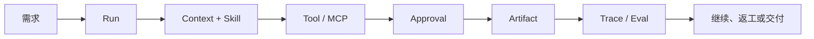
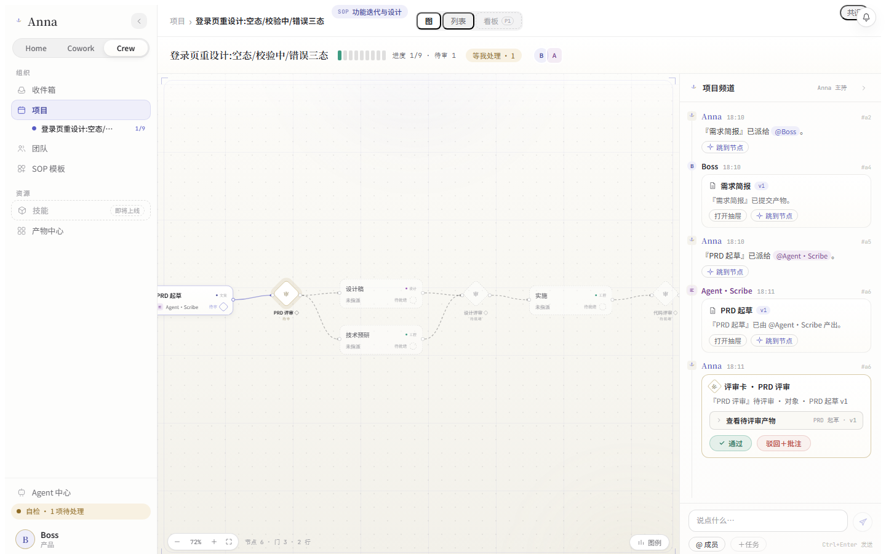

# Anna

## 企业工作流的本地 AI Agent

> 从一句需求开始，走到可追溯的 Run、Artifact 和下一步动作。

Anna 是一个面向企业工作流的 local-first 桌面 AI Agent。它把对话、工具、审批、记忆和执行证据放在同一条工作链路里，让 AI 的价值从“回答得不错”延伸到“事情可以继续、结果可以检查”。


**当前版本：`0.2.0 Developer Preview`** · macOS 本地预览 · MIT License

[快速开始](#快速开始) · [English release brief](./ANNA-RELEASE-EN.md) · [许可证](../../LICENSE) · [安全说明](../../SECURITY.md)

## Anna 是什么

Anna 的核心是一套可以长期工作的 Agent Runtime：

- **Identity**：知道当前工作空间、用户和权限边界；
- **Judgment**：在继续、等待、请求补充信息或结束之间做出可解释判断；
- **Memory**：把经过确认的业务记忆和当前任务上下文区分管理。

它以桌面应用运行，默认把运行状态保留在本地；模型和企业系统通过可配置的 OpenAI-compatible provider 与 MCP connector 接入。没有配置凭据时，Anna 会明确显示 `not_configured`，不会伪造模型结果、工具结果或成功状态。

## 它解决什么问题

企业任务通常跨越多个步骤：澄清目标、读取资料、调用系统、生成产物、等待审批、返工和复盘。单次聊天很难保留这些状态，也很难回答“这一步谁做的、依据是什么、结果能否复现”。

Anna 将一项工作组织为一条连续链路：



## 核心体验

### 1. Chat：让对话成为可继续的工作

- 流式输出与后台 Run，页面断开后仍可回看状态；
- 支持停止、继续、插话、恢复和历史查看；
- 每次运行都保留状态、事件和基础 Trace 线索；
- 可选择模型 Profile、Skill 和本地工作空间；
- 缺少 provider 时展示诚实的失败或未配置状态。

Chat 适合研究、分析、写作、资料整理和需要多轮推进的日常任务。

### 2. Create：从描述到可复用能力

Create 把“帮我做一个能力”变成可检查的草稿流程：

- 生成 Skill、Prompt 或 Python Tool 草稿；
- 将工作空间文件作为上下文输入；
- 通过权限模式区分 `ask` 与 `bypass`；
- 在保存或激活前保留草稿、校验与确认环节；
- Harness v2 的 Create 路径可在本地 opt-in 体验持久化 Run 与事件流。

### 3. Cowork：把业务动作放进审批和审计链路

Cowork 聚合企业工作台场景，并把外部系统连接放在边界上：

- **Reimbursement**：报销草稿、政策校验、缺字段补充、提交意图、审批与审计；
- **Hiker 集成**：通过外部 MCP 提供全球客户与业务数据的只读分析入口；Hiker 是合作项目，作者为 [kc8zshnt6n-gif](https://github.com/kc8zshnt6n-gif)，目前未开源；
- **Associate**：应收回款恢复、节点执行和审批协作；
- **MCP Connector**：连接器可单独配置、探测和显示状态；
- 涉及外部写入的动作需要明确的 permission 与 human-in-the-loop 审批。

这些场景可以从确定性 fixture 开始体验；接入真实 provider 或 MCP 后，才会产生真实模型和业务系统结果。

### 4. Crew：让多人协作有结构、有产物、有回路

Crew 面向项目制工作，把多人协作从消息流提升为可观察的工作图：

- 项目、SOP 模板、收件箱和团队成员视图；
- 任务分解、指派、启动、提交、评审和返工；
- 图上的节点、依赖、进度和待处理门禁；
- 频道消息与产物卡片关联到具体任务；
- Markdown/HTML 产物阅读、下载、通知和回到节点。



*截图为仓库内的合成演示素材，用于展示项目图、频道与评审卡片的关系。*

### 5. Harness：让 Agent 的每一步都能被解释

Harness v2 是 Anna 的执行与治理层，重点关注可恢复性和证据质量：

- Durable Run / Event Store：运行状态和事件可以持久化；
- Channel-scoped isolation：不同工作空间和频道之间保持边界；
- Tool Gateway：工具经过 schema、permission、approval 和 audit 约束；
- Event cursor / resume：按事件序列回看和恢复；
- Memory policy：区分候选记忆、已确认记忆和禁止写入的场景；
- Trace / Eval：把模型、工具、审批、重试和终局证据串起来；
- Scheduler 与执行围栏：为后续的主动运行和恢复提供基础。


*同一套产物可以在工作流中被阅读、评审、通过或退回。*

当前 Harness v2 采用 opt-in bridge，Create 已有本地垂直切片；Cowork、Crew、Hub 的领域级迁移仍在后续迭代中。这个边界会在能力面板中显式展示。

## 这对团队的价值

| 价值 | Anna 的具体做法 |
| --- | --- |
| **从对话走向交付** | 每项工作都有 Run、状态、产物和下一步，不把结果停留在一条消息里。 |
| **让自动化可控** | 只读工具可以受限自动执行；外部写入保留 permission、审批和审计。 |
| **让失败可继续** | 中断、等待、缺配置和连接器不可用都有明确状态，支持回看与恢复。 |
| **让结果可复盘** | Trace/Eval 记录上下文、模型调用、工具调用、审批和终局证据。 |
| **把数据控制权留在本地** | 桌面运行状态、数据库和配置默认留在本机；外部 provider/MCP 由用户显式配置。 |
| **为企业扩展留出边界** | 业务域通过 Connector、Skill 和 Run Profile 接入，Runtime 保持小接口和统一治理。 |

## 一次工作如何完成

1. 用户在 Home、Cowork 或 Crew 中提交目标；
2. Anna 创建一个带身份和工作空间边界的 Run；
3. Runtime 载入 Skill、上下文和可用工具；
4. Agent 调用模型或 MCP，并把事件写入本地 Journal/Event Store；
5. 需要外部写入时进入审批或等待状态；
6. 结果以 Artifact、状态和 Trace 形式返回；
7. 用户继续、返工、批准或把结果带到下一项工作。

## 快速开始

### 环境要求

- Node.js `>=22.19.0`
- Python `>=3.12,<3.14`
- 当前 Developer Preview 已验证 macOS；Windows 安装验收属于后续工作

### 启动本地桌面预览

```bash
npm ci
python3.12 -m venv .venv
. .venv/bin/activate
python -m pip install -e '.[dev]'
npm run desktop:run
```

在设置中配置本地 runtime。真实 Chat 或业务连接器需要 provider/MCP 凭据；无配置时 Anna 仍可启动并显示明确的 `not_configured` 状态。

### 体验 Harness v2 sidecar

```bash
ANNA_HARNESS_V2_BRIDGE_ENABLED=1 npm run desktop:run
```

Live Harness v2 需要完整的 OpenAI-compatible 配置（HTTPS endpoint、model name 和 API key）。这个开关用于本地开发与验证，不代表所有业务域已经完成切换。

## 验证与质量门禁

仓库提供可复现的类型、测试、构建、证据和桌面打包检查：

```bash
npm run typecheck
npm test -- --reporter=dot
npm run frontend:smoke
./.venv/bin/python -m pytest -q
npm run build
npm run release:verify
npm run evidence:verify:all
npm run desktop:package
npm run desktop:smoke-asar
```

CI 在没有私有 provider、MCP endpoint、本机运行状态或签名身份的环境中运行基础门禁。

## Developer Preview 边界

当前版本适合：

- 了解 Anna 的桌面 Agent Runtime 和 Harness 设计；
- 在本地连接一个 OpenAI-compatible provider；
- 体验 Chat/Create、Cowork 和 Crew 的工作流界面；
- 使用 deterministic fixture 验证 Run、Tool、Artifact、Trace 和审批契约；
- 基于真实 Trace 和失败案例继续迭代。

当前版本暂不承诺：

- production-ready 或 hosted cloud runtime；
- Cowork、Crew、Create、Hub 的完整 Legacy-to-Harness-v2 迁移；
- 生产 Review-to-Validated-Patch 审批闭环；
- 保证可用的外部 WebSearch 或 MCP 服务；
- 已签名/notarized 的 macOS 安装包；
- Windows 安装包和跨平台发布验收。

## 开源与参与

Anna 使用 MIT License。提交代码前请阅读 [CONTRIBUTING.md](../../CONTRIBUTING.md)，并遵守 [SECURITY.md](../../SECURITY.md) 的安全边界。不要提交 `.anna/`、数据库、运行日志、provider 响应、API key 或真实企业数据。

本仓库只开源 Anna 侧的 Hiker Connector 与界面集成代码，不包含 Hiker 平台、服务端源码、部署或业务数据；Anna 的 MIT License 不延伸至 Hiker。

欢迎围绕 Runtime、Connector、Trace/Eval、桌面体验和可复现测试提出 Issue 或 Pull Request。
