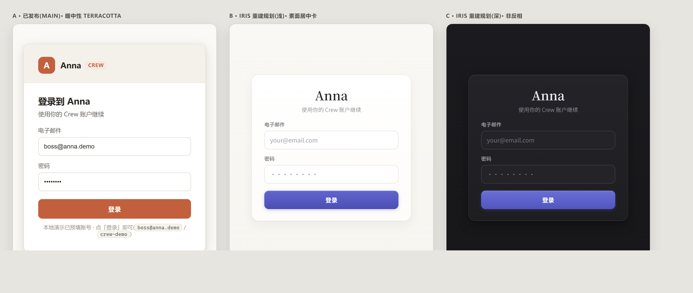

# 设计 Brief — Anna 登录页(鸢尾 Iris)

- **日期**:2026-07-10
- **交付对象**:Claude Design(出原型)
- **产出后流程**:原型返稿 → 我们回来按数据契约(§6)重搭前端登录页(它属于 Iris 重建的 R3 外壳切片,tsx 尚未落地)
- **一句话**:重新设计 Anna 的登录页 —— 用户看到产品的**第一眼**。它不是面向公海的营销落地页,而是**团队/组织内部的身份门**;要在鸢尾 Iris 的克制语言里,给这第一眼恰到好处的分量。

---

## 0. 一个必须先读的前提:Anna 桌面版默认免登录

这条直接决定「登录页是什么」,请先吃进去:

- 启动 → 打 `GET /api/session/current`。
- **本机桌面形态**:没有 token 也会回落到 `local-runtime` 身份,**直接进主壳,永远看不到登录页**。
- **登录页只在一种情况出现**:`session/current` 返回 4xx —— 即**远程 / 多用户部署形态**(多人共用一个 Anna 服务端时)。

所以这一屏的真实受众,是「某个 Crew 的成员,在浏览器/远程形态里登入自己团队的 Anna」。它不承担拉新、不承担注册转化,承担的是**"这是谁的 Anna、以什么身份进入"** 的第一印象。

> 方向题(留给设计判断):既然是内部身份门,要维持"素面克制、一张登录卡"就够;还是顺势把这第一眼升级成更有仪式感、更能立住 Anna 人格的入口?两条路的信息密度与情绪完全不同 —— 见 §5。

---

## 1. 现状可视化(三态并置)

下图三张都是**用真实生产 CSS / design tokens 逐字还原**渲染的,不是示意图:



- **A · 已发布(main)**:暖中性 terracotta(`--accent #c2603d`,Claude-inspired 暖白底)。带品牌头行(方形 `A` logo + 「Anna」+ 胶囊「Crew」徽章)、标题「登录到 Anna」、副标题、邮箱/密码、terracotta 实底按钮、底部 dev 预填提示。**这是当前线上真实长相,但它属于上一代视觉,不作为重设计的约束 —— 只作"我们从哪来"的参照。**
- **B · Iris 重建规划(浅)**:当前重建分支已写好的 CSS 骨架(`.ir-login`,tsx 未建)。素面居中卡、**衬线「Anna」标题**(无品牌 logo、无点缀)、副标题、邮箱/密码、**鸢尾紫渐变实底按钮**。这是重建"默认会长成的样子",相当克制。
- **C · Iris 重建规划(深)**:同一套,深色**非反相**(瓷变墨 `#17171A`、面变 `#232328`、鸢尾提亮为 `#8B8ED9`)。

### 登录页通往的世界(重要参照)

登录成功后进入的主壳(**已是 Iris 语言、真实渲染**),第一眼的视觉记忆必须和它连贯:


暖瓷白底、衬线「Anna」品牌、鸢尾 tinted 的激活导航、圆角瓷面卡、底部 UserChip。登录卡应当像"这个世界的门厅",而不是另一套视觉。

---

## 2. 现状结构与字段清单(逐项,给你精确起点)

**已发布版(A)的完整构件**,重设计可增删,但这是当前承载的信息:

| 区块 | 内容 |
|---|---|
| 品牌头行 | 方形 `A` 标记 + 「Anna」+ 胶囊徽章「CREW」 |
| 标题 | 「登录到 Anna」 |
| 副标题 | 「使用你的 Crew 账户继续」 |
| 字段 1 | 电子邮件(label + input,placeholder `your@email.com`) |
| 字段 2 | 密码(label + input,`••••••••`) |
| 错误态 | 红底条:401 → 「登录失败,请检查邮箱和密码」 |
| 主按钮 | 「登录」;提交中 → 「登录中…」;空字段 disabled |
| 底注 | dev 预填提示(`boss@anna.demo` / `crew-demo`) |

**Iris 规划版(B/C)已砍掉品牌 logo 与徽章**,只留衬线「Anna」+ 副标题 + 两字段 + 按钮。错误态改用系统组件 `StateNote kind="error"`(米黄/红的行内提示,非弹窗)。

**目前没有的东西**(不必凭空补,除非你想扩认证模型):注册、找回密码、SSO/第三方登录、记住我、workspace 选择器、语言切换。

---

## 3. 认证模型(登录页能承载什么字段)

- 端点:`POST /api/auth/login`,**只吃 `{ email, password }`** → 返回 `{ token, session }`。token 存 localStorage,后续请求带 `Authorization: Bearer`。
- 失败:凭据错 → HTTP 401(前端显示中文错误文案)。
- 登出:`POST /api/auth/logout`。
- 底层**有多租户/团队概念**:一个 workspace 下多个成员,带 `role`(boss / PM / UIUE / 前端 / 文案 / 设计 / 运营…)和 `kind`(**human / agent** —— 成员里真的有 AI agent 身份)。演示 workspace 叫「Crew Demo Team」,8 个账号共用密码 `crew-demo`,boss 是预填那个。
- 但**登录入口本身只有"邮箱 + 密码"这一条极简路径**,不暴露 workspace 选择。

> 内容层方向题:Anna 的叙事是「人机同 Crew」(登入的是一个真有 AI 成员的协作组织)。第一眼要不要透出这层气质(而不仅是一个通用登录框)?

---

## 4. Iris 设计系统边界(你必须遵循的硬约束)

完整 tokens 见仓库 `apps/desktop/src/styles/tokens.css`。要点:

**调色**
- 底色:暖瓷白 `#F7F6F2`(纵向微渐变,**非纯白**);深色底 `#17171A`。
- 面:`#FFFFFF → #FDFCF9` 渐变卡;深色 `#232328 → #1E1E22`。
- 墨(文字三级):`#232328 / #6C6C72 / #A3A3A8`。
- **唯一主色 = 鸢尾紫 `#575BC4`**(思考 / 进行中 / 可点按都用它;深色下提亮到 `#8B8ED9`)。渐变按钮 `#6165CF → #4B4FB2`。
- 金线 `#CBBB8E`:**仅作滚边**,禁作底色/正文,每屏至多两处。

**字体三分工**(生产走 `@fontsource` 随包,**禁 CDN**)
- 衬线 `Noto Serif SC` = 仪式 / 问候 / 标题(「Anna」标题就用它)。
- 无衬线 `Noto Sans SC` = 做事 / 表单 / 正文。
- 等宽 `JetBrains Mono` = 账本 / 代码 / 凭据。

**纪律(硬性)**
- **点缀名额:每屏 ≤ 2 处装饰性点缀。而登录页目前不在点缀白名单里**(白名单只有:侧栏品牌行 / 空态 / 问候页)。→ **这是最值得你拍板的一处**:要不要给登录页破例开 1–2 个点缀名额(如鸢尾花瓣 `IrisPetal`、微光标题、呼吸光环),给第一眼一点仪式感;还是坚持素面。请在返稿里明确你的选择和理由。
- **图标**:一律内联 SVG、1.5px 描边、`stroke=currentColor`;**禁 emoji、禁第三方图标库**。
- **深色非反相**:不是把浅色反色,而是"瓷变墨、话语变纸、鸢尾提亮"。浅深两稿都要给。
- **动效克制**:全屏常驻动效只有一个"呼吸光环"(2.4s);其余按需。尊重 `prefers-reduced-motion`。

---

## 5. 给设计的方向题(希望返稿里有答案)

1. **登录页的身量**:内部身份门(素面一张卡即可)vs 有仪式感的"产品第一眼"(左图叙事/品牌区 + 右侧表单的分栏?整屏氛围?)。给出你推荐的一种,可附次选。
2. **点缀取舍**:是否为登录页破"每屏 ≤2 点缀 + 登录页不在白名单"的例?若破,用什么(IrisPetal / 微光 / 呼吸 / 衬线大字),各占几个名额。
3. **品牌呈现**:衬线「Anna」纯文字是否够立住第一眼?要不要一个 Anna 的标识/花蕊符号(须符合"内联 SVG、克制"纪律)。
4. **人格气质**:要不要在这一屏就透出「人机同 Crew」「Anna 大小姐」的温度(一句问候语?一句 slogan?),还是保持工具的冷静。
5. **两种部署形态**:一套设计通吃"免登录桌面很少见到 / 远程多用户才出现"这一事实即可 —— 你只需为**远程登录形态**设计。
6. **浅 + 深**两稿必须都给;错误态、加载态、disabled 态请一并示意。

---

## 6. 不变的地基(数据 / 交互契约,重搭前端时照此对齐)

这些是固定的,设计可围绕它们发挥,但字段/流程别凭空改契约:

```
POST /api/auth/login   body { email, password }  ->  200 { token, session }
                                                       401 (凭据错)
POST /api/auth/logout  header Authorization: Bearer <token>
```
- 成功:`setToken(body.token)` → 重取身份 → 进主壳。
- 失败:401 → 行内错误(Iris 用 `StateNote kind="error"`)。
- dev 便利:`import.meta.env.DEV` 下预填 `boss@anna.demo` / `crew-demo`(发布档不生效)。
- 无异步多步、无验证码、无二次验证。就是一次提交。

---

## 7. 交付什么 / 不用管什么

**请交付**:登录页原型(浅 + 深),含品牌/氛围区、表单、按钮、错误/加载/disabled 态;点缀取舍的明确说明;若做了分栏/氛围区,给出各断点(桌面为主)的排布。

**不用管**:注册/找回/SSO(当前无);主壳与其它页(已是 Iris,另有 brief);后端(契约见 §6,已定);字体文件打包(我们随包)。

**参照文件**(仓库内,可要来看):
- `apps/desktop/src/styles/tokens.css` — 完整 design tokens
- `apps/desktop/src/pages/auth/LoginPage.css` — Iris 登录卡现有 CSS 骨架
- `docs/superpowers/plans/2026-07-09-iris-rebuild/03-shell-login-nav.md` — 重建切片里登录页的原始规格(Task 3)
- `docs/superpowers/progress/2026-07-10-r3-*.png` — 登录后进入的主壳真图
