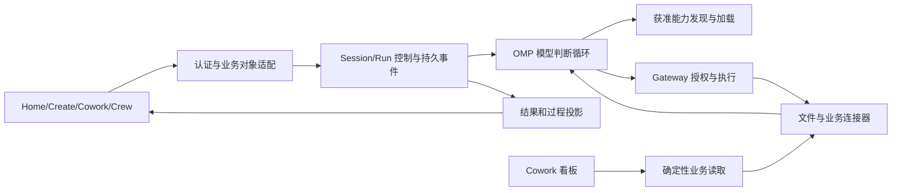

# WB-00 职责与源码核查

状态：主控设计记录，基线运行结果及最终验收另见本目录 WB-00 交接胶囊。Spec 1.2；R-01/02/17/18/19，AC-18a。核查源码 `d461a1a344d82d7bd95ca5073b0a1e2a700d2162`，Anna package 0.2.0。本卡不修改产品代码，也不关闭 M1 能力。

## 派卡前五项判断

1. 用户结果：Create 普通提问、Crew 项目追问、另开任务和看板可独立使用。WB-00 交付这些行为当前能做到什么、缺在哪里及可重复的比较基线。
2. 保留约束：认证身份、Channel/Project 授权、用户数据、业务审批和评审。Surface 工具上限、每个 Create Run 新建 conversation、全页面单个运行状态及禁用控制属于现有实现选择。
3. 公开边界：Home composer 的实际请求，业务 Create/Crew/Cowork API，Product Host 任务/事件/信号接口，真实 Runtime/Gateway 与 OMP worker；源码索引只解释观察，不能代替运行证据。
4. 复用：OMP 18.0.11 已有模型/工具循环、steer、abort 和可配置 Session。Anna 已有身份、业务状态机、持久事件和 Gateway。优先修改接入职责，无证据需要更换 OMP。
5. 可失败判据：普通问题仍带强制 kind；同一获准工具被 Skill 求交集去掉；answer 无法消费；两个独立 Run 未到达重叠 transport barrier。各行为状态与“成功复现该行为”的测试结果分开。

## 本次实际调用链

`npm run desktop:run` → 当前前端/Host/Python/OMP 构建 → Electron `runtime-service.mjs` → Node `apps/harness-service/src/main.ts` → `createLiveHarnessV2Runtime(requireOmp=true)` → `OmpLoopKernel` → 本树 materialize 的 OMP worker。

模型由 Host transport 调用；工具由 Host Gateway 执行；Python `services.business_main` 为无模型业务适配进程。业务 API 提交整个 ProductTask，不能将旧 Python Agent 路径的测试误记成当前产品执行证据。

| 核查入口（仓库相对路径） | 当前源码事实 | 后续处理 |
| --- | --- | --- |
| `apps/desktop/electron/runtime-service.mjs:createProductRuntimeConfig`；`apps/harness-service/src/main.ts` | 配置、状态、工作目录分开；强制 OMP；Host 与 business service token 独立处理 | 沿用实际入口；新配置不能指向旧用户数据库 |
| `apps/harness-service/src/product-session.ts:ProductSessionStore` | records 以 run_id 为 key，保存 ProductTask；不是稳定 Session 对象存储 | WB-01 以公开会话契约及迁移测试决定存储；保留旧记录 |
| `apps/harness-service/src/product-facade.ts:withConversationContext` | 以 workspace/actor/conversation/channel/surface 过滤旧 Run，回填最多 16 条消息 | WB-01 去除显示入口造成的连续性限制，同时维持私聊隔离 |
| `services/api/app/routes/create.py:_task_for_create_run` | conversation_id 为 `create:{run.id}`，context 携带 kind | WB-01 稳定映射；WB-03 普通对话与显式资源创建的契约 |
| `apps/desktop/src/pages/home/HomePage.tsx` | kind 初始 skill；onSend 在 runStream.running 时返回；页面只有当前订阅控制 | WB-03/04 用 UI 复现定位实际锁；不据此推断整个 Host 串行 |
| `apps/harness-service/src/production.ts:createLiveProfile/toolNamesForSurface/narrowProductProfile` | 按 Surface 工具目录、task catalog 收窄；产品默认 180 秒/12 turns/64 tools；预选 Skill 和 Artifact 契约 | WB-02 分离授权和加载；WB-03 prompt 引导；预算深改 WB-05 |
| `packages/harness-v2/src/run-profile.ts:resolveRunProfile` | Channel/Worker/Profile/Skill.allowedTools 求交并扣除 forbiddenTools | WB-02 普通会话不以预选 Skill 作为基础授权；保留可信权限和 v1 策略版本 |
| `packages/omp-loop-kernel/src/omp-loop-kernel.ts:answer/steer` | answer 抛 OmpKernelControlUnavailableError；active 按 Run 维护；steer 有 scoped 查找 | WB-04 实现持久问题与幂等回答；不把 API 存在当作闭环 |
| `apps/harness-service/src/product-facade.ts:signalTask` | awaiting_input/approval 被 terminalEvents 提前拒绝，accepted=false | WB-04 等待/终态投影与 answer 一起修改 |
| `packages/omp-loop-kernel/runtime/worker.ts:createSession` | OMP 原生 memory/autolearn/compaction/retry 关闭；SessionManager.inMemory；原生 MCP/扩展发现关闭；工具由获准 proxy 提供 | WB-02 接入能力；WB-05 接压缩/恢复；Memory 留 WB-09 |
| `services/api/app/routes/crew.py:post_channel`；`services/crew/app/service.py:is_contextual_question` | 已有上下文问答分支，组装项目、频道消息、已接受 Memory；等待 submit_and_wait 后追加 Anna 消息 | WB-03 保留项目事实，检查触发/能力限制；不能声称 Crew 完全无问答 |
| `services/api/app/routes/hiker.py:create_hiker_dashboard_run` | 看板直接调用确定性 Hiker orchestrator，未提交模型任务 | 通过真实本地 API 验证不占模型槽；真实 MCP 数值另列 M |

源码核查与执行结果分开：上述结论由当前文件读取所得，D/O 执行结果以评测 evidence 为准。未执行 UI、外部服务或包内用例不得因源码看起来正确而通过。

## 目标职责及事实归属

| 责任层 | 输入 → 输出 | 唯一事实与边界 | 可调整范围 / 保留价值 |
| --- | --- | --- | --- |
| 模型 + OMP | 指令、历史、能力定义、真实观察 → 动作/提问/回答 | 模型决定下一动作；不产生授权事实 | 复用锁定的循环、steer、abort；不额外包固定分类或计划流水线 |
| Session/Run 控制 | 认证提交/信号 → ID、持久 ACK、事件、终态 | 一个 Run 一个执行所有者；Session 可含多个 Run；Channel 继续表达授权和共同事实 | 可重设 API/存储；旧历史确定性迁移、dry-run、幂等、来源水位 |
| 能力目录与加载 | 当前用户/项目/工作区授权 → 可发现目录、实际加载 receipt | 授权来自可信服务；模型选择加载；调用时复查撤销 | 复用 registry/Gateway；Surface 和 Skill 文字不授予权限；Worker 限制保留 |
| Gateway/执行环境 | 具名工具、参数、scope、版本 → 真返回、失败、effect receipt | I/O 前校验，副作用事实不由模型自评；原文件版本冲突明确 | M1 接现有受控工具；强 Sandbox/命令在 WB-06，不能拿 AST 预检替代 |
| 业务与连接器 | 认证对象引用/操作 → 看板、项目、审批/评审事实 | 业务数据库/真实 MCP 是事实源，读成功不证明写成功 | 适配可以重写；用户身份、数据、Crew 图/版本/共识、报销规则保留 |
| 投影/分发/评测 | 规范事件、产物验证、版本锁 → UI、运行包、可比结果 | 投影不创建第二终态；测试通过与任务成功分开 | UI 可重组；L/M/P 分别核验；固定输入/轮次/分母保留失败 |

领域决定沿用 CONTEXT 既定含义：Session 不等于 Run，Project 不等于工作目录，Channel 不等于 Session，挂起不等于最终结束。无新增领域术语，不将执行日志写回用户现有 CONTEXT。

## OMP 复用证据与边界

- 本树 `packages/omp-loop-kernel/runtime/package.json` 与 lock 精确固定 coding-agent/native 18.0.11，准备脚本固定 Bun 1.3.14 及归档/二进制摘要。
- 已重新 materialize `build/omp-runtime/darwin-arm64`，未复制其他树构建。manifest：`sha256:d3ff0284f9d7a4489d66e78fb5b1d3819471a59f4c9dcd01d0e118b6994a241d`；21,465 个文件；lock：`f5a96c28a0187d549959fbe33c78596198491df29be9ea18424bf814fea88ceb`。
- 锁定依赖本地源码 `@oh-my-pi/pi-coding-agent/src/session/agent-session.ts` 暴露 `steer()` 和 `abort()`；SDK 允许受限工具/Session 配置。Anna worker 已调用 `createAgentSession` 并通过 `agent.setTools` 装载获准 proxy。此项证明复用触点，实际执行另用 D+O 验证。
- 当前证据支持继续 OMP。未批准替换组件，未采用具体 Codex 实现机制，因此无 Codex SDK 安装或技术源码 pin 前置。Memory backend 选择保持 WB-09 范围外。

## 后续任务的可验证起点

| WB | 目标 seam / 首个可失败行为 | 退出证据 |
| --- | --- | --- |
| 01 | 产品 Session/Run 提交查询与认证；同 conversation 换 Surface 后续聊，同 Project 两私聊隔离，旧数据 dry-run 重复迁移 | AC-03/15/17a；真实目标持久状态与身份，不 mock 内部授权 |
| 02 | 目录发现→加载→Gateway；同用户换入口仍发现获准工具，依观察选择不同动作 | AC-01/04/05/15 对应部分；定义/调用 receipt 一致，撤权在 I/O 前拒绝 |
| 03 | 原 Home/Create/Crew composer + Cowork 看板 API；普通问题不被 kind/Artifact 约束 | AC-01/02/05/16 只读部分；原业务流程可达，真实 L/M 独立记账 |
| 04 | Run 信号、事件与原 UI；双 barrier、第三项排队、定向 stop、重复/冲突 answer | AC-06/07a/08/15；问题持久化、单次消费、别的 Run 继续 |
| 05（范围外） | 真实压缩/预算/恢复 | AC-09/10/17b，不能用旧包证明 |
| 06（范围外） | Sandbox 文件/命令公开执行接口 | AC-11a/12/13a，真实 I/O 和完整进程树停止 |
| 07（范围外） | Create 保存→新 Session 使用、Crew v1/v2 评审 | AC-14a～d/16 各自证据；Python 激活条件保持 |
| 08（范围外） | 同模型冻结 36 槽、macOS 新包原 UI | AC-18c/19，L/M/P 外部门禁不能由 D/O 替代 |

本 Session 验收后仅接力 WB-01；上表 WB-05～08 为缺口归属，不构成启动授权。
