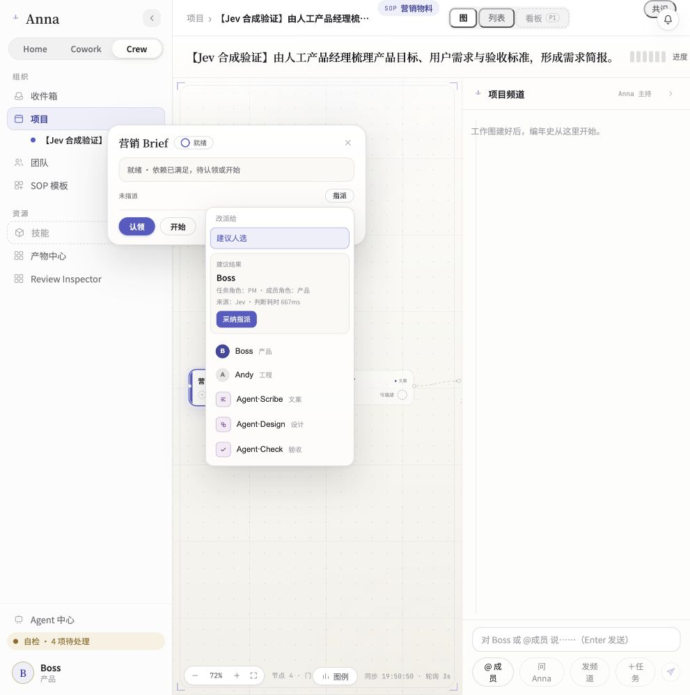

# JEV-02 real UI round: jev02-ui-r1

2026-09-21 · Synthetic demo data · Local preview only.

## Candidate and environment

- Pre-change commit: `dc4bf0f03604f8cf2f7e1ec838ef27b184a188cc`.
- Evaluated source: [r7 candidate manifest](../jev02-contract-r7/candidate.sha256), 20 implementation/test files. Production Host remains the accepted [JEV-01 r6 manifest](../jev01-contract-r6/candidate.sha256). All hashes matched before and after this round.
- Served build: [r7 build manifest](../jev02-contract-r7/build.sha256). The final accepted commit is recorded in [JEV-02 handoff](../../../docs/superpowers/plans/2026-09-21-jev-crew-preview/handoff/JEV-02.md).
- SPEC: `JEV-PREVIEW-1.0`, question: `crew-assignee-v1`, model requested and returned: `jev-1.13.0`.
- macOS 26.6.2 arm64; Node v24.12.0; Python 3.12.13. The existing product runtime launcher started production Host/business against fresh isolated state. Main-model configuration was empty in this round.
- Synthetic project `proj_1`, workspace `ws_crew_demo`, demo actor `acc_boss`, template `marketing_collateral`. No existing project, database or original configuration was changed.
- Browser actions were performed by the supervising agent through the actual UI. This is an exercised explicit-adoption control, not a claim that the human user personally clicked.

## Primary: actual Jev suggestion and adoption

1. `task_1_brief` began `todo`, unassigned, with role `PM`. The actual demo roster has the Human Boss role `产品`, so the normal UI did not take the exact-role shortcut. No force-Jev override was used.
2. Clicking **建议人选** reached public Crew HTTP, production Host and the real provider. `decision_id=9f664eca-7ccb-4dce-aa85-678521ecca11`, input hash `8793a527fcfbde5d074390ac075ef719af8102ea71e74c157279fedbf4a3f7da`.
3. Actual result selected `acc_boss`, raw choice `c5`, source `jev`. Host inference started `2026-09-21T11:49:44.423Z`, ended `11:49:45.090Z`, elapsed **667 ms**. Usage: **648 input / 68 output tokens**, one provider request, zero retries, no error. Provider request ID was absent and remains null. Confidence/probabilities are provider outputs, not probabilities of business success. This duration excludes UI/API overhead and thinking time; it is not E2E latency.
4. After suggestion, the public project readback was still unassigned with no assignment receipt. Repeating the same request UUID returned the cached response without another provider request.
5. Clicking **采纳指派** displayed Boss on the task and the assignment channel event. Public API and read-only SQLite confirmed `assigned`, `acc_boss`, `run_ref=null`, project version 2 and one durable assignment receipt bearing the same decision ID, input hash, question version and `source=jev`.
6. Repeating public assign returned HTTP 200. Receipt count, channel message count and notification count remained one each. Cancel after commit returned `already_applied`. No Host Run/tool events were created.

Evidence: [before](project-before.json), [suggestion](suggestion.json), [sanitized Host inference](host-inference.json), [after suggestion](project-after-suggestion.json), [after adoption](project-after-adoption.json), [SQLite readback](sqlite-readback.json), [duplicate/cancel](duplicate-and-cancel.json). The `audit_event_count=2` in the duplicate response includes project creation plus one assignment; it is not two assignment receipts.

## Secondary: exact-role rule and blocked Worker

The actual UI suggested Agent·Scribe for `task_2_copy` using `source=role_rule`, displayed **未调用模型** and the dependency-wait explanation, then accepted the explicit adoption click. Public GET and read-only SQLite confirmed project version 3, assignee `acc_agent_scribe`, state **blocked**, dependency `task_1_brief`, and `run_ref=null`. The second receipt has decision ID `a73f9310-6e1a-4c11-947f-dff3157ae291` and `source=role_rule`.

After both assignments there were exactly two assignment receipts, two channel messages and two notifications. The entire round still had exactly one Jev inference record, zero main-model calls and zero canonical Host events. Thus the rule path did not consume an additional Jev request or start a blocked Worker.

Evidence: [public project](project-after-rule-adoption.json), [SQLite readback](secondary-readback.json), [rule suggestion screenshot](04-rule-blocked-suggestion.png), [final screenshot](05-blocked-assigned.png).

## Budget and limits

The shared ledger was reserved before the live click and settled using the actual inference usage. [Before](budget-before.json): 8 cumulative Jev requests; [reservation](reservation.json): 1 request / $0.002688 conservative allowance; [after](budget-after.json): **9 cumulative Jev requests, $0.000201558 estimated cumulative spend**, zero reservations and no unknown usage. Cumulative tokens: 4,799 input / 439 output. Main-model requests remain 0. Prices and source/date are recorded in the ledger; estimates are not a confirmed invoice.

Remaining limits: 491 Jev requests and approximately $1.999798442 Jev allowance; 100 main-model requests and approximately $9.999798442 total allowance, with the first corresponding cap binding. The 24 heldout cases remain unused.

AC15's actual suggestion → explicit adoption → receipt/readback is demonstrated. This round also provides live Human/no-Run and blocked-Worker/rule evidence. Error, unavailable, concurrency and ready-Worker policy paths were covered by deterministic tests; they are not relabeled as live provider execution. AC16's ready Worker execution/terminal result, the fixed 32-case A/B/C/D comparison, full repository checks and publishable homepage remain JEV-03 work. No Windows/Linux/install-package or remote publication claim is made.
